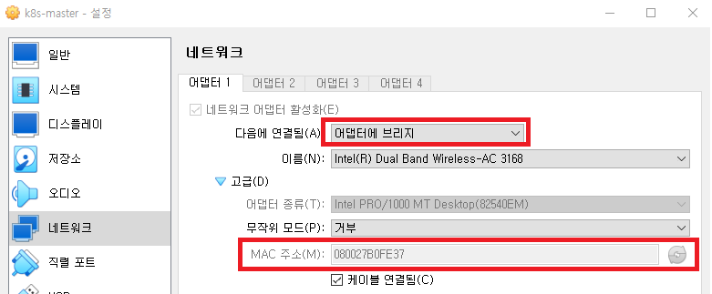
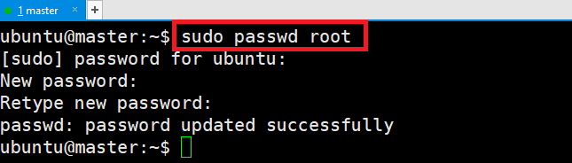
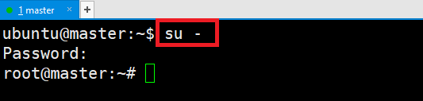
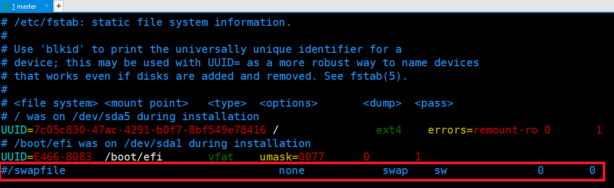
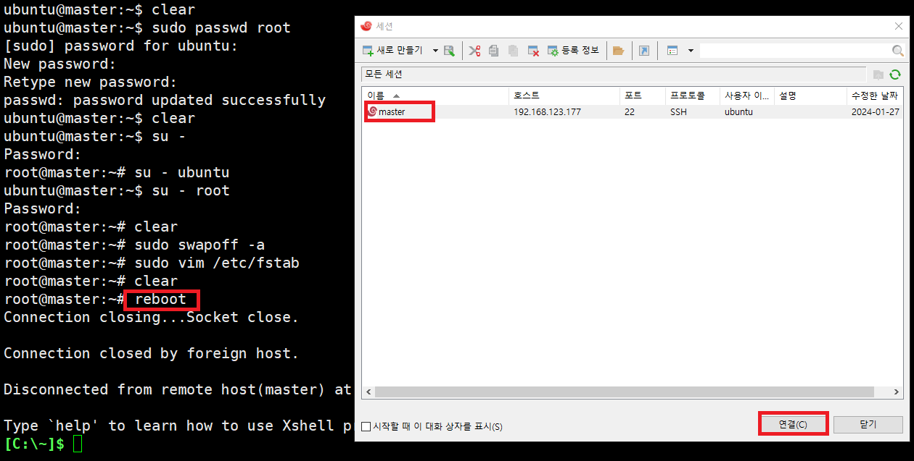
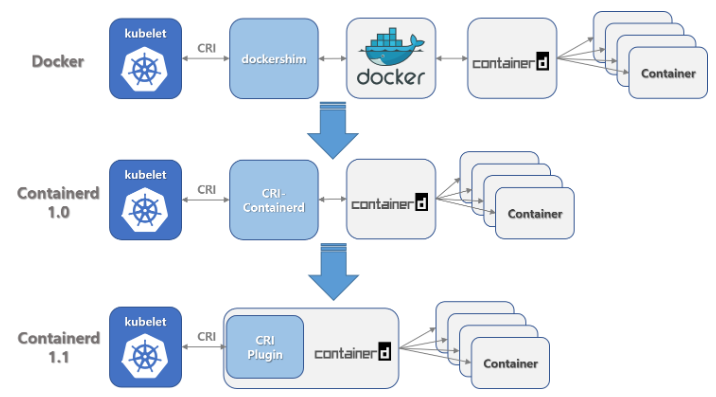
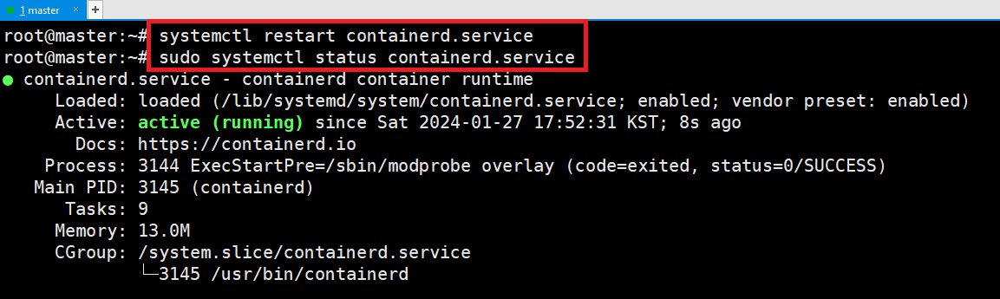
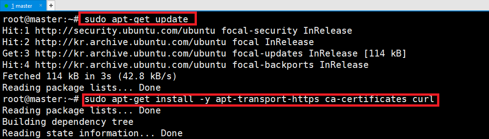
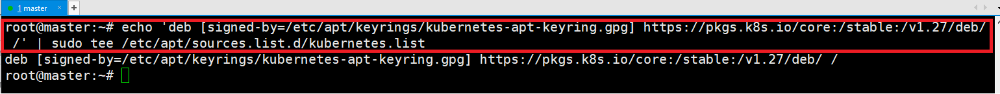

# [kubernetes v1.27](https://v1-27.docs.kubernetes.io/docs/setup/production-environment/tools/kubeadm/install-kubeadm/)


---
### 설치조건 확인 
- 2 GB or more of RAM per machine
- 2 CPUs or more


---
- Full network connectivity between all machines in the cluster
- Unique hostname, MAC address, and product_uuid for every node
- Swap disabled. -> 설정예정 



---
### 단계1: root 계정으로 변경 
- root 계정의 비번 정의 
```shell
sudo passwd root
```


- root 계정으로 접속 
```shell
su - # 또는 su - root
```


---
### 단계2: [Swap disabled](https://lovedh.tistory.com/entry/Ubuntu-2004%EC%97%90%EC%84%9C-swap-%EB%A9%94%EB%AA%A8%EB%A6%AC-%EC%84%A4%EC%A0%95%ED%95%98%EA%B8%B0)
- Swap 메모리는 하드디스크의 일부를 RAM처럼 사용하도록 만들어진 메모리입니다.
```shell
sudo swapoff -a
sudo vim /etc/fstab
# swap으로 시작하는 내용 주석처리 
```


---
### 단계3: 재부팅 및 재접속
```shell
reboot
```


---
### 단계4: [IPv4를 포워딩하여 iptables가 브리지된 트래픽을 보게 하기](https://v1-27.docs.kubernetes.io/ko/docs/setup/production-environment/container-runtimes/)
```shell
cat <<EOF | sudo tee /etc/modules-load.d/k8s.conf
overlay
br_netfilter
EOF

sudo modprobe overlay 
sudo modprobe br_netfilter 

# 필요한 sysctl 파라미터를 설정하면, 재부팅 후에도 값이 유지된다.
cat <<EOF | sudo tee /etc/sysctl.d/k8s.conf
net.bridge.bridge-nf-call-iptables  = 1
net.bridge.bridge-nf-call-ip6tables = 1
net.ipv4.ip_forward                 = 1
EOF

# 재부팅하지 않고 sysctl 파라미터 적용하기
sudo sysctl --system
```
---


---
### 단계5: [containerd](http://www.opennaru.com/kubernetes/containerd/)
- Containerd 는 Kubernetes 의 하이 레벨 런타임 표준인 CRI(Container Runtime Interface) 런타임입니다. 



---
```shell
sudo apt-get install -y containerd
sudo systemctl status containerd.service
```


---
- SystemdCgroup = true
```shell
sudo mkdir -p /etc/containerd
containerd config default | sudo tee /etc/containerd/config.toml

sudo vim /etc/containerd/config.toml
# 아래내용 수정  
SystemdCgroup = true
```
---


---
- restart containerd
```shell
sudo systemctl restart containerd.service
sudo systemctl status containerd.service
```


---
### 단계6: [kubeadm, kubelet and kubectl 설치](https://v1-27.docs.kubernetes.io/docs/setup/production-environment/tools/kubeadm/install-kubeadm/)
- `apt-transport-https` : 패키지 관리자가 https를 통해 데이터 및 패키지에 접근할 수 있도록 한다.
- `ca-certificates` : ca-certificate는 certificate authority에서 발행되는 디지털 서명. SSL 인증서의 PEM 파일이 포함되어 있어 SSL 기반 앱이 SSL 연결이 되어있는지 확인할 수 있다.
- `curl` : 특정 웹사이트에서 데이터를 다운로드 받을 때 사용

---
- Update the apt package index and install packages needed to use the Kubernetes apt repository
```shell
sudo apt-get update
# apt-transport-https may be a dummy package; if so, you can skip that package
sudo apt-get install -y apt-transport-https ca-certificates curl
```


---
- Download the public signing key for the Kubernetes package repositories. 
```shell
sudo mkdir -p /etc/apt/keyrings
curl -fsSL https://pkgs.k8s.io/core:/stable:/v1.27/deb/Release.key | sudo gpg --dearmor -o /etc/apt/keyrings/kubernetes-apt-keyring.gpg
```

- Add the appropriate Kubernetes apt repository
```shell
echo 'deb [signed-by=/etc/apt/keyrings/kubernetes-apt-keyring.gpg] https://pkgs.k8s.io/core:/stable:/v1.27/deb/ /' | sudo tee /etc/apt/sources.list.d/kubernetes.list
```


---
- Update the apt package index and check version
```shell
sudo apt-get update
apt-cache madison kubeadm # 설치가능버전 확인 
```


---
- 설치가능버전으로 변경 후 설치 
```shell
sudo apt-get install -y kubelet=1.27.10-1.1 kubeadm=1.27.10-1.1 kubectl=1.27.10-1.1
```


