### 단계1: worker1, worker2 생성 
- master를 복제하여 생성 
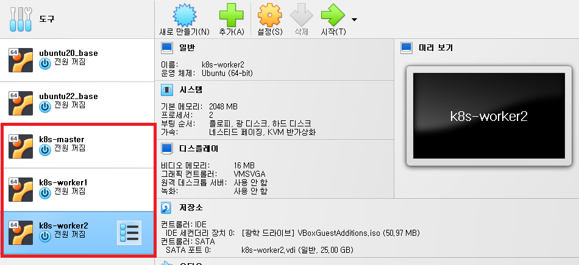

---
### 단계2: hostname 설정 
```shell
# master
sudo hostnamectl set-hostname master
hostname

# worker1
sudo hostnamectl set-hostname worker1
hostname

# worker2
sudo hostnamectl set-hostname worker2
hostname
``` 
---
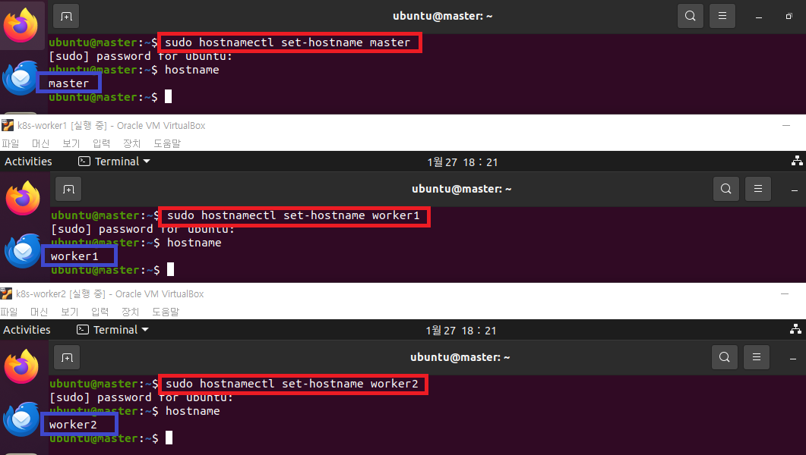

---
### 단계3: workers > xshell 접속 
- ip 확인 
```shell
ifconfig
```
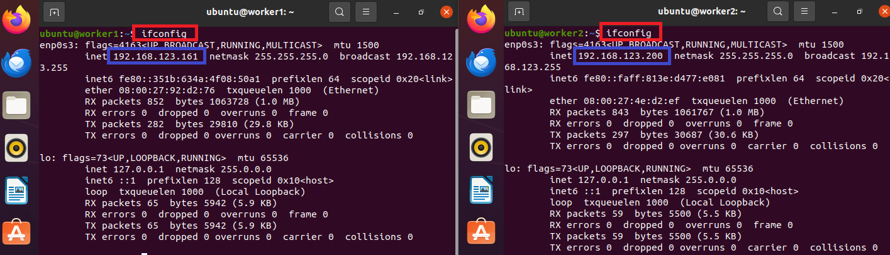

---
- 세션 생성 

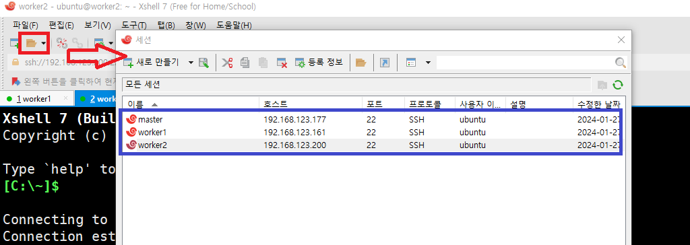

---
- xshell 접속 

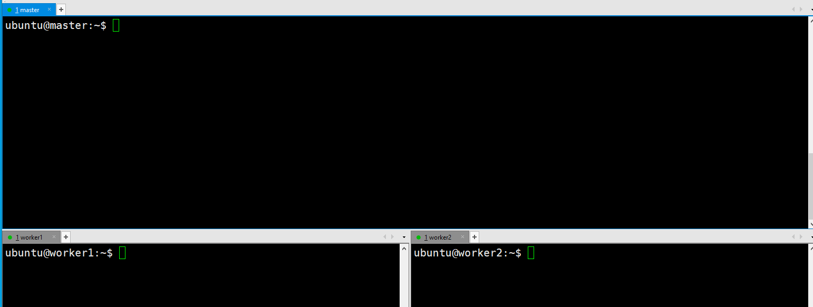

---
### 단계4: root 계정 전환 
```shell
su -
```


---
### 단계4: master > kubeadm init
- apiserver-advertise-address <master ip>으로 수정 
```shell
kubeadm init --apiserver-advertise-address 192.168.123.177 --pod-network-cidr=10.1.0.0/16
```


---
- 초기화 완료 
- 파란색 부분 따로 저장


---
### 단계5: 사용자 정의 > root 
```shell
mkdir -p $HOME/.kube
sudo cp -i /etc/kubernetes/admin.conf $HOME/.kube/config
sudo chown $(id -u):$(id -g) $HOME/.kube/config
```
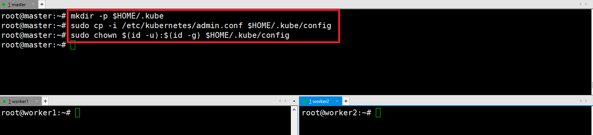

---
### 단계6: kube nodes 확인 
```shell
kubectl get no
``` 


---
### 단계7: workers 클러스트에 추가  
```shell
kubeadm join 192.168.123.177:6443 --token 0dili4.ehx7yanfv0hl3h6d \
	--discovery-token-ca-cert-hash sha256:5ff3b518de8b5985bc7f5be07c1a4ac1012643839131368b4faf6a94a360167b
```


---
- 확인 
```shell
kubectl get no
``` 
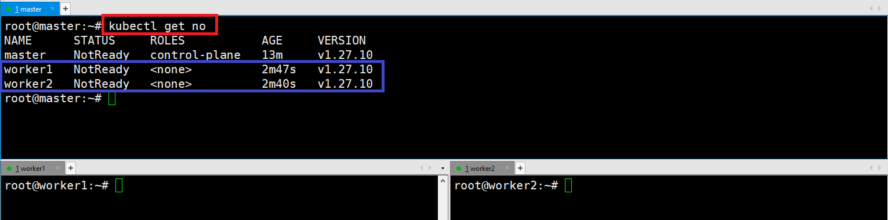

---
### 단계8: [Container Network Interface 설치]((https://docs.tigera.io/calico/latest/getting-started/kubernetes/quickstart))  
- CNI 디렉토리 생성
```shell
mkdir cni
cd cni
```
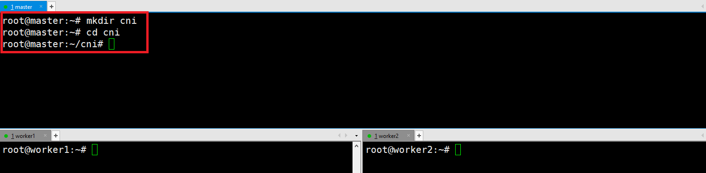

---
- Install the Tigera Calico operator
```shell
kubectl create -f https://raw.githubusercontent.com/projectcalico/calico/v3.27.0/manifests/tigera-operator.yaml
```
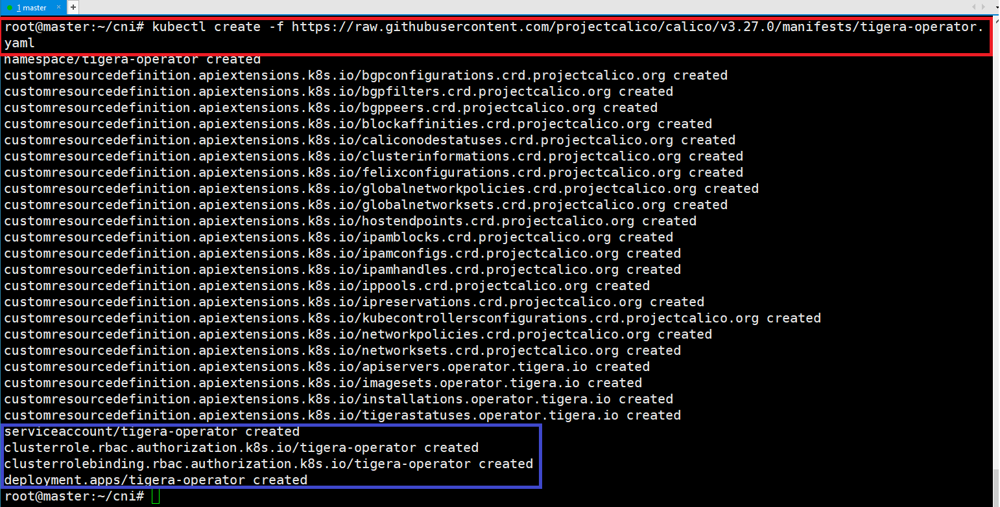

---
- custom-resources.yaml 다운로드 및 수정 
```shell
wget https://raw.githubusercontent.com/projectcalico/calico/v3.27.0/manifests/custom-resources.yaml

vim custom-resources.yaml
# 아래 내용으로 수정 
cidr: 10.1.0.0/16
```
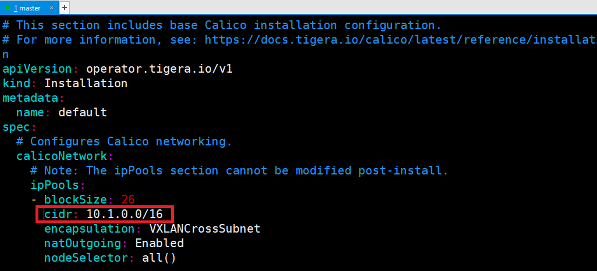

---
- Install Calico by creating the necessary custom resource
```shell
kubectl create -f custom-resources.yaml
```
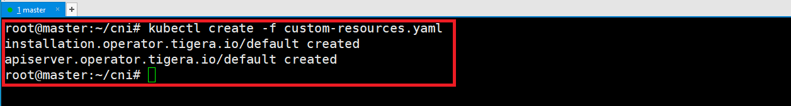
- CNI 설치 확인 
```shell
kubectl get ns
```
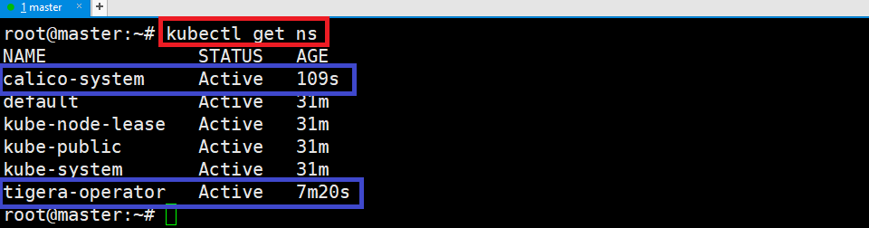

---
### 단계9: 클러스터 구축 확인  
```shell
kubectl get all -n tigera-operator
```


---
```shell
kubectl get all -n calico-system
```


---
```shell
kubectl get all -n kube-system
```
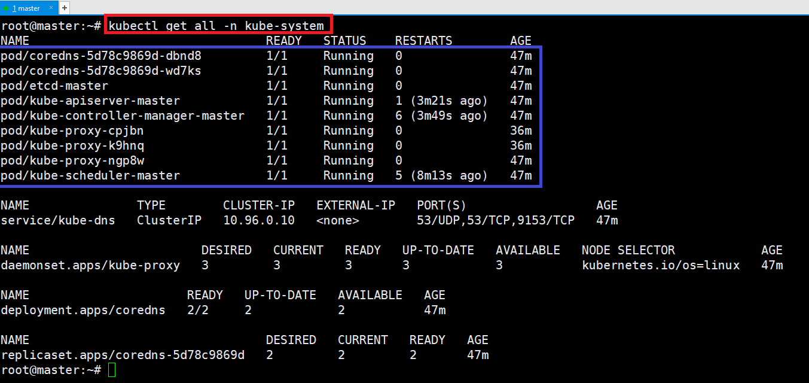

---
### 단계9: (옵션)[kubectl autocomplete](https://kubernetes.io/docs/reference/kubectl/quick-reference/)
- 자동완성 명령어 세팅 
```shell
cd ~
source <(kubectl completion bash) 
echo "source <(kubectl completion bash)" >> ~/.bashrc 
alias k=kubectl
complete -o default -F __start_kubectl k
```


