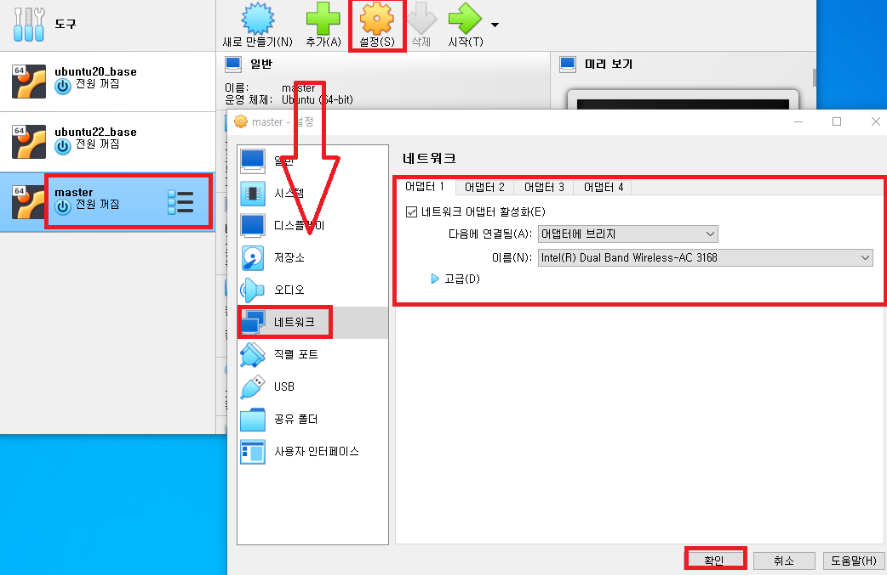
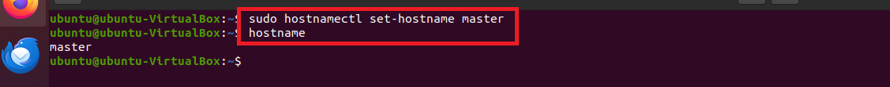

# 인스턴스 최소 스펙 
- CPU: 2 core 
- RAM: 2 GiB 
- Storage: 30 GB


---
### 단계1: master 생성 & 어댑터에 브리지


---
### 단계2: update & install
```shell
sudo apt-get -y update && \
sudo apt-get -y upgrade && \
sudo apt-get -y dist-upgrade && \
sudo apt-get install -y vim wget unzip ssh openssh-* net-tools chrony
```


---
### 단계3: ssh start 
- xshell과 연결하기 위해서 실행 
```shell
sudo service ssh start
sudo systemctl status sshd
```


---
### 단계4: [chrony](https://access.redhat.com/documentation/ko-kr/red_hat_enterprise_linux/7/html/system_administrators_guide/ch-configuring_ntp_using_the_chrony_suite#doc-wrapper)
- Chrony 는 NTP(Network Time Protocol) 구현입니다.   
```shell
sudo vim /etc/chrony/chrony.conf

# 아래내용 수정 
#pool ntp.ubuntu.com        iburst maxsources 4
#pool 0.ubuntu.pool.ntp.org iburst maxsources 1
#pool 1.ubuntu.pool.ntp.org iburst maxsources 1
#pool 2.ubuntu.pool.ntp.org iburst maxsources 2
server 203.248.240.140 iburst maxsources 2
```
---


---
- 재실행 
```shell
sudo systemctl restart chrony
sudo systemctl status chrony
chronyc sources
```


---
### 단계5: timezone 
```shell
sudo timedatectl set-timezone Asia/Seoul
date
```


### 단계6: hostname


---
### 단계7: master ip 확인  
```shell
ifconfig
```


---
### 단계8: xshell의 세션 생성 
- 이름: master
- 호스트: master ip
- 로그인할 아이디: ubuntu
- 로그인할 비번: ubuntu

---


---
- 접속 확인 


