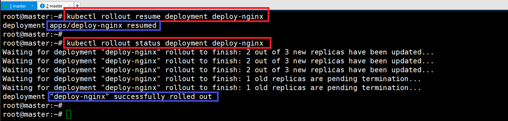

### 단계1: Deployment 
- ReplicaSet을 컨트롤해서 Pod 수를 조절 
- [Rolling Update & Rolling Back](https://kubernetes.io/ko/docs/tutorials/kubernetes-basics/update/update-intro/)


--- 
- deploy-nginx.yaml 생성 
```shell
vim deploy-nginx.yaml
```
```yaml
apiVersion: apps/v1
kind: Deployment
metadata:
  name: deploy-nginx
spec:
  replicas: 3
  selector:
    matchLabels:
      app: webui
  template:
    metadata:
      name: nginx-pod
      labels:
        app: webui
    spec:
      containers:
      - name: nginx-container
        image: nginx:1.14
```
---
- deploy-nginx.yaml 실행 
```shell
kubectl create -f deploy-nginx.yaml
# 결과 > deploy가 rs를 만듬 > rs가 pod를 만듬  
kubectl get deploy,rs,pod 
```


---
- deploy 삭제 
```shell
# pod 삭제 > 다시 생성됨 
kubectl delete pod deploy-nginx-9cc457697-9rtt7
kubectl get rs deploy-nginx-9cc457697

# ReplicaSet 삭제 > 다시 생성됨 
kubectl delete rs deploy-nginx-9cc457697
kubectl get rs

# Deployment 삭제 > ReplicaSet & pod 모두 삭제 
kubectl delete deployments.apps deploy-nginx
kubectl get pod
```

---


---
### 단계2: Rolling Update > set
- 롤링 업데이트는 파드 인스턴스를 점진적으로 새로운 것으로 업데이트하여 디플로이먼트 업데이트가 서비스 중단 없이 이루어질 수 있도록 해준다.


---
#### 테스트 > nginx 버전 변경 
```shell
kubectl get pods -o wide --watch # rolling update 확인!!
```
```shell
kubectl create -f deploy-nginx.yaml --record # record: history를 기록함 
kubectl set image deployment deploy-nginx nginx-container=nginx:1.15 --record
```


---
- 변경된 버전 확인 
```shell
kubectl get pods -o wide
kubectl describe pod deploy-nginx-6459b7498d-bwhqf
```


---
#### 테스트 > pause
- rolling update 잠시 중단 

```shell
# rolling update
kubectl set image deployment deploy-nginx nginx-container=nginx:1.16 --record
# pause
kubectl rollout pause deployment deploy-nginx
# status
kubectl rollout status deployment deploy-nginx
```


---
#### 테스트 > resume
- rolling update 재실행 
```shell
# resume
kubectl rollout resume deployment deploy-nginx
# status
kubectl rollout status deployment deploy-nginx
```


---
### 단계3: history
```shell
kubectl rollout history deployment deploy-nginx
```


---
### 단계4: Rolling Back > undo
- `--to-revisio`:history 기준 과거 버전으로 롤백 
  - 기존 버전이 사라지고 새로운 버전이 생성됨 (1 version -> 4 version)
```shell
kubectl rollout undo deployment deploy-nginx --to-revision=1
```


---
- 테스트 deploy 삭제 
```shell
kubectl delete deployments.apps deploy-nginx
kubectl get pod
```


