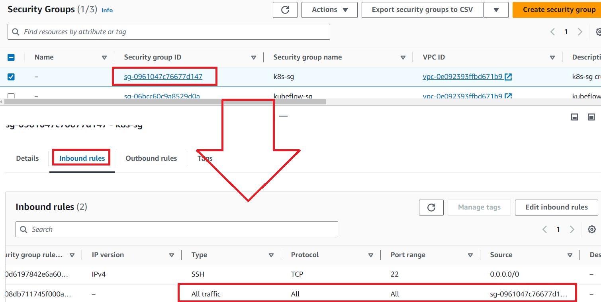
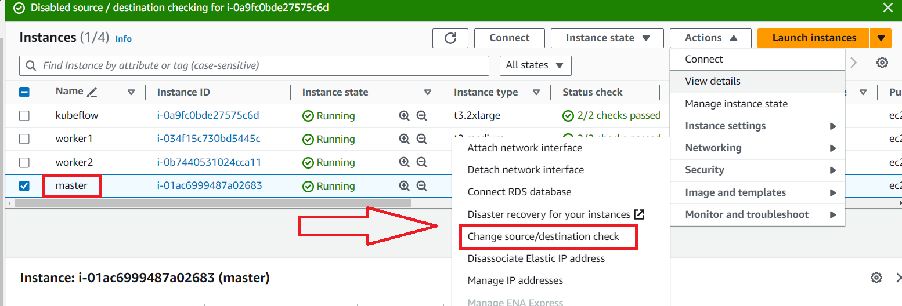
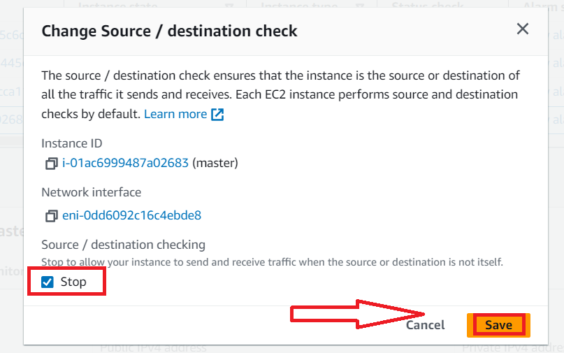

# [AWS EC2 Network](https://dev.classmethod.jp/articles/external-communication-from-private-ec2-instance-to-nat-instance/)
- 기본적으로 인스턴스는 트래픽이 자신이 목적지가 아닌 IP 트래픽이 들어왔을 경우 폐기합니다. 반대로 인스턴스에서 나가는 트래픽의 출발지 IP가 자기자신이 아닌 경우도 폐기합니다.
- NAT Instance는 masquerade(마스커레이드)를 통해서 출발지 IP와 포트 번호를 변경하고 기록합니다. 이후 라우팅 테이블에 따라서 인터넷 게이트웨이로 트래픽을 보내게 됩니다. 즉 Private EC2에서 보내는 출발지 IP와 포트 번호를 변경하기 때문에「소스/대상 확인 비활성화」를 할 필요가 있습니다.

---
### Security Groups

---

---

