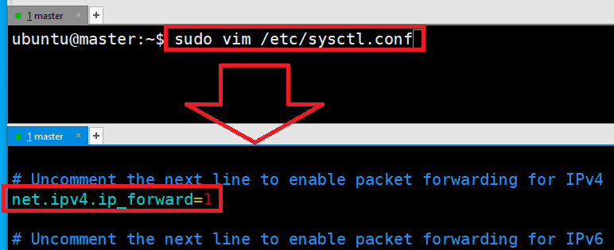
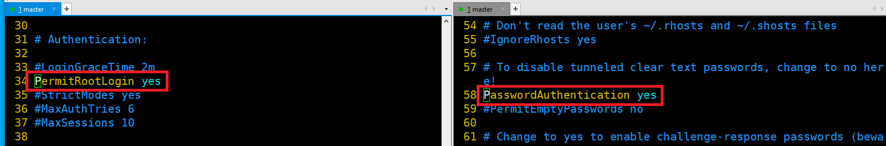
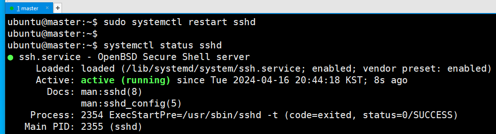
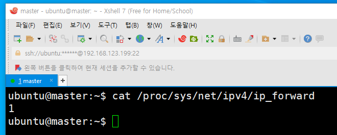

### 단계1: swap off
- K8s에서는 swap 기능이 켜져 있으면 문제가 발생할 수 있으므로 꺼줘야 한다.
```shell
sudo swapoff -a

# 재부팅되더라도 유지될 수 있도록 아래와 같이 swap 부분을 주석 처리해준다.
sudo vim /etc/fstab
```
---


---
### 단계2: ip_forward 
- 가상화 머신끼리 패킷을 주고받을 수 있도록 ip_forward 기능을 켜줘야 한다.
- Enable: 1 / Disable: 0
```shell
sudo vim /etc/sysctl.conf

# 아래와 같이 주석 제거 
net.ipv4.ip_forward=1
```


---
### 단계3: sshd_config
```shell
sudo vim /etc/ssh/sshd_config

# sshd_config파일에서 아래와 같이 수정 
PermitRootLogin yes # (root 로그인 허용여부를 결정함,yes, no, without-password를 사용할 수 있음) 
PasswordAuthentication yes # (열쇠글 인증을 설정하는 것으로 프로토콜 버전 1과 2 모두 적용) 
```


---
### 단계4: ssh restart
```shell
# 재실행 
sudo systemctl restart sshd
# 확인 
systemctl status sshd
```


---
### 단계5: Reboot & ip_forward 확인 
```shell
# 재부팅
sudo reboot

cat /proc/sys/net/ipv4/ip_forward
```



