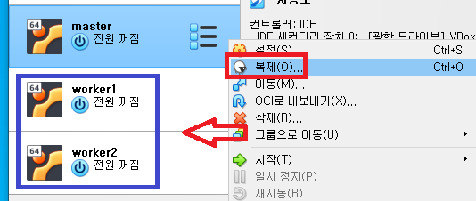
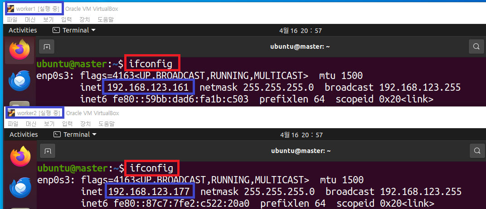
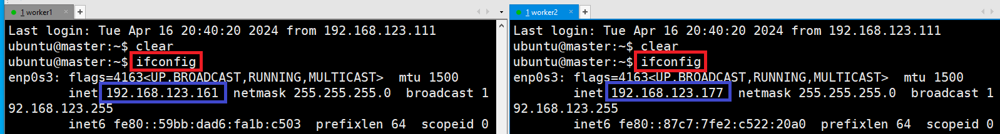
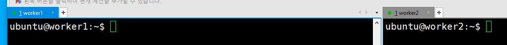
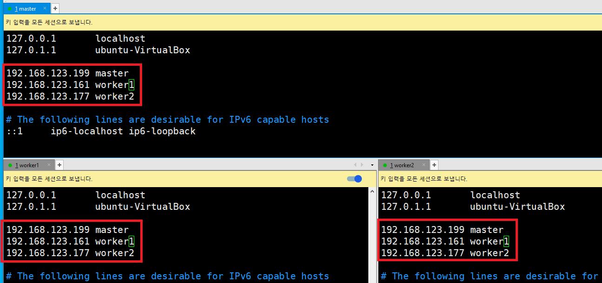
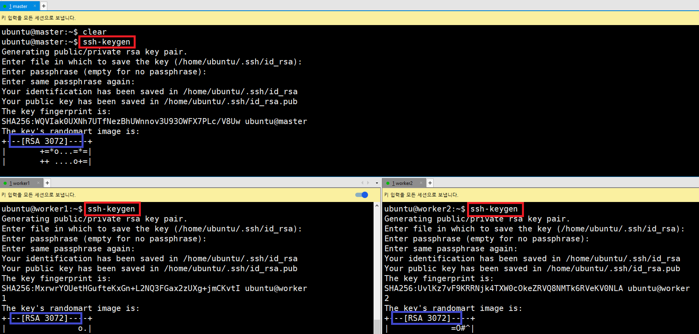
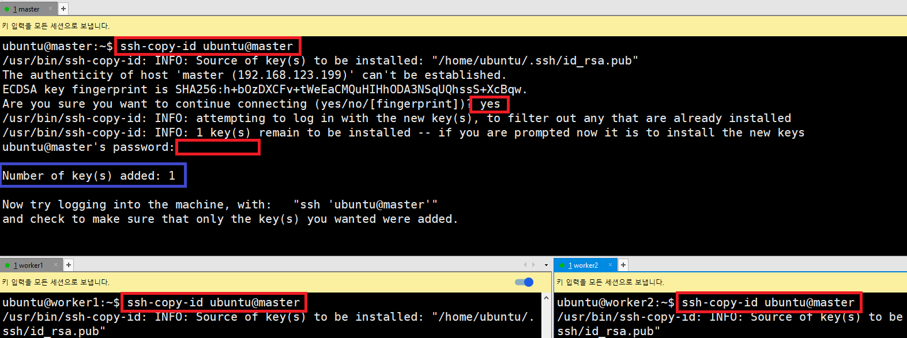
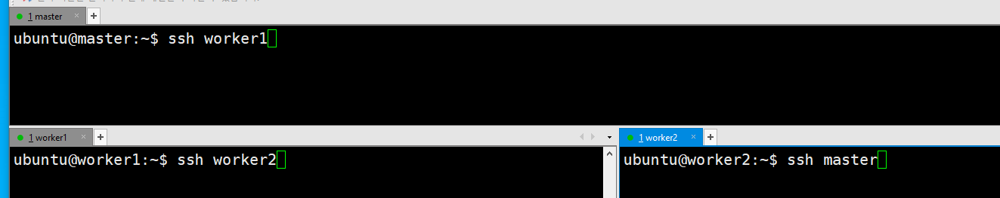

# Workers 생성

---
### 단계1: workers 생성
- 하드웨어
    - OS: ubuntu 20.04 LTS / CPU: 2 Core
    - RAM: 4096 MB / Storage: 30 ~ 40 GB
- 네트워크 
    - 어댑터에 브리지 



---
### 단계2: ifconfig
- worker1 ip: 192.168.123.161 / worker2 ip: 192.168.123.177
```shell
ifconfig
```


---
### 단계3: Xshell 접속 
- worker1 ip: 192.168.123.161 
- worker2 ip: 192.168.123.177



---
### 단계4: hostname & Reboot
- worker1
```shell
sudo hostnamectl set-hostname worker1
# 재기동
sudo reboot
```
- worker2
```shell
sudo hostnamectl set-hostname worker2
# 재기동
sudo reboot
```


---
# Cluster 구축 

---
### 단계1: hosts
```shell
sudo vim /etc/hosts

# 아래와 같이 입력 (ip는 위에서 확인)
192.168.123.199 master
192.168.123.161 worker1
192.168.123.177 worker2
```
---


---
### 단계2: ssh-key 생성
```shell
ssh-keygen # enter 3번 입력 
```


---
### 단계3: ssh public key 교환
- master & worker1 & worker2에서 모두 복사(key 교환)
- 입력순서: yes & 비번
```shell
ssh-copy-id ubuntu@master
ssh-copy-id ubuntu@worker1
ssh-copy-id ubuntu@worker2
```
---


---
### 단계4: ssh 접속 테스트 



