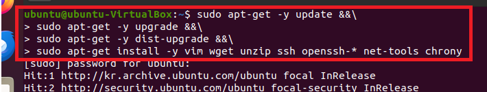

### 단계1: worker 생성
- 인스턴스 최소 스펙 
    - CPU: 3 core 
    - RAM: 4 GiB 
    - Storage: 50 GB


---
### 단계2: 네트워크 > 어댑터에 브리지


---
### 단계3: update & install
```shell
sudo apt-get -y update &&\
sudo apt-get -y upgrade &&\
sudo apt-get -y dist-upgrade &&\
sudo apt-get install -y vim wget unzip ssh openssh-* net-tools chrony
```


---
### 단계4: ssh start 
- [오류발생시](https://blog.msalt.net/326)
- xshell과 연결하기 위해서 실행 
```shell
sudo systemctl status sshd
# 실행이 안되어 있으면, 실행 
sudo service ssh start
```


---
### 단계5: hostname & 재기동 
```shell
sudo hostnamectl set-hostname worker
hostname
# 재기동
sudo reboot
``` 


---
### 단계6: root 계정 접속 
```shell
sudo passwd root # 비번 설정 
su - root # root 계정 접속
```


---
### 단계7: ifconfig
- ip: 192.168.123.182
```shell
ifconfig
```


---
### 단계8: Xshell 접속 


