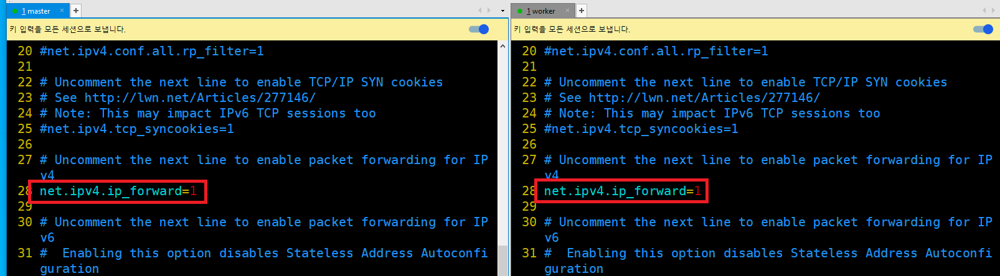

# master & worker 모두 적용 

---
### 단계1: swap off
- K8s에서는 swap 기능이 켜져 있으면 문제가 발생할 수 있으므로 꺼줘야 한다.
```shell
sudo swapoff -a
```


---
- 재부팅되더라도 유지될 수 있도록 아래와 같이 swap 부분을 주석 처리해준다.
```shell
sudo vim /etc/fstab
```


---
### 단계2: ip_forward 설정  
- 가상화 머신끼리 패킷을 주고받을 수 있도록 ip_forward 기능을 켜줘야 한다.
- Enable: 1 / Disable: 0
```shell
sudo vim /etc/sysctl.conf
# 아래와 같이 주석 제거 
net.ipv4.ip_forward=1
```


---
### 단계3: 재부팅 후 ip_forward 확인 
```shell
# 재부팅
sudo reboot

cat /proc/sys/net/ipv4/ip_forward
```


