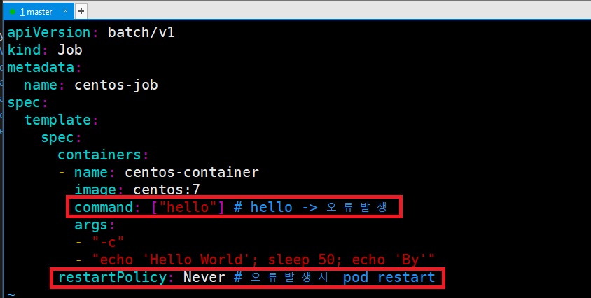
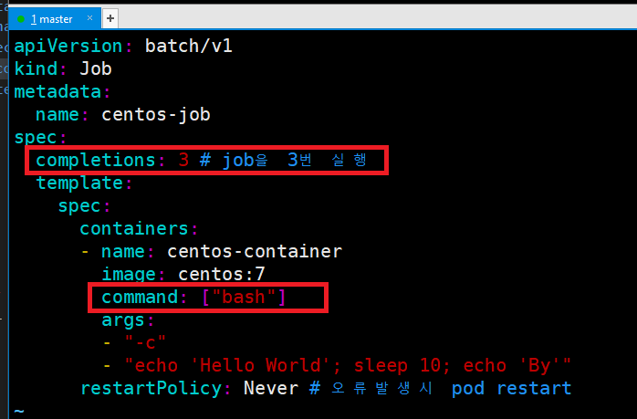

# [Job](https://kubernetes.io/ko/docs/concepts/workloads/controllers/job/)
- 잡에서 하나 이상의 파드를 생성하고 지정된 수의 파드가 성공적으로 종료될 때까지 계속해서 파드의 실행을 재시도한다. 파드가 성공적으로 완료되면, 성공적으로 완료된 잡을 추적한다.


---
### 단계1: Job 
- job-exam.yaml 생성 
```shell
vim job-exam.yaml
```
```yaml
apiVersion: batch/v1
kind: Job
metadata:
  name: centos-job
spec:
  template:
    spec:
      containers:
      - name: centos-container
        image: centos:7
        command: ["bash"]
        args:
        - "-c"
        - "echo 'Hello World'; sleep 50; echo 'By'"
      restartPolicy: Never # 오류발생시 pod restart
```
---
- job-exam.yaml 실행 
```shell
kubectl get pods -o wide --watch
```
```shell
kubectl create -f job-exam.yaml
kubectl delete pod # 다시 pod가 생성됨 
```


---
- job-exam.yaml 삭제 
```shell
kubectl get jobs
kubectl delete jobs.batch centos-job
kubectl get jobs
```


---
### 단계2: Job with OnFailure
- job-exam.yaml 수정 
```shell
vim job-exam.yaml
```
```yaml
apiVersion: batch/v1
kind: Job
metadata:
  name: centos-job
spec:
  backoffLimit: 3 # (기본값은 6) OnFailure인 경우 3번 시도 
  template:
    spec:
      containers:
      - name: centos-container
        image: centos:7
        command: ["hello"] # hello -> 오류발생 
        args:
        - "-c"
        - "echo 'Hello World'; sleep 50; echo 'By'"
      restartPolicy: OnFailure # 오류발생시 container restart
```
---


---
- job-exam.yaml 실행 > 3번 시도 후 pod 삭제 & job은 유지 
```shell
kubectl get pods -o wide --watch
```
```shell
kubectl create -f job-exam.yaml
kubectl get jobs
kubectl delete jobs.batch centos-job
```


---
### 단계3: Job with Never
- job-exam.yaml 수정 
```shell
vim job-exam.yaml
```
```yaml
apiVersion: batch/v1
kind: Job
metadata:
  name: centos-job
spec:
  template:
    spec:
      containers:
      - name: centos-container
        image: centos:7
        command: ["hello"] # hello -> 오류발생 
        args:
        - "-c"
        - "echo 'Hello World'; sleep 50; echo 'By'"
      restartPolicy: Never # 오류발생시 pod restart
```
---


---
- job-exam.yaml 실행 > 계속 pod restart
```shell
kubectl get pods -o wide --watch
```
```shell
kubectl create -f job-exam.yaml
kubectl get jobs
kubectl delete jobs.batch centos-job
```


---
### 단계4: Job with completions
- job-exam.yaml 수정 
```shell
vim job-exam.yaml
```
```yaml
apiVersion: batch/v1
kind: Job
metadata:
  name: centos-job
spec:
  completions: 3 # job을 3번 실행 
  template:
    spec:
      containers:
      - name: centos-container
        image: centos:7
        command: ["bash"]
        args:
        - "-c"
        - "echo 'Hello World'; sleep 10; echo 'By'"
      restartPolicy: Never # 오류발생시 pod restart
```
---


---
- job-exam.yaml 실행 > job 3번 실행 
```shell
kubectl get pods -o wide --watch
```
```shell
kubectl create -f job-exam.yaml
kubectl get jobs
kubectl delete jobs.batch centos-job
```


---
### 단계5: Job with parallelism
- job-exam.yaml 수정 
```shell
vim job-exam.yaml
```
```yaml
apiVersion: batch/v1
kind: Job
metadata:
  name: centos-job
spec:
  completions: 3 # job을 3번 실행 
  parallelism: 3 # 동시에 3개 job을 실행 
  template:
    spec:
      containers:
      - name: centos-container
        image: centos:7
        command: ["bash"]
        args:
        - "-c"
        - "echo 'Hello World'; sleep 5; echo 'By'"
      restartPolicy: Never # 오류발생시 pod restart
```
---


---
- job-exam.yaml 실행 > job 3개를 동시에 실행 
```shell
kubectl get pods -o wide --watch
```
```shell
kubectl create -f job-exam.yaml
kubectl get jobs
kubectl delete jobs.batch centos-job
```


---
### 단계6: Job with activeDeadlineSeconds
- job-exam.yaml 수정 
```shell
vim job-exam.yaml
```
```yaml
apiVersion: batch/v1
kind: Job
metadata:
  name: centos-job
spec:
  activeDeadlineSeconds: 15 # 15초 이내로 job을 강제 종료 
  template:
    spec:
      containers:
      - name: centos-container
        image: centos:7
        command: ["bash"]
        args:
        - "-c"
        - "echo 'Hello World'; sleep 50; echo 'By'"
      restartPolicy: Never # 오류발생시 pod restart
```
---


---
- job-exam.yaml 실행 > 15초 이내로 job을 강제 종료 
```shell
kubectl get pods -o wide --watch
```
```shell
kubectl create -f job-exam.yaml
kubectl get jobs
kubectl delete jobs.batch centos-job
```


