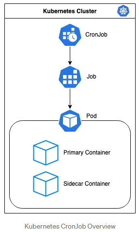

# [CronJob](https://kubernetes.io/ko/docs/concepts/workloads/controllers/cron-jobs/)
- 크론잡은 반복 일정에 따라 잡을 만든다.



---
### Cronjob Schedule
- `0 0 13 * 5`: 해당 작업이 매주 금요일 자정에 시작되어야 하고, 매월 13일 자정에도 시작되어야 한다는 뜻


---


---
### 단계1: CronJob 
- cronjob-exam.yaml 생성 
```shell
vim cronjob-exam.yaml
# 아래 입력 
apiVersion: batch/v1
kind: CronJob
metadata:
  name: hello
spec:
  schedule: "* * * * *" # 1분마다 실행
  startingDeadlineSeconds: 500 # 500초 안에 job이 시작하지 않으면, 취소함 
  successfulJobsHistoryLimit: 3 # 성공이력을 3개까지만 저장
  failedJobsHistoryLimit: 1 # 실패이력을 1개까지만 저장  
  concurrencyPolicy: Forbid # running 중인 job이 있으면, 실행하지 않음  
  jobTemplate:
    spec:
      template:
        spec:
          containers:
          - name: hello
            image: busybox
            args:
            - /bin/sh
            - -c
            - echo Hello; sleep 10; echo Bye
          restartPolicy: Never # 오류발생시 pod restart
```
---


---
- cronjob-exam.yaml 실행 
```shell
kubectl get pods -o wide --watch
```
```shell
kubectl create -f cronjob-exam.yaml
kubectl get cronjob
kubectl get pod # job이 4번 이상 실행 될때까지 기다림 > 하지만 생성된건 3개임 
kubectl delete cronjobs.batch hello
```


---
### 단계2: CronJob > Forbid
- cronjob-exam.yaml 수정 
```shell
vim cronjob-exam.yaml
# 아래 입력 
apiVersion: batch/v1
kind: CronJob
metadata:
  name: hello
spec:
  schedule: "* * * * *" # 1분마다 실행
  startingDeadlineSeconds: 500 # 500초 안에 job이 시작하지 않으면, 취소함 
  successfulJobsHistoryLimit: 3 # 성공이력을 3개까지만 저장
  failedJobsHistoryLimit: 1 # 실패이력을 1개까지만 저장  
  concurrencyPolicy: Forbid # running 중인 job이 있으면, 실행하지 않음  
  jobTemplate:
    spec:
      template:
        spec:
          containers:
          - name: hello
            image: busybox
            args:
            - /bin/sh
            - -c
            - echo Hello; sleep 90; echo Bye
          restartPolicy: Never # 오류발생시 pod restart
```
---


---
- cronjob-exam.yaml 실행 > 1분이 지났지만, 새로운 job이 생성되지 않았음 
```shell
kubectl get pods -o wide --watch
```
```shell
kubectl create -f cronjob-exam.yaml
kubectl delete cronjobs.batch hello
```


---
### 단계3: CronJob > Allow
- cronjob-exam.yaml 수정 
```shell
vim cronjob-exam.yaml
# 아래 입력 
apiVersion: batch/v1
kind: CronJob
metadata:
  name: hello
spec:
  schedule: "* * * * *" # 1분마다 실행
  startingDeadlineSeconds: 500 # 500초 안에 job이 시작하지 않으면, 취소함 
  successfulJobsHistoryLimit: 3 # 성공이력을 3개까지만 저장
  failedJobsHistoryLimit: 1 # 실패이력을 1개까지만 저장  
  concurrencyPolicy: Allow # running 중인 job이 있더라도 shedule에 따라 job 실행  
  jobTemplate:
    spec:
      template:
        spec:
          containers:
          - name: hello
            image: busybox
            args:
            - /bin/sh
            - -c
            - echo Hello; sleep 90; echo Bye
          restartPolicy: Never # 오류발생시 pod restart
```
---


---
- cronjob-exam.yaml 실행 > 1분이 지났지만, 새로운 job이 생성되지 않았음 
```shell
kubectl get pods -o wide --watch
```
```shell
kubectl create -f cronjob-exam.yaml
kubectl delete cronjobs.batch hello
```


