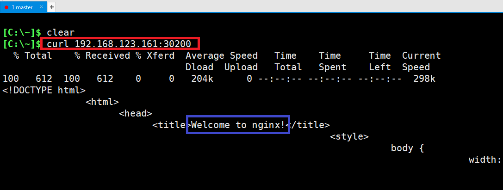

# [NodePort](https://kubernetes.io/docs/concepts/services-networking/service/?ref=seongjin.me#type-nodeport)
- 모든 노드를 대상으로 외부 접속 가능한 포트를 할당
- Default NodePort 범위: 30000-32767
- ClusterIP를 생성 후 NodePort를 생성 


---
### 단계1: nodeport-nginx.yaml 생성
```shell
vim nodeport-nginx.yaml
```
```yaml
apiVersion: v1
kind: Service
metadata:
  name: nodeport-service
spec:
  type: NodePort
  selector:
    app: webui
  ports:
  - protocol: TCP
    port: 80
    targetPort: 80
    nodePort: 30200
```


---
### 단계2: nodeport-nginx.yaml 실행 
```shell
kubectl create -f nodeport-nginx.yaml
kubectl get svc 
```


---
### 단계3: worker ip 확인 
```shell
kubectl get no -o wide
```


---
### 단계4: 외부 접속 > worker1 > ClusterIP > Pod > Container 접속
```shell
curl 192.168.123.161:30200
```


---
### 단계5: 외부 접속 > worker2 > ClusterIP > Pod > Container 접속
```shell
curl 192.168.123.200:30200
```


