# Helm Chart 구조 
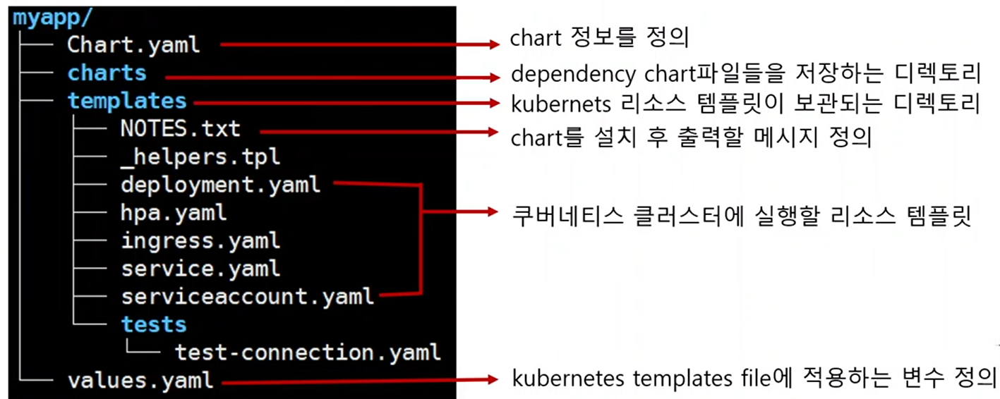

---
# Helm Chart 만들기 

---
### 단계1: templates yaml 만들기 
```shell
mkdir manifests && cd manifests

kubectl create deployment webserver --image nginx:1.25.2 --port 80 -o yaml > deployment.yaml
kubectl expose deployment webserver --port 80 --target-port 80 --type NodePort -o yaml > service.yaml

ls -l
```
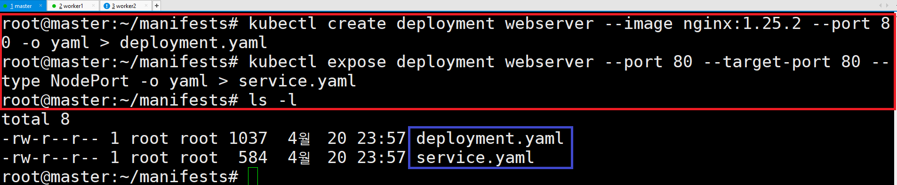

---
### 단계2: 생성된 webserver 확인
```shell
kubectl get all
```
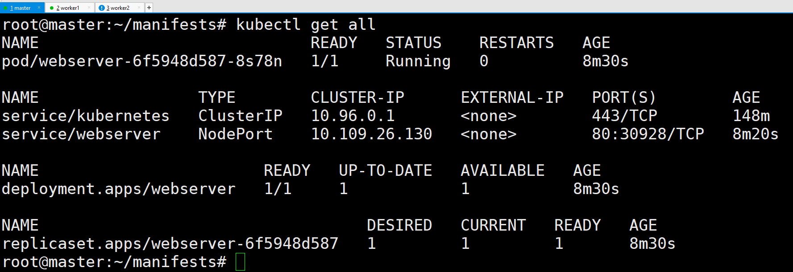

---
### 단계3: 생성된 webserver 삭제 
```shell
cd ~ 
kubectl delete -f manifests/
kubectl get all
```
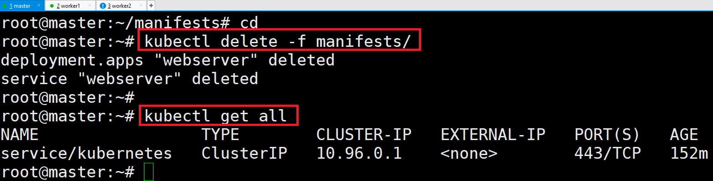

---
### 단계4: mynginx chart 생성 
```shell
helm create mynginx
tree mynginx/
```
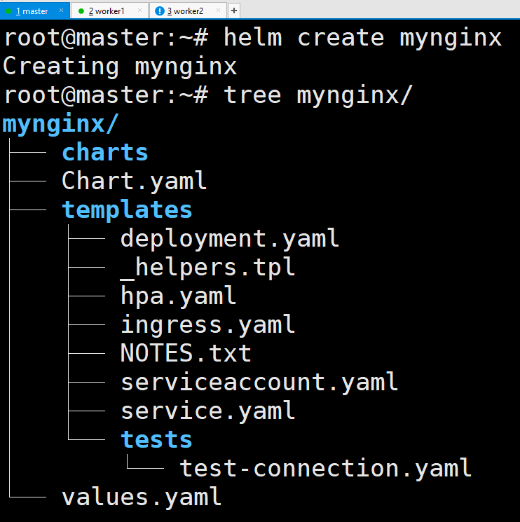

---
### 단계5: mynginx templates 수정 
```shell
rm mynginx/templates/*.yaml mynginx/templates/{_helpers.tpl,NOTES.txt}
rm -rf mynginx/templates/tests/
cp manifests/* mynginx/templates/

tree mynginx/
```
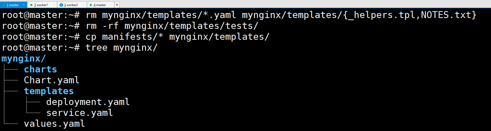

---
### 단계6: mynginx Chart.yaml 수정 
```shell
vim mynginx/Chart.yaml
# 수정 > description: A halm chart for running nginx web server
```
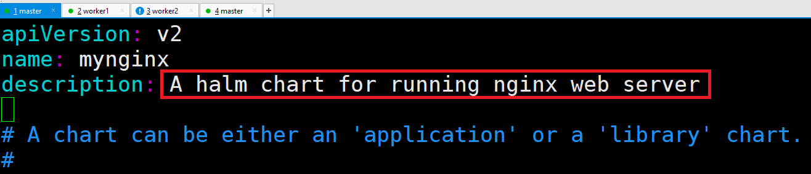

---
### 단계7: 생성된 chart 문법 오류 확인 
```shell
helm lint mynginx/
```
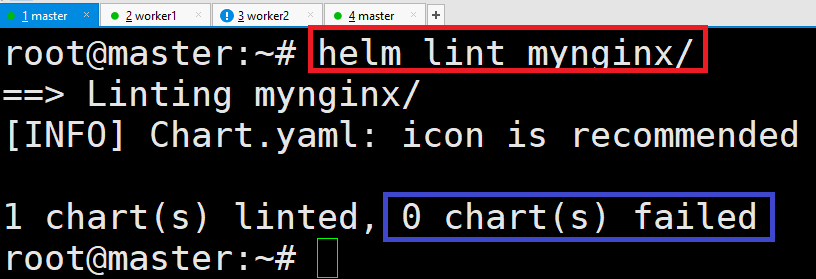

---
### 단계8: install mynginx
```shell
helm install webserver ./mynginx/

helm list
```
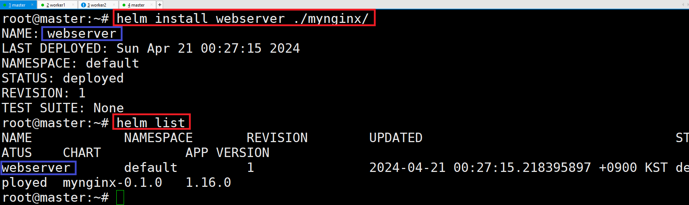

---
### 단계9: kubernetes 확인 
```shell
kubectl get all
```
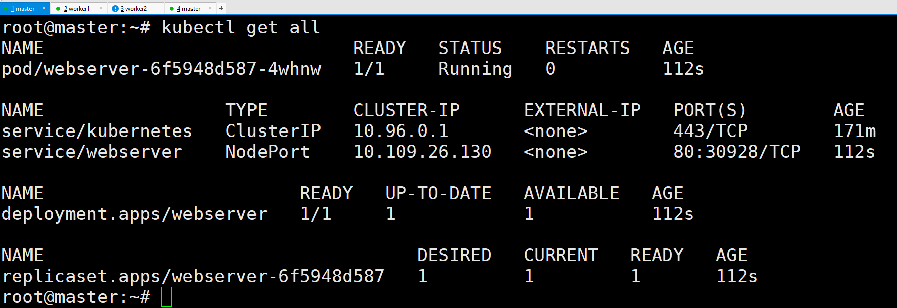

---
### 단계10: nginx 접속 
```shell
curl localhost:30928
```
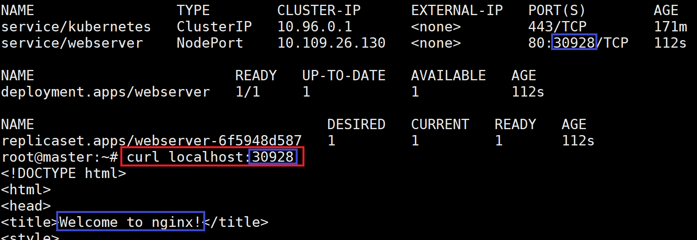

---
### 단계11: uninstall mynginx
```shell
helm uninstall webserver
helm list
```
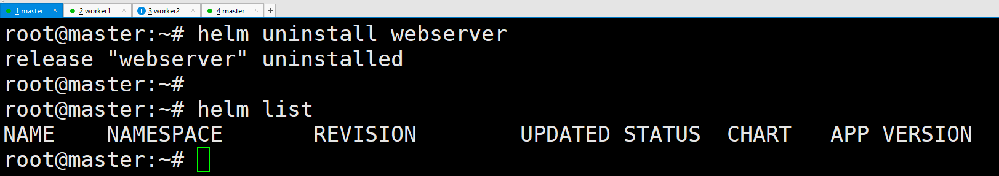

---
# Helm Chart 만들기 with values
- mynginx 폴더 참고

---
### 단계1: Chart.yaml 수정
```shell
cat > ./mynginx/Chart.yaml
apiVersion: v2
name: mynginx
description: A halm chart for running nginx web server

type: application

version: 0.1.0

appVersion: "1.16.0"
```
---
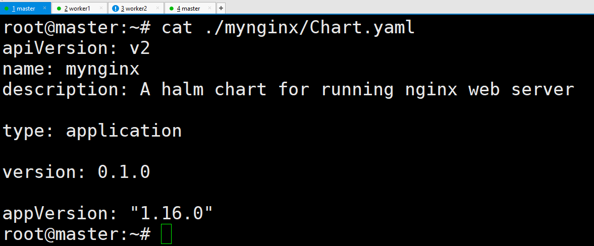

---
### 단계2: values.yaml 수정
```shell
cat > ./mynginx/values.yaml
replicaCount: 2
image:
  repository: nginx
  tag: 1.25.2
  pullPolicy: IfNotPresent
  pullSecret:
service:
  type: NodePort
```
---
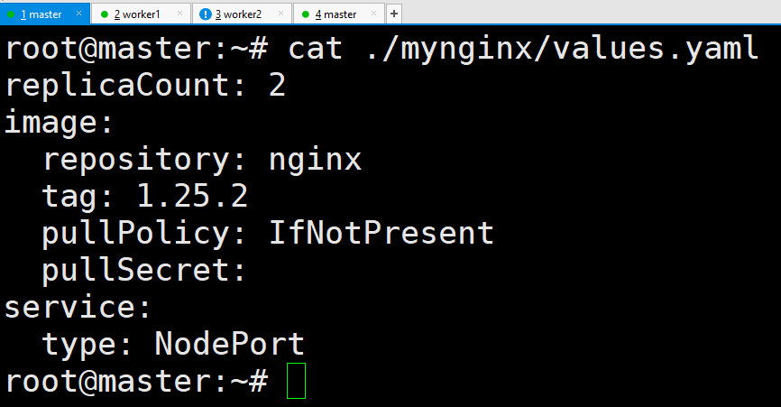

---
### 단계3: deployment.yaml 수정
```shell
cat > ./mynginx/templates/deployment.yaml
apiVersion: apps/v1
kind: Deployment
metadata:
  # Release.Name > helm install의 이름을 의미함 
  name: "deploy-{{ .Release.Name }}"
  namespace: default
spec:
  replicas: {{ .Values.replicaCount }}
  selector:
    matchLabels:
      app: "{{ .Chart.Name }}"
  template:
    metadata:
      labels:
        app: "{{ .Chart.Name }}"
    spec:
      containers:
      - image: "{{ .Values.image.repository }}:{{ .Values.image.tag }}"
        imagePullPolicy: "{{ .Values.image.pullPolicy }}"
        name: "{{ .Chart.Name }}"
        ports:
        - containerPort: 80
```
---
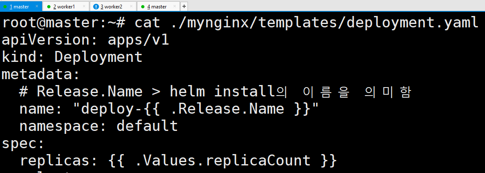

---
### 단계4: service.yaml 수정
```shell
cat > ./mynginx/templates/service.yaml
apiVersion: v1
kind: Service
metadata:
  # Release.Name > helm install의 이름을 의미함 
  name: "svc-{{ .Release.Name }}"
  namespace: default
spec:
  type: "{{ .Values.service.type }}"
  ports:
  - port: 80
    protocol: TCP
    targetPort: 80
  selector:
    app: "{{ .Chart.Name }}"
```
---
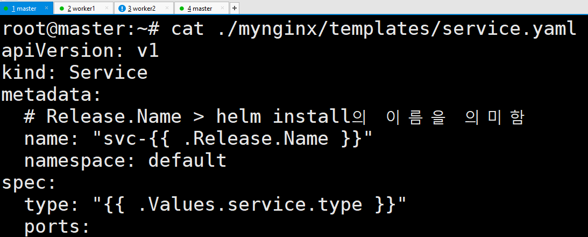

---
### 단계5: lint mynginx
```shell
helm lint mynginx/
```


---
### 단계8: install mynginx
```shell
helm install mynginx ./mynginx/
helm list
```
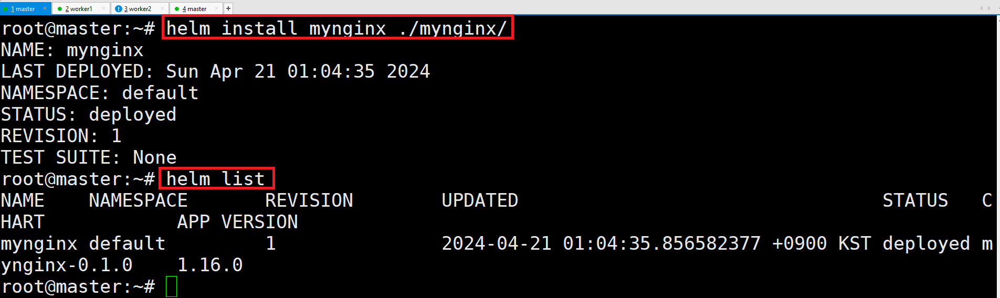

---
### 단계9: kubectl get all
```shell
kubectl get all
```
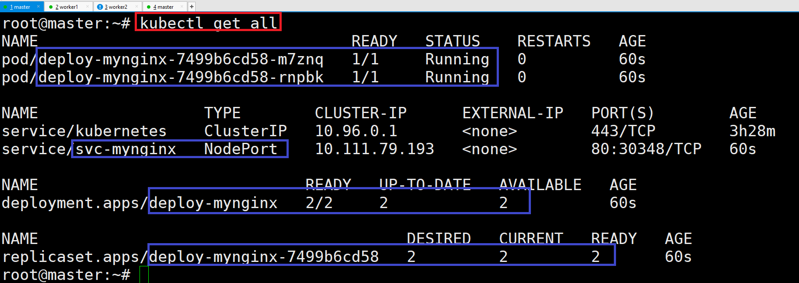

---
### 단계10: Nginx Server 
```shell
curl localhost:30348
```
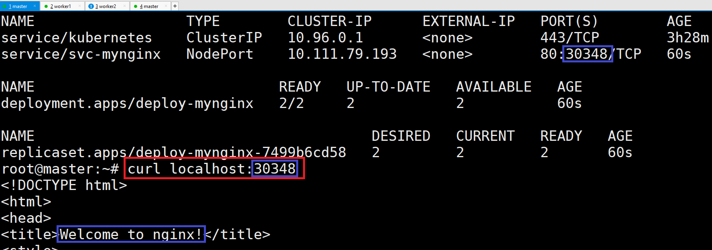

---
# Helm Chart 만들기 with rolling update & rollback

---
### 단계1: upgrade: nginx -> httpd(아파치 웹서버)
```shell
helm upgrade --set image.repository=httpd --set image.tag=2.2.34-alpine mynginx mynginx
```
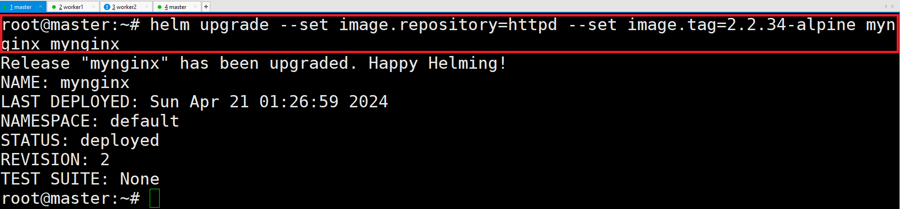

---
### 단계2: httpd Server 
```shell
curl localhost:30348
```
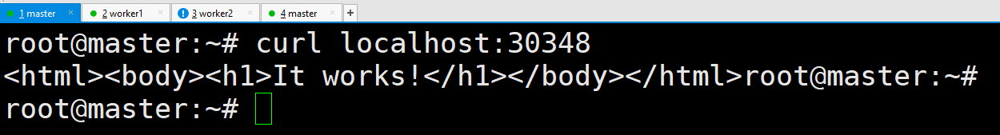

---
### 단계3: kubernetes는 변경되지 않았음 
```shell
kubectl get all
```
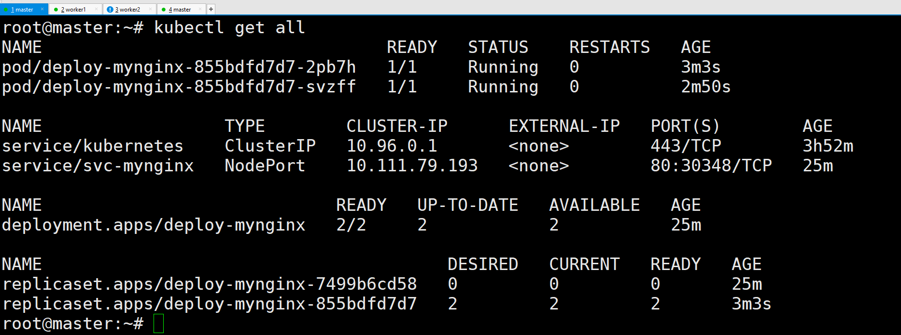

---
### 단계4: chart revision 변경됨 
- upgrade를 함으로써 chart 버전이 변경됨 
```shell
helm list
```


---
### 단계5: rollback
- revision 1로 rollback > revision 증가함 
```shell
helm rollback mynginx 1
# 롤백 검증 
curl localhost:30348
```
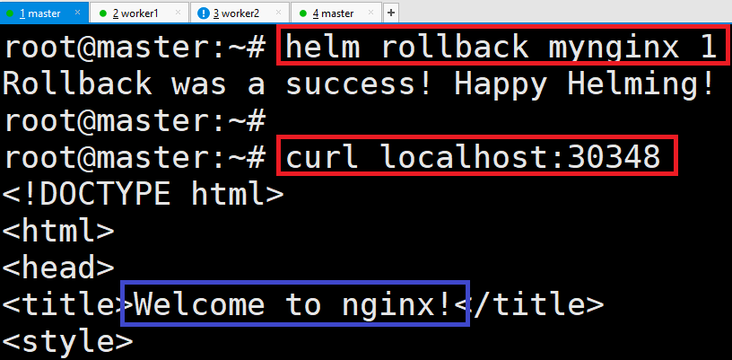

---
### 단계6: chart revision 변경됨 
```shell
helm list
```
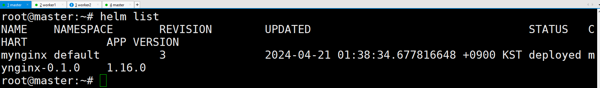

---
### 단계7: uninstall mynginx
```shell
helm uninstall mynginx
helm list
```
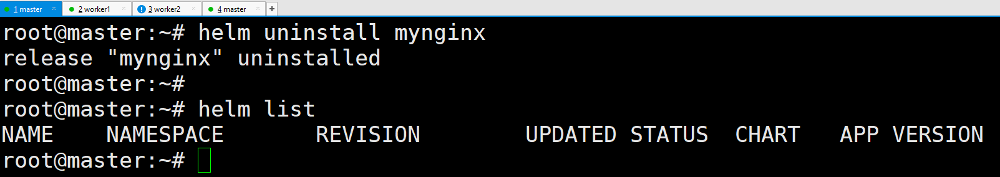

---
# Helm Chart Package 만들기 

---
### 단계1: Package 만들기 
```shell
helm package mynginx/
```
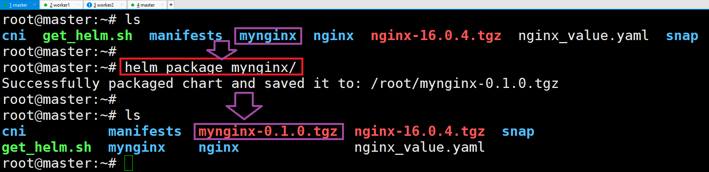

