# Helm Chart 저장소
- 패키지형 차트를 저장하고 공유할 수 있는 HTTP 서버 
- Index.yaml 파일과 패키지화 된 차트(name-version.tgz)를 이용해 배포 
- 클라이언트의 GET 요청에 응답하는 Amazon S3, Github, 웹 서버 등에서 운영 가능 

---
### 단계1: 등록된 chart repository 조회 
```shell
helm repo list
```
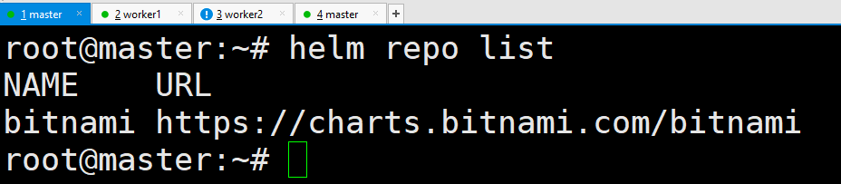

---
### 단계2: 패키지화 된 차트(name-version.tgz) 
```shell
ls 
```
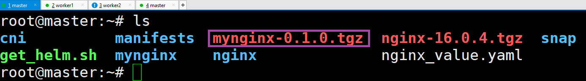

---
# Github Chart 저장소 만들기 

---
### 단계1: Repository 생성
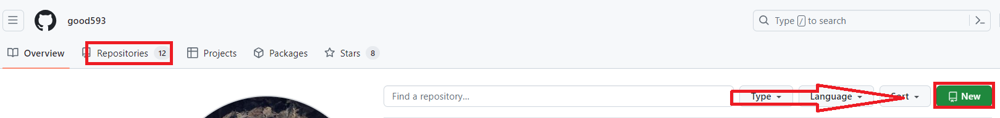

---
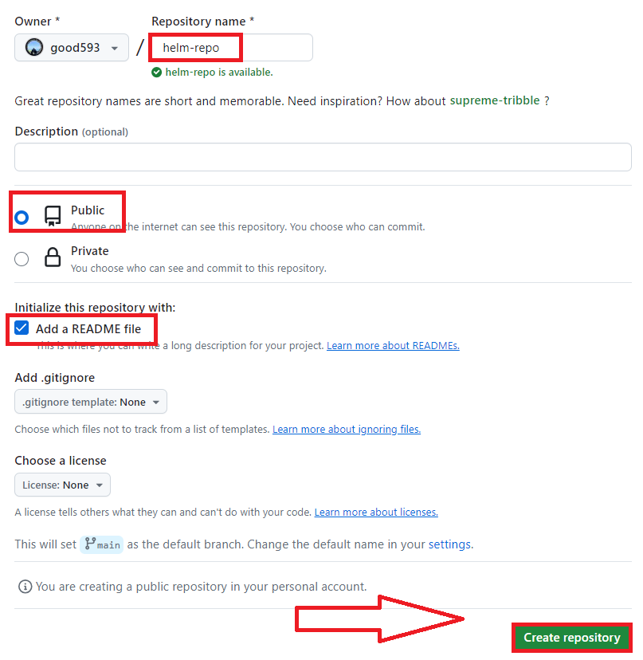

---
### 단계2: 토큰 생성 
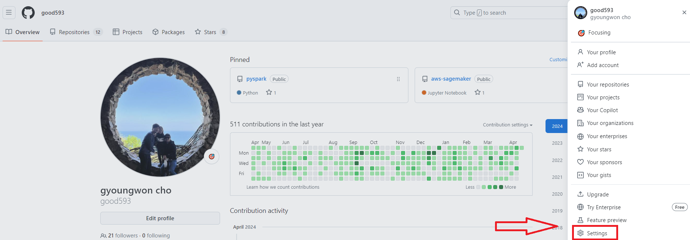

---
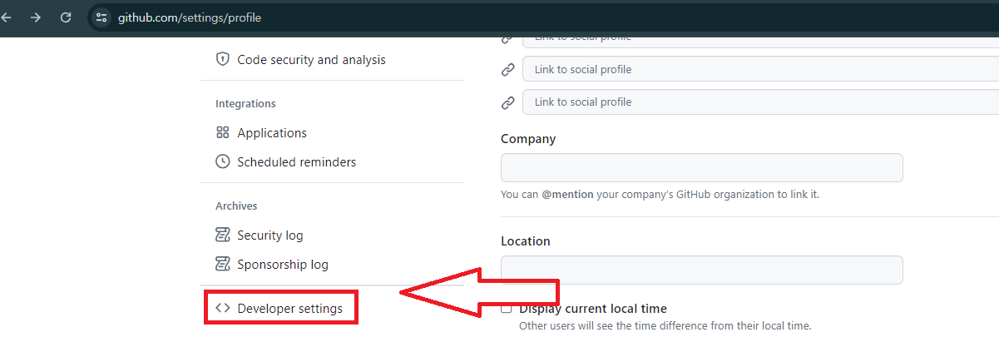

---
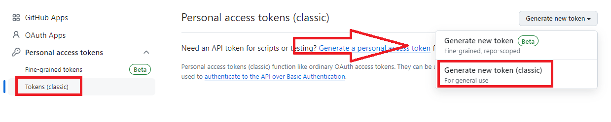

---
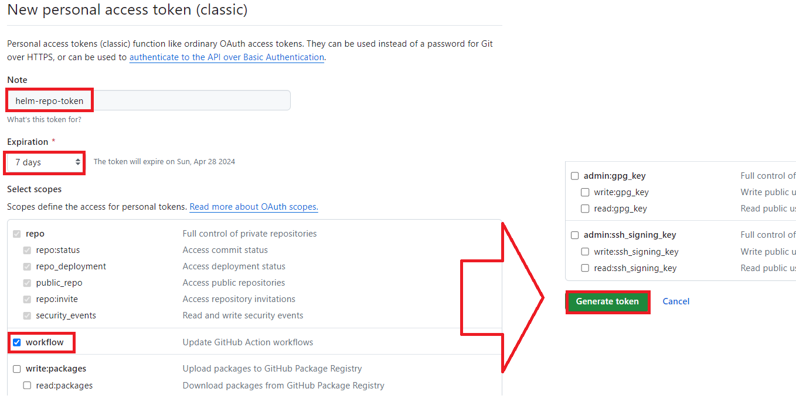

---
- 생성된 토큰 정보 복사: 토큰정보
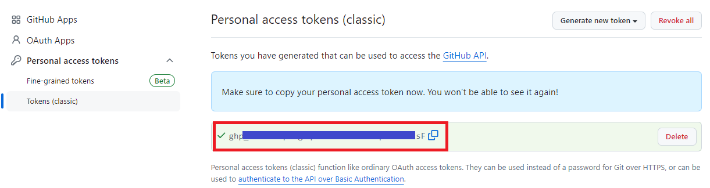

---
### 단계3: install git
```shell
sudo apt-get install -y git
git --version

git config --global user.email "goodwon593@gmail.com"
git config --global user.name "goodwon593"
```


---
### 단계4: clone git
- Repository 주소 복사 
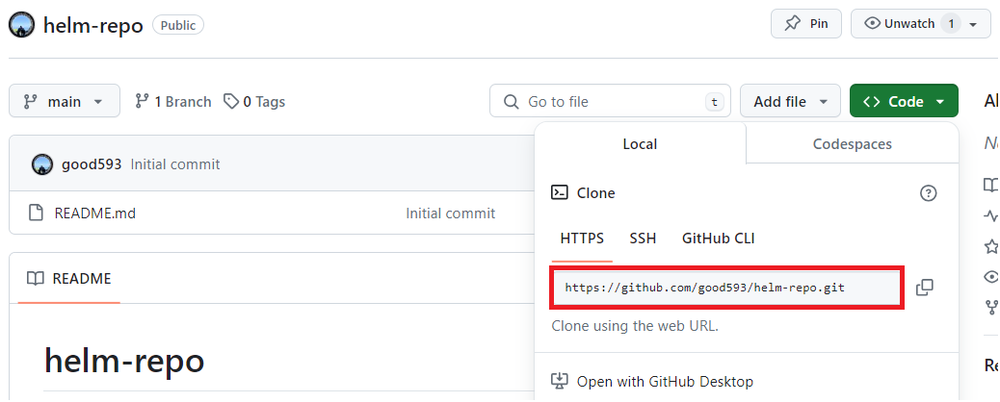

---
```shell
mkdir github && cd github
git clone https://github.com/good593/helm-repo.git
```
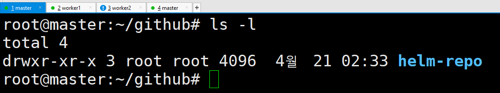

---
### 단계5: 패키지화 된 차트 복사 
```shell
cp ~/mynginx-0.1.0.tgz ~/github/helm-repo
ls -l ~/github/helm-repo/
```
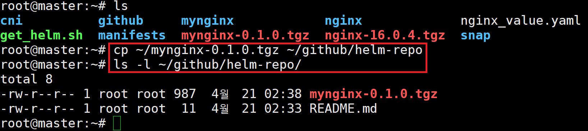

---
### 단계6: index.yaml 생성 
```shell
helm repo index ~/github/helm-repo
ls -l ~/github/helm-repo/
```
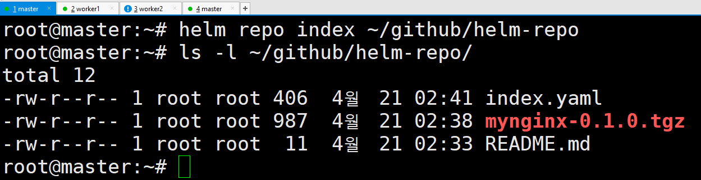

---
### 단계7: git commit
```shell
cd ~/github/helm-repo
git add .
git commit -m "create helm chart"
```
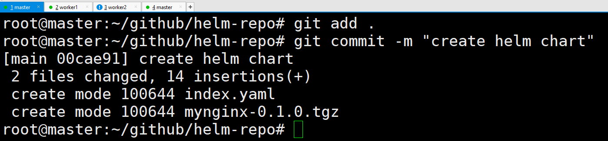

---
### 단계8: remote
```shell
git push -u origin main
```
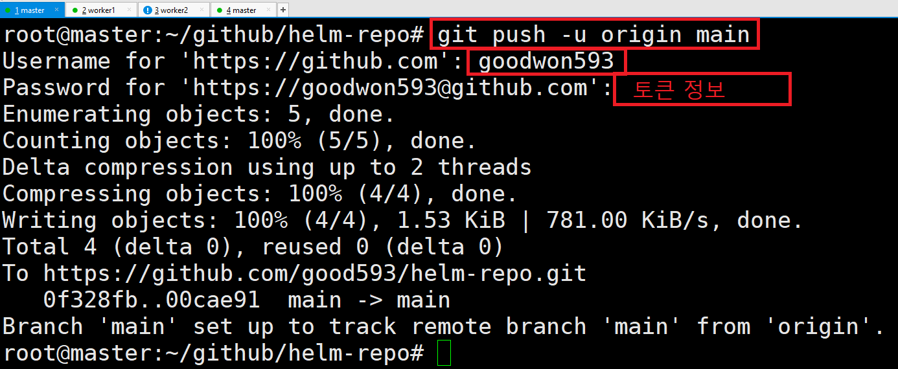

---
# Github Page 만들기 

---
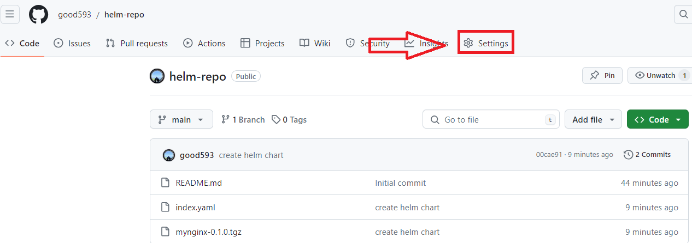

---
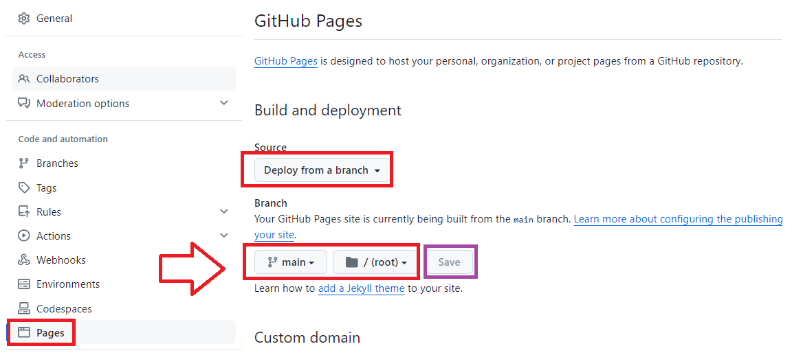

---
- 2~5분 뒤에 화면 리로드 후 확인 

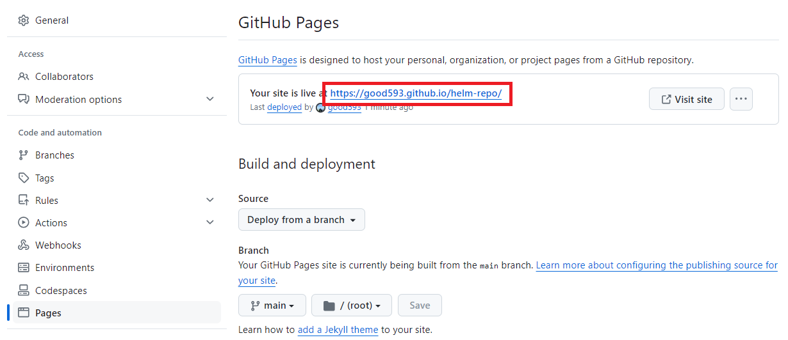

---
# Helm Repo에 추가하기 

---
### 단계1: add repo
```shell
cd
helm repo add my-helm-repo https://good593.github.io/helm-repo/
helm repo list
```
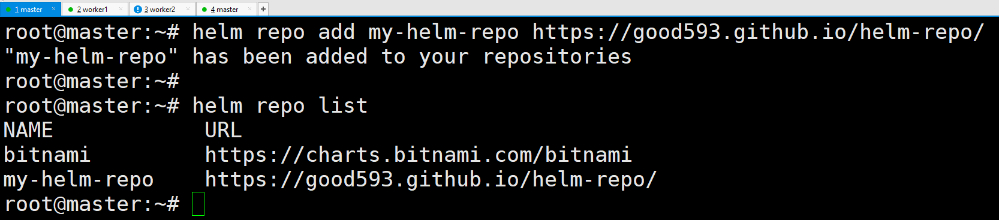

---
### 단계2: helm repo update & search
```shell
helm repo update
helm search repo mynginx
```
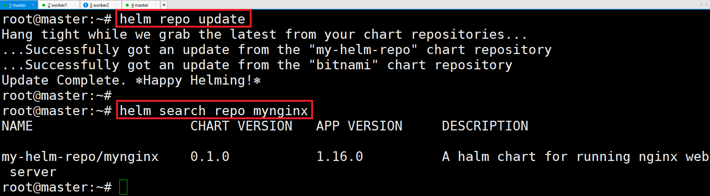

---
### 단계3: install 
```shell
helm install webserver-github my-helm-repo/mynginx
helm list
```
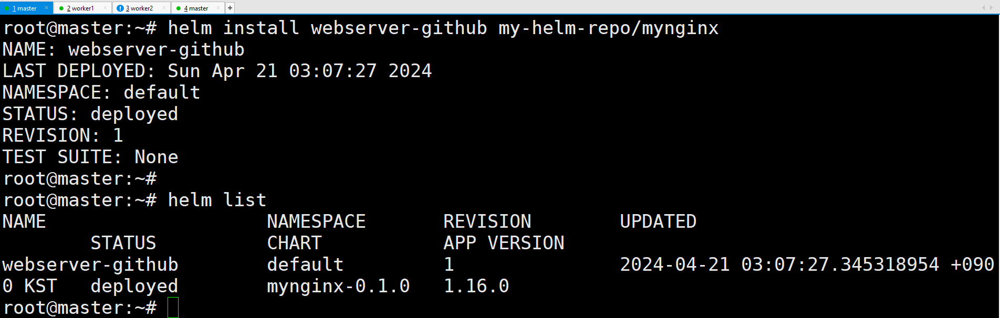

---
### 단계11: uninstall
```shell
helm uninstall webserver-github
helm list
```
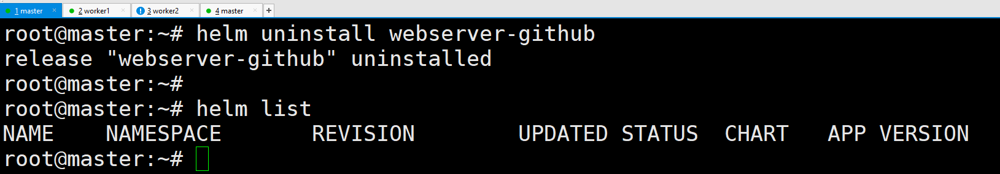


