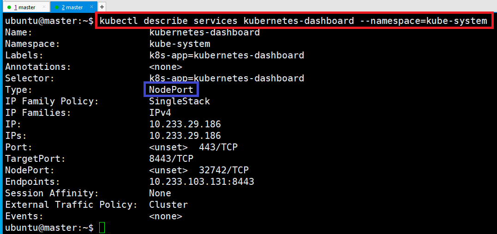
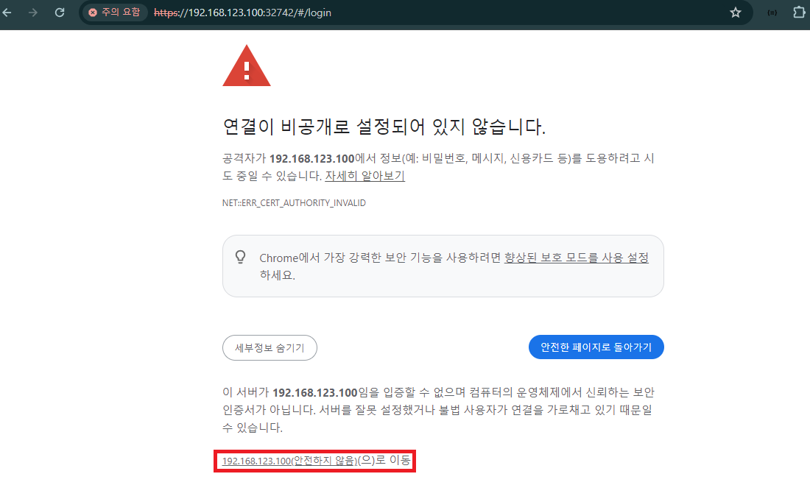
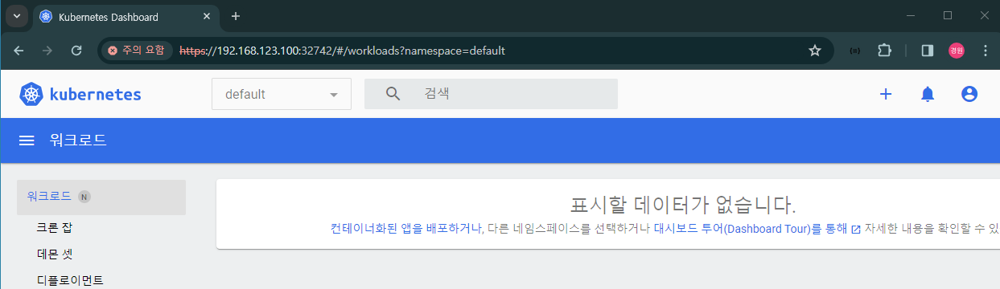
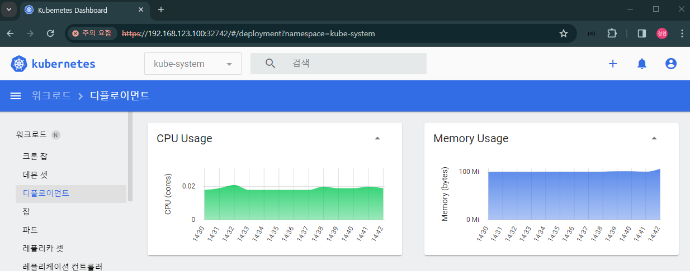

# Dashboard 확인 
- 만약 Dashboard가 설치되지 않았다면, [Install Dashboard](https://kubernetes.io/docs/tasks/access-application-cluster/web-ui-dashboard/)
```shell
kubectl get deployment -n kube-system
```


---
# Dashboard 계정 생성하기 

---
### 단계1: [Creating a Service Account](https://github.com/kubernetes/dashboard/blob/master/docs/user/access-control/creating-sample-user.md)
- yaml/admin-user.yaml
```shell
cd && mkdir yaml && cd yaml
vim admin-user.yaml
# 참고: yaml/admin-user.yaml

# 계정 생성
kubectl apply -f admin-user.yaml
```


---
### 단계2: Service Account 확인
```shell
# 유저 확인 
kubectl get serviceaccounts -A | grep admin-user
# 권한 확인 
kubectl get ClusterRoleBinding | grep admin-user
# Secret 확인
kubectl get Secret -n kube-system | grep admin-user
```


---
# VirtualBox > localhost에서 Dashboard 접속하기

---
### 단계1: Proxy Dashboard Server
- Dashboard는 기본적으로 외부에서 접근이 불가능합니다. 반드시 `localhost(127.0.0.1)`에서 웹브라우저로 접속하자!
```shell
kubectl proxy --address='127.0.0.1' --port='8001'
```


---
### 단계2: 생성된 계정의 토큰 복사
```shell
kubectl get secret admin-user -n kube-system -o jsonpath={".data.token"} | base64 -d
```


---
### 단계3: [Accessing Kubernetes Dashboard 로그인](https://github.com/kubernetes-sigs/kubespray/blob/release-2.21/docs/getting-started.md)
- 복사한 토큰 정보를 이용하여 로그인하기 
```shell
http://127.0.0.1:8001/api/v1/namespaces/kube-system/services/https:kubernetes-dashboard:/proxy/#/login
```


---
### 단계4: Kubernetes Dashboard 접속 성공 


---
# Host PC > Dashboard를 외부에서 접속하기 

---
### 단계1: kubernetes-dashboard 확인
```shell
kubectl get svc -n kube-system kubernetes-dashboard
```


---
### 단계2: kubernetes-dashboard 수정
- Dashboard를 외부에서 접속하기 위해서  `NodePort`로 수정
```shell
kubectl -n kubernetes-dashboard edit service kubernetes-dashboard --namespace=kube-system
```


---
### 단계2: 변경내용 및 포트 확인하기
- 포트: 32742
```shell
kubectl get svc -n kube-system kubernetes-dashboard
```


---
```shell
kubectl describe services kubernetes-dashboard --namespace=kube-system
```


---
### 단계3: ip 확인 
- 아이피: 192.168.123.100
```shell
ifconfig
```


---
### 단계3: Proxy Dashboard Server  
```shell
kubectl proxy --address=192.168.123.100 --accept-hosts='^*$'
```


---
### 단계4: 새로운 shell 접속하여 포트 및 아이피 확인
- 포트 확인: 32742 
```shell
kubectl get svc -n kube-system kubernetes-dashboard
```


---
### 단계5: Dashboard를 외부에서 로그인
- https://[아이피]:[포트]/#/login
  > https://192.168.123.100:32742/#/login


---


---


---
### 단계6: 생성된 계정의 토큰을 이용하여 접속
```shell
kubectl get secret admin-user -n kube-system -o jsonpath={".data.token"} | base64 -d
```


---
# Dashboard

---
### 단계1: 네임스페이스 변경 > kube-system


---
### 단계2: 디플로이먼트


---
### 단계3: 노드


