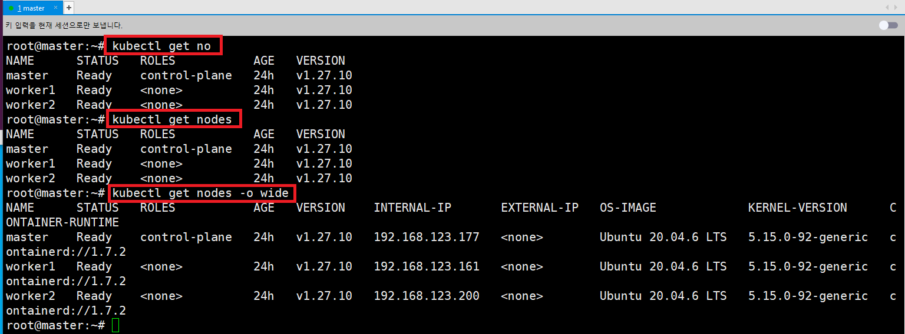
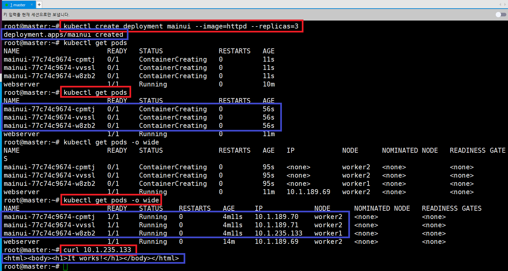
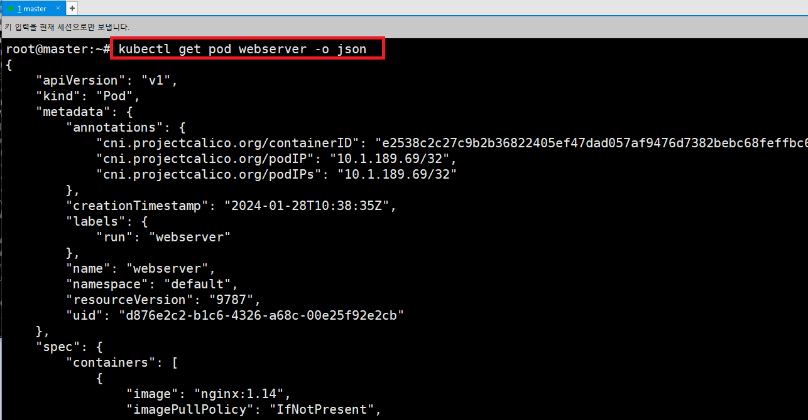
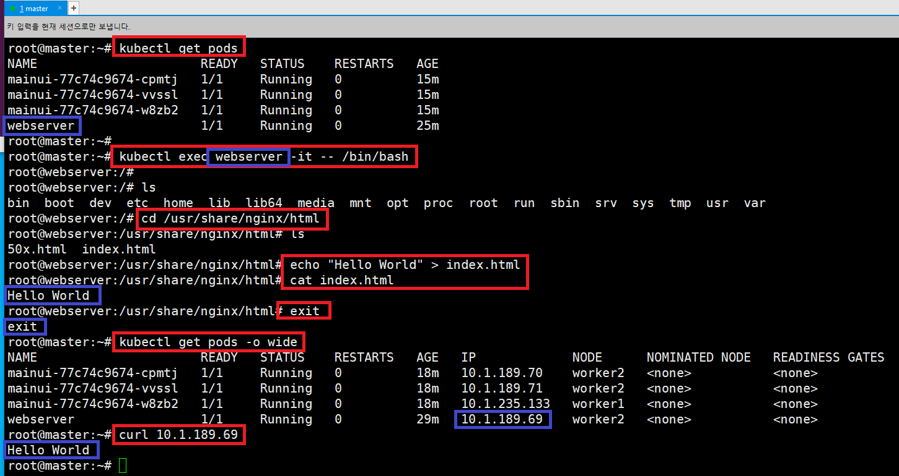
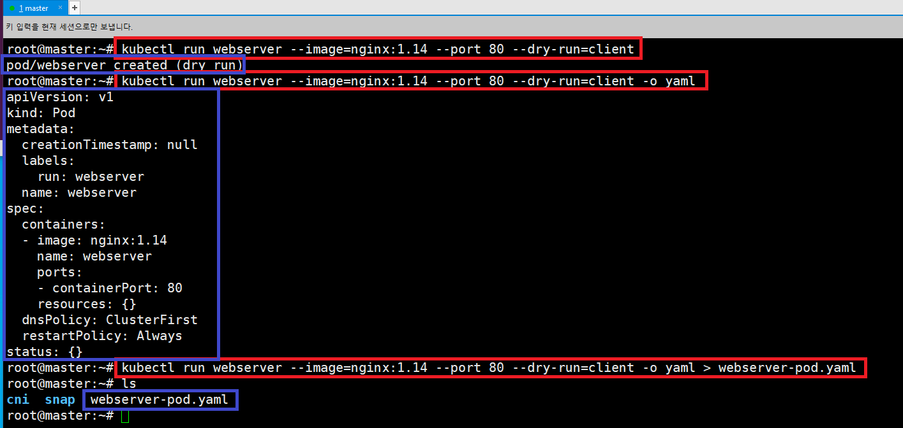
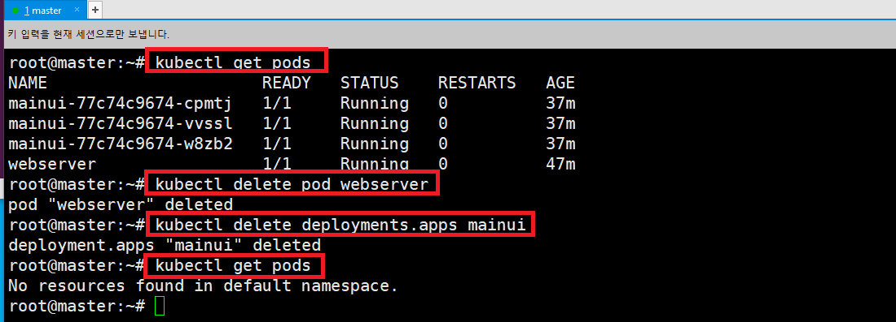

### 단계1: node 확인 
- node list 확인 
```shell
kubectl get no # kubectl get nodes
kubectl get nodes -o wide 
```


---
- node describe
```shell
kubectl describe node master
```


---
### 단계2: pod 생성
- `run`: 하나의 pod 생성
```shell
# nginx 서버 생성 및 실행 
kubectl run webserver --image=nginx:1.14 --port 80
# pod 확인 
kubectl get pods
kubectl get pods -o wide
# nginx 서버 접속 
curl 10.1.189.69 # nginx ip 작성 
```
---


---
- `create deployment`: 여러개의 pod 생성 
- `httpd`: 아파치 톰켓 서버 
- `replicas`: 생성할 pod 수 
```shell
kubectl create deployment mainui --image=httpd --replicas=3
# pod 확인 
kubectl get pods
kubectl get pods -o wide
# 서버 접속 
curl 10.1.235.133 # ip 작성 
```
---


---
### 단계3: pod 정보 확인 
```shell
# webserver 정보 확인  
kubectl get pod webserver -o wide
# webserver 정보 yaml 문서로 확인 
kubectl get pod webserver -o yaml
# webserver 정보 json 문서로 확인 
kubectl get pod webserver -o json
```
---


---


---
### 단계3: pod 접속, 수정 및 확인   
```shell
# pod 확인 
kubectl get pods
# pod 접속 
kubectl exec webserver -it -- /bin/bash

# index.html 파일 수정 
cd /usr/share/nginx/html
echo "Hello World" > index.html
# pod 나오기 
exit

# pod ip 확인 
kubectl get pods -o wide 
# 접속 > Hello World 확인 
curl 10.1.189.69
```

---


---
### 단계4: pod 생성할 yaml 문서만들기
```shell
# pod를 가상으로 만들어봄(실제 아님)
kubectl run webserver --image=nginx:1.14 --port 80 --dry-run=client
# pod를 만들 수 있는 yaml 확인 
kubectl run webserver --image=nginx:1.14 --port 80 --dry-run=client -o yaml
# pod를 만들 수 있는 yaml 문서 생성 
kubectl run webserver --image=nginx:1.14 --port 80 --dry-run=client -o yaml > webserver-pod.yaml
# 확인 
ls 
```

---


---
### 단계5: pod 삭제
```shell
kubectl get pods
# pod 삭제 
kubectl delete pod webserver
# deployment pods 삭제 
kubectl delete deployments.apps mainui
kubectl get pods
```



