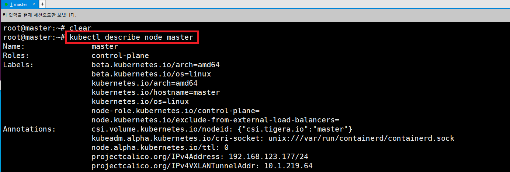

### 단계1: node 확인 
- node list 확인 
```shell
kubectl get no # kubectl get nodes
kubectl get nodes -o wide 
```


---
- node describe
```shell
kubectl describe node master
```


---
### 단계2: pod 생성
- `run`: 하나의 pod 생성
```shell
# nginx 서버 생성 및 실행 
kubectl run webserver --image=nginx:1.14 --port 80
# pod 확인 
kubectl get pods
kubectl get pods -o wide
# nginx 서버 접속 
curl 10.1.189.69 # nginx ip 작성 
```
---


---
- `create deployment`: 여러개의 pod 생성 
- `httpd`: 아파치 톰켓 서버 
- `replicas`: 생성할 pod 수 
```shell
kubectl create deployment mainui --image=httpd --replicas=3
# pod 확인 
kubectl get pods
kubectl get pods -o wide
# 서버 접속 
curl 10.1.235.133 # ip 작성 
```
---


---
### 단계3: pod 정보 확인 
```shell
# webserver 정보 확인  
kubectl get pod webserver -o wide
# webserver 정보 yaml 문서로 확인 
kubectl get pod webserver -o yaml
# webserver 정보 json 문서로 확인 
kubectl get pod webserver -o json
```
---


---


---
### 단계3: pod 접속, 수정 및 확인   
```shell
# pod 확인 
kubectl get pods
# pod 접속 
kubectl exec webserver -it -- /bin/bash

# index.html 파일 수정 
cd /usr/share/nginx/html
echo "Hello World" > index.html
# pod 나오기 
exit

# pod ip 확인 
kubectl get pods -o wide 
# 접속 > Hello World 확인 
curl 10.1.189.69
```

---


---
### 단계4: pod 생성할 yaml 문서만들기
```shell
# pod를 가상으로 만들어봄(실제 아님)
kubectl run webserver --image=nginx:1.14 --port 80 --dry-run=client
# pod를 만들 수 있는 yaml 확인 
kubectl run webserver --image=nginx:1.14 --port 80 --dry-run=client -o yaml
# pod를 만들 수 있는 yaml 문서 생성 
kubectl run webserver --image=nginx:1.14 --port 80 --dry-run=client -o yaml > webserver-pod.yaml
# 확인 
ls 
```

---


---
### 단계5: pod 삭제
```shell
kubectl get pods
# pod 삭제 
kubectl delete pod webserver
# deployment pods 삭제 
kubectl delete deployments.apps mainui
kubectl get pods
```


---
### 단계6: Multi Container
- yaml 생성 
```shell
vim pod-multi.yaml
cat pod-multi.yaml
```
```yaml
apiVersion: v1
kind: Pod
metadata:
  name: multipod
spec:
  containers:
  - name: nginx-container
    image: nginx:1.14
    ports:
    - containerPort: 80
  - name: centos-container
    image: centos:7
    command:
    - sleep
    - "10000"
```


---
- Multi Container pods 생성
```shell
kubectl create -f pod-multi.yaml
kubectl get pods -o wide
```


---
- nginx 접속 
```shell
curl 10.1.189.78 # 위에서 확인한 ip 적용 
```


---
- nginx-container에 접속하기 
```shell
# 접속
kubectl exec multipod -c nginx-container -it -- /bin/bash
# 확인 
cd /usr/share/nginx/html/
ls
exit
```


---
- centos-container에 접속하기 
```sehll
# 접속
kubectl exec multipod -c centos-container -it -- /bin/bash
# 확인 
cd /usr/share/nginx/html/ # error
ps -ef 
```


---
- nginx-container와 centos-container는 같은 pod을 공유
- 따라서 centos-container에서 curl localhost를 실행하면 nginx 접속 
```shell
curl localhost
exit
```


---
- log 확인 
```shell
kubectl logs multipod -c nginx-container
```


