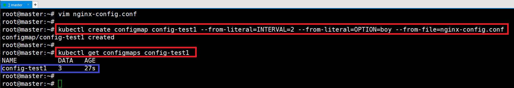
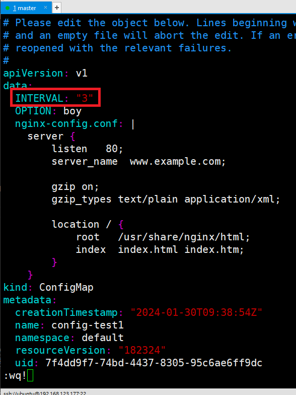
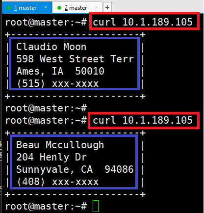
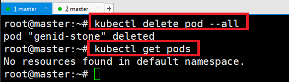
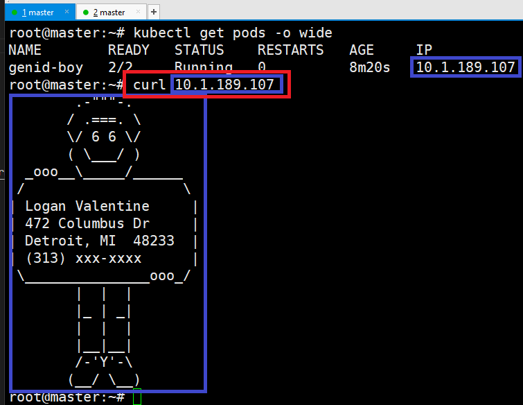
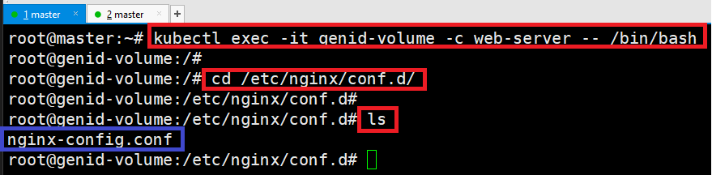
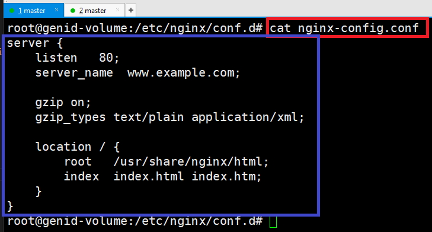
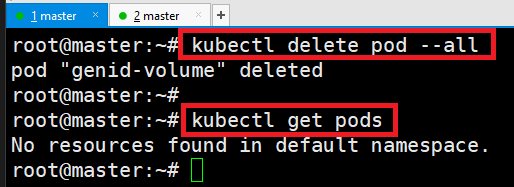

# [ConfigMap](https://kubernetes.io/ko/docs/concepts/configuration/configmap/)
- 컨테이너 구성 정보를 한곳에 모아서 관리 


---
# ConfigMap 생성하기 
- 명령어
> kubectl create configmap NAME [--from-file=source] [--from-literal=key1=value1]
- 명령어 예제
> - kubectl create configmap name1 --from-literal=id=b2021002 --from-literal=class=bigdata
> - kubectl create configmap name2 --from-file=text.file
> - kubectl create configmap name3 --from-file=mydata=text.file
> - kubectl create configmap name4 --from-file=/configmap.dir/

---


---
### 단계1: nginx-config.conf 생성 
```shell
vim nginx-config.conf
# 아래내용 작성 
server {
    listen   80;
    server_name  www.example.com;

    gzip on;
    gzip_types text/plain application/xml;

    location / {
        root   /usr/share/nginx/html;
        index  index.html index.htm;
    }
}
```
---
### 단계2: configmap > config-test1 생성 
```shell
# 생성 
kubectl create configmap config-test1 --from-literal=INTERVAL=2 --from-literal=OPTION=boy --from-file=nginx-config.conf

# 확인 > 3개의 데이터가 등록되어 있음
kubectl get configmaps config-test1
```


---
### 단계3: configmap > describe
```shell
kubectl describe configmaps config-test1
```


---
### 단계4: configmap > edit
```shell
# 내용 수정 
kubectl edit configmaps config-test1
```


---
### 단계5:  수정된 내용 확인 
```shell
kubectl describe configmaps config-test1
```


---
# ConfigMap의 일부 정보를 컨테이너(pod)에 적용하기 


---
### 단계1: genid.yaml 작성
```shell
vim genid.yaml

# 아래내용 작성 
apiVersion: v1
kind: Pod
metadata:
  name: genid-stone
spec:
  containers:
  - image: smlinux/genid:env
    env:
    - name: INTERVAL
      valueFrom:
        configMapKeyRef:
          name: config-test1
          key: INTERVAL 
    name: fakeid
    volumeMounts:
    - name: html
      mountPath: /webdata
  - image: nginx:1.14
    name: web-server
    volumeMounts:
    - name: html
      mountPath: /usr/share/nginx/html
      readOnly: true
    ports:
    - containerPort: 80
  volumes:
  - name: html
    emptyDir: {}
```
---
### 단계2: genid.yaml 생성
```shell
kubectl create -f genid.yaml
kubectl get pods -o wide # ip 확인 
```


---
### 단계3: genid.yaml 확인 
- INTERVAL값이 3임으로 3초 단위로 내용이 다르게 나옴 
```shell
curl 10.1.189.105 # ip 작성 
```


---
### 단계4: pods 삭제 
```shell
kubectl delete pod --all
kubectl get pods
```


---
### 단계5: configmap > INTERVAL값 수정  
```shell
# 내용 수정 
kubectl edit configmaps config-test1
```


---
### 단계6: genid.yaml 재생성
```shell
kubectl create -f genid.yaml
kubectl get pods -o wide # ip 확인 
```


---
### 단계7: 수정된 내용확인 
- 1초단위로 내용이 변경됨 
```shell
curl 10.1.189.104 # ip 작성 
```


---
### 단계8: pods 삭제 
```shell
kubectl delete pod --all
kubectl get pods
```


---
# ConfigMap의 모든 정보를 컨테이너(pod)에 적용하기 

---
### 단계1: genid-whole.yaml 작성
```shell
vim genid-whole.yaml

# 아래내용 작성 
apiVersion: v1
kind: Pod
metadata:
  name: genid-boy
spec:
  containers:
  - image: smlinux/genid:env
    envFrom:
    - configMapRef:
        name: config-test1
    name: fakeid
    volumeMounts:
    - name: html
      mountPath: /webdata
  - image: nginx:1.14
    name: web-server
    volumeMounts:
    - name: html
      mountPath: /usr/share/nginx/html
      readOnly: true
    ports:
    - containerPort: 80
  volumes:
  - name: html
    emptyDir: {}
```
---
### 단계2: genid-whole.yaml 생성
```shell
kubectl create -f genid-whole.yaml
kubectl get pods -o wide # ip 확인 
```


---
### 단계3: genid-boy의 환경변수 확인  
- INTERVAL, OPTION, nginx-config.conf
```shell
kubectl exec genid-boy -- env
```
---


---
### 단계4: genid-boy 테스트 
- 1초단위로 내용이 변경됨 
```shell
curl 10.1.189.107 # ip 작성 
```


---
### 단계5: pods 삭제 
```shell
kubectl delete pod --all
kubectl get pods
```


---
# ConfigMap을 볼륨으로 적용하기 

---
### 단계1: genid-volume.yaml 작성
```shell
vim genid-volume.yaml

# 아래내용 작성 
apiVersion: v1
kind: Pod
metadata:
  name: genid-volume
spec:
  containers:
  - image: smlinux/genid:env
    env:
    - name: INTERVAL
      valueFrom:
        configMapKeyRef:
          name: config-test1
          key: INTERVAL
    name: fakeid-generator
    volumeMounts:
    - name: html
      mountPath: /webdata
  - image: nginx:1.14
    name: web-server
    ports:
    - containerPort: 80
    volumeMounts:
    - name: html
      mountPath: /usr/share/nginx/html
      readOnly: true
    - name: config
      mountPath: /etc/nginx/conf.d
      readOnly: true
  volumes:
  - name: html
    emptyDir: {}
  - name: config
    configMap:
      name: config-test1
      items:
      - key: nginx-config.conf
        path: nginx-config.conf
```
---
### 단계2: genid-volume.yaml 생성
```shell
kubectl create -f genid-volume.yaml
kubectl get pods -o wide # ip 확인 
```


---
### 단계3: INTERVAL 적용 유무 확인 
```shell
curl 10.1.189.109 # ip 작성 
```


---
### 단계4: 마운트된 내용 확인 
```shell
# web-server 접속 
kubectl exec -it genid-volume -c web-server -- /bin/bash
```


---
### 단계5: 마운트된 nginx-config.conf 확인 
```shell
cat nginx-config.conf
```


---
### 단계6: pods 삭제 
```shell
kubectl delete pod --all
kubectl get pods
```

