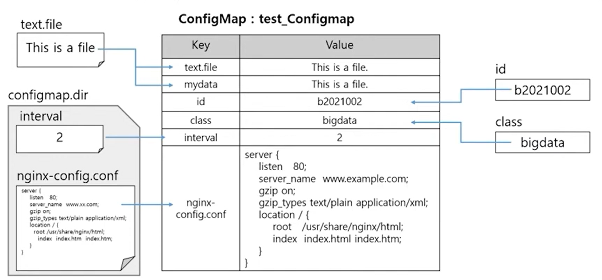
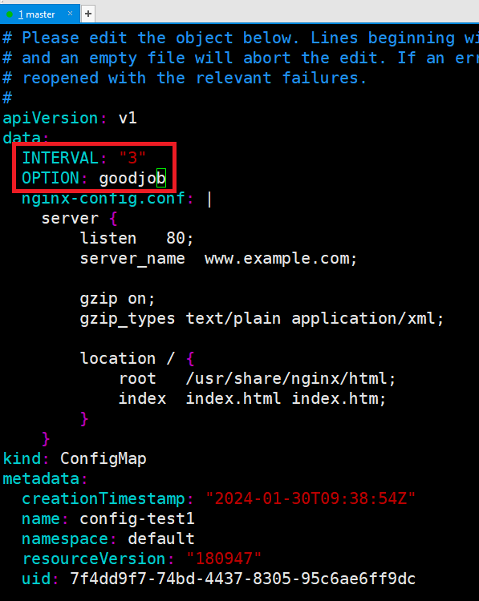
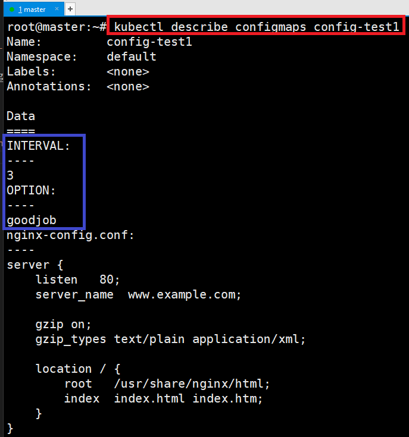

# [ConfigMap](https://kubernetes.io/ko/docs/concepts/configuration/configmap/)
- 컨테이너 구성 정보를 한곳에 모아서 관리 


---
### ConfigMap 생성 
- 명령어
> kubectl create configmap NAME [--from-file=source] [--from-literal=key1=value1]
- 명령어 예제
> - kubectl create configmap name1 --from-literal=id=b2021002 --from-literal=class=bigdata
> - kubectl create configmap name2 --from-file=text.file
> - kubectl create configmap name3 --from-file=mydata=text.file
> - kubectl create configmap name4 --from-file=/configmap.dir/

---


---
### 단계1: nginx-config.conf 생성 
```shell
vim nginx-config.conf
# 아래내용 작성 
server {
    listen   80;
    server_name  www.example.com;

    gzip on;
    gzip_types text/plain application/xml;

    location / {
        root   /usr/share/nginx/html;
        index  index.html index.htm;
    }
}
```
---
### 단계2: configmap > config-test1 생성 
```shell
# 생성 
kubectl create configmap config-test1 --from-literal=INTERVAL=2 --from-literal=OPTION=boy --from-file=nginx-config.conf

# 확인 > 3개의 데이터가 등록되어 있음
kubectl get configmaps config-test1
```


---
### 단계3: configmap > describe
```shell
kubectl describe configmaps config-test1
```


---
### 단계3: configmap > edit
```shell
# 내용 수정 
kubectl edit configmaps config-test1
```


---
- 수정된 내용 확인 
```shell
kubectl describe configmaps config-test1
```


---
- https://www.youtube.com/watch?v=xyGTvkKzrB4&list=PLApuRlvrZKohaBHvXAOhUD-RxD0uQ3z0c&index=34


