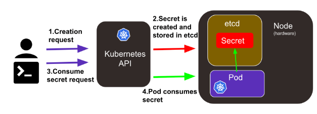
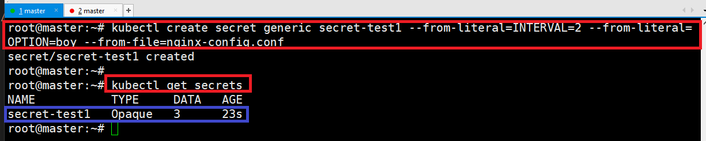
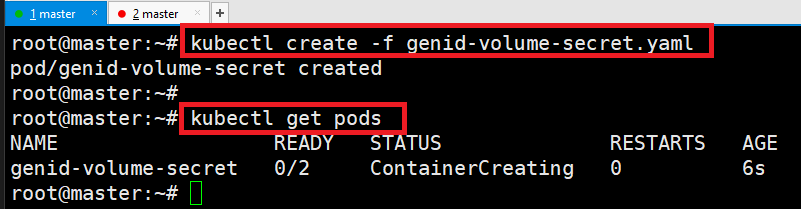
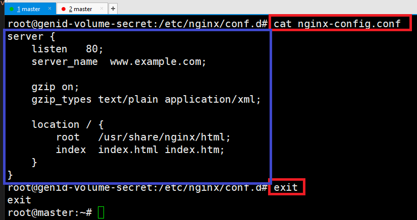

# [Kubernetes Secret](https://kubernetes.io/ko/docs/tasks/configmap-secret/managing-secret-using-kubectl/)
- 쿠버네티스에서는 환경 변수나 새롭게 작성한 파일을 컨테이너 내부에 전달해주기 위해서 Configmap, Secret 을 사용합니다. 
- 이름에서 유추할 수 있듯 Configmap 은 보안적으로 중요치 않은 데이터들을 사용할 때, Secret 은 보안적으로 중요한 데이터를 사용할 때 사용합니다. 
- 따라서 Configmap 은 Plain Text 로 데이터가 저장되는 반면, Secret 은 인코딩 되어 저장됩니다.



---
# [주요 Secret 종류](https://chalchichi.tistory.com/81)
### Opaque(generic)
- 가장 일반적인 시크릿 유형입니다. 
- 이 유형은 사용자가 지정한 임의의 키-값 쌍을 저장할 수 있습니다. 
- 값들은 base64로 인코딩되어 저장되므로 보안을 위해서라면 base64로 인코딩된 데이터를 다시 디코딩하는 작업이 필요합니다.
```shell
kubectl create secret generic my-opaque-secret --from-literal=key1=value1 --from-literal=key2=value2
```
---
### tls
- SSL/TLS 인증서와 개인 키를 저장하는 데 사용됩니다. 
- 주로 HTTPS를 지원하는 서비스를 배포할 때 사용되며, 인증서와 키를 쌍으로 저장하고 관리할 수 있습니다.
```shell
kubectl create secret tls my-tls-secret --cert=path/to/cert.crt --key=path/to/key.key
```
### DockerConfigJSON
- Docker 레지스트리에 대한 인증 정보를 저장하는 데 사용됩니다. 
- Docker 레지스트리에 이미지를 푸시하거나 풀(다운로드)할 때 사용자의 권한을 인증하는 데 필요한 데이터를 포함합니다.
```shell
kubectl create secret docker-registry my-docker-secret --docker-server=DOCKER_REGISTRY_SERVER --docker-username=DOCKER_USERNAME --docker-password=DOCKER_PASSWORD --docker-email=DOCKER_EMAIL
```
---
# Secret 만들기
- secret etcd에 암호화 하지 않은 텍스트로 저장되므로 secret value가 커지면 메모리 용량을 많이 사용하게 됨 
- secret의 최대 크기는 1MB
---
### 단계1: (없다면,) nginx-config.conf 생성 
```shell
vim nginx-config.conf
# 아래내용 작성 
server {
    listen   80;
    server_name  www.example.com;

    gzip on;
    gzip_types text/plain application/xml;

    location / {
        root   /usr/share/nginx/html;
        index  index.html index.htm;
    }
}
```
---
### 단계2: Secret 생성 및 확인 
```shell
kubectl create secret generic secret-test1 --from-literal=INTERVAL=2 --from-literal=OPTION=boy --from-file=nginx-config.conf
kubectl get secret
```


---
### 단계3: Secret 정보 확인 
- 데이터를 확인할 수 없음 
```shell
kubectl describe secrets secret-test1
```


---
### 단계4: Secret 정보를 yaml 파일로 확인 
- 암호화된 데이터 확인 
```shell
kubectl get secrets secret-test1 -o yaml
```


---
# Secret > 컨테이너 환경변수로 사용하기  

---
### 단계1: genid-env-secret.yaml 작성 
```shell
vim genid-env-secret.yaml

# 아래내용 작성
apiVersion: v1
kind: Pod
metadata:
  name: genid-env-secret
spec:
  containers:
  - image: smlinux/genid:env
    env:
    - name: INTERVAL
      valueFrom:
        secretKeyRef:
          name: secret-test1
          key: INTERVAL
    name: fakeid-generator
    volumeMounts:
    - name: html
      mountPath: /webdata
  - image: nginx:1.14
    name: web-server
    volumeMounts:
    - name: html
      mountPath: /usr/share/nginx/html
      readOnly: true
    ports:
    - containerPort: 80
  volumes:
  - name: html
    emptyDir: {}
```
---
### 단계2: genid-env-secret.yaml 생성
```shell
kubectl create -f genid-env-secret.yaml
kubectl get pods
```


---
### 단계3: ip 확인 및 테스트 
```shell
kubectl get pods -o wide
curl 10.1.189.108
```


---
### 단계4: pod 삭제 
```shell
kubectl delete pod --all
kubectl get pods
```


---
# Secret > 컨테이너에 볼륨 마운트로 사용하기  

---
### 단계1: genid-volume-secret.yaml 작성 
```shell
vim genid-volume-secret.yaml

# 아래내용 작성
apiVersion: v1
kind: Pod
metadata:
  name: genid-volume-secret
spec:
  containers:
  - image: smlinux/genid:env
    env:
    - name: INTERVAL
      valueFrom:
        secretKeyRef:
          name: secret-test1
          key: INTERVAL
    name: fakeid-generator
    volumeMounts:
    - name: html
      mountPath: /webdata
  - image: nginx:1.14
    name: web-server
    volumeMounts:
    - name: html
      mountPath: /usr/share/nginx/html
      readOnly: true
    - name: config
      mountPath: /etc/nginx/conf.d
      readOnly: true
    ports:
    - containerPort: 80
  volumes:
  - name: html
    emptyDir: {}
  - name: config
    secret:
      secretName: secret-test1
      items:
      - key: nginx-config.conf
        path: nginx-config.conf
```
---
### 단계2: genid-env-secret.yaml 생성
```shell
kubectl create -f genid-volume-secret.yaml
kubectl get pods
```


---
### 단계3: ip 확인 및 테스트 
```shell
kubectl get pods -o wide
curl 10.1.189.108
```


---
### 단계4: 볼룸 마운트 확인 
```shell
kubectl exec -it genid-volume-secret -c web-server -- /bin/bash
# 여기부터는 web-server 컨테이너 
cd /etc/nginx/conf.d/
ls
```


---
### 단계5: nginx-config.conf 복호화된 내용 확인 
```shell
cat nginx-config.conf
exit
```


---
### 단계6: pod 삭제 
```shell
kubectl delete pod --all
kubectl get pods
```


---
### 단계7: secret 삭제 
```shell
kubectl delete secret --all
kubectl get secret
```


