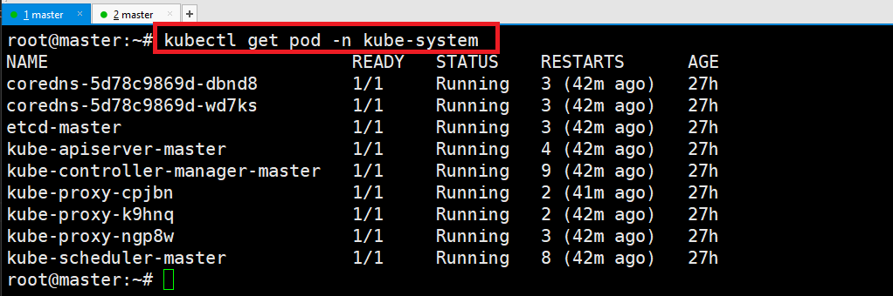
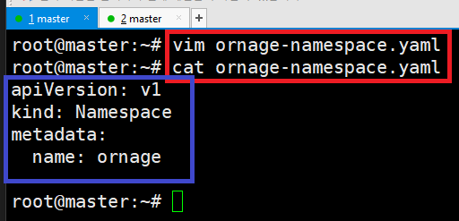
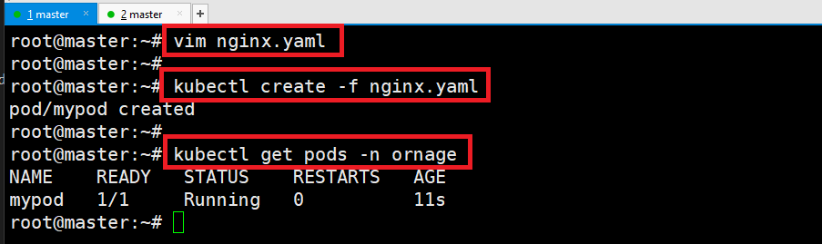
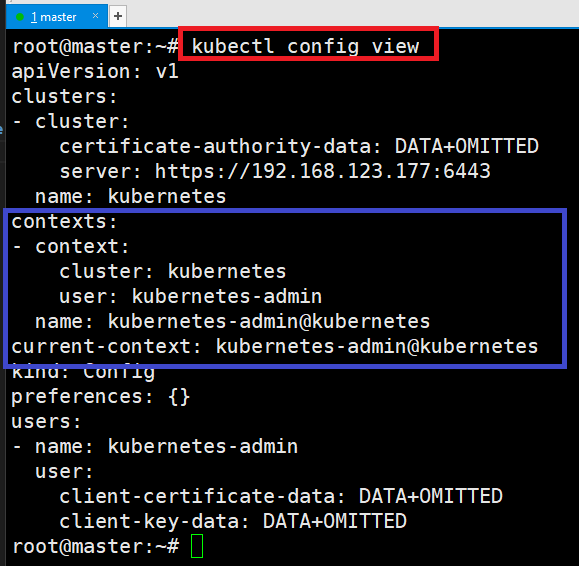
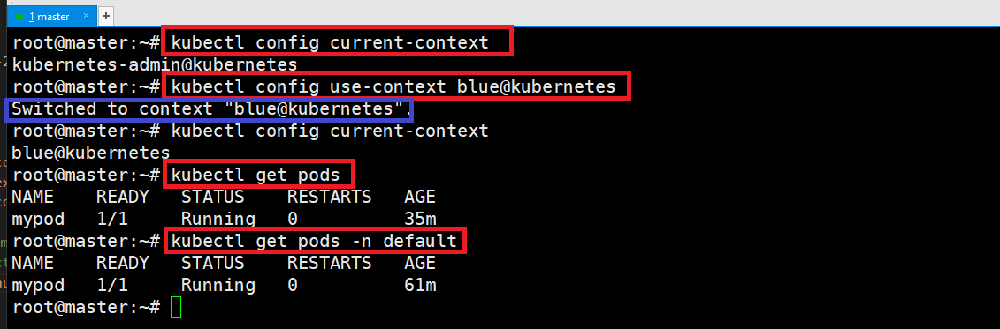
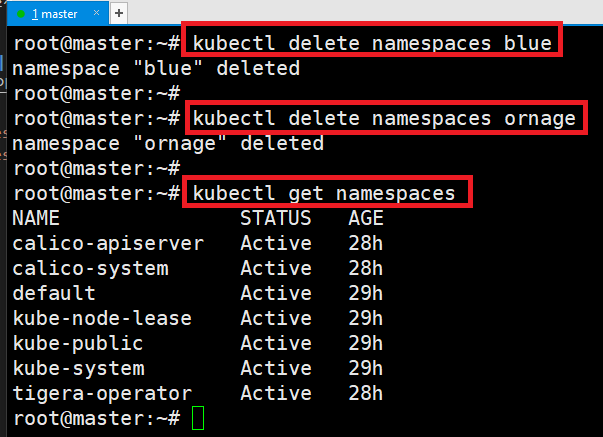

### 단계1: namespace 조회 
- `default`: 기본 namespace 
- `kube-*` : kubernetes의 운영을 위해서 사용
- `calico-*, tigera-operator` : CNI의 운영을 위해서 사용
```shell
kubectl get namespaces
```


---
### 단계2: namespace의 pod 조회 
- namespace를 정의하지 않으면, default namespace의 pod 조회 
```shell
# 3개 모두 같은 명령어임
kubectl get pod 
kubectl get pod --namespace default
kubectl get pod -n default
```


---
- kube-system의 pod 조회 
```shell
kubectl get pod -n kube-system
```


---
- 전체 namespace에서 동작하는 pod 조회
```shell
kubectl get pod --all-namespaces
```


---
### 단계3: nginx.yaml 생성 
```shell
vim nginx.yaml
# 아래 yaml 작성 

cat nginx.yaml
```
```yaml
apiVersion: v1
kind: Pod
metadata:
  name: mypod
spec:
  containers:
  - image: nginx:1.14
    name: nginx
    ports:
    - containerPort: 80
    - containerPort: 443
```


---
### 단계4: nginx.yaml을 이용하여 node 생성 
```shell
kubectl create -f nginx.yaml
kubectl get pods -n default
```


---
### 단계5: CLI > namespace 생성 
```shell
kubectl create namespace blue
kubectl get namespaces
```


---
- blue에 nginx.yaml을 이용하여 node 생성 
```shell
kubectl create -f nginx.yaml -n blue
kubectl get pods -n blue
```


---
### 단계6: yaml > namespace 생성 
```shell
vim ornage-namespace.yaml
# 아래 yaml 작성 

cat ornage-namespace.yaml
```
```yaml
apiVersion: v1
kind: Namespace
metadata:
  name: ornage
```


---
```shell
kubectl create -f ornage-namespace.yaml
kubectl get namespaces
```


---
- ornage에 nginx.yaml을 이용하여 node 생성 
```shell
vim nginx.yaml
```
```yaml
apiVersion: v1
kind: Pod
metadata:
  name: mypod
  namespace: ornage # 이부분 추가 
spec:
  containers:
  - image: nginx:1.14
    name: nginx
    ports:
    - containerPort: 80
    - containerPort: 443
```
---
```shell
kubectl create -f nginx.yaml 
kubectl get pods -n ornage
```


---
### 단계7: Switch namespace
1. config contexts 확인
```shell
kubectl config view
```


---
2. context 생성
```shell
kubectl config set-context blue@kubernetes --cluster=kubernetes --user=kubernetes-admin --namespace=blue

kubectl config view
```


---
3. 기본 namespace를 blue로 변경
```shell
kubectl config current-context # defualt namepace
kubectl config use-context blue@kubernetes 
kubectl config current-context # blue namepace

# 이제부터 기본은 blue namepace
kubectl get pods # kubectl get pods -n blue와 같음
kubectl get pods -n default # default pod 정보 조회 
```


---
4. 기본 namespace를 default로 변경
```shell
kubectl config use-context kubernetes-admin@kubernetes
kubectl config current-context 

kubectl delete pods mypod -n default
kubectl get pods 
```


---
### 단계8: namespace 삭제 
- namespace를 삭제하면, 안에 있는 모든 pod도 삭제됨 
```shell
kubectl delete namespaces blue
kubectl delete namespaces ornage

kubectl get namespaces
```



- https://www.youtube.com/watch?v=QGF7igBYSEI&list=PLApuRlvrZKohaBHvXAOhUD-RxD0uQ3z0c&index=6
