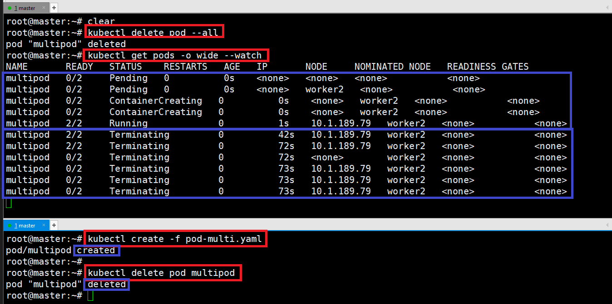
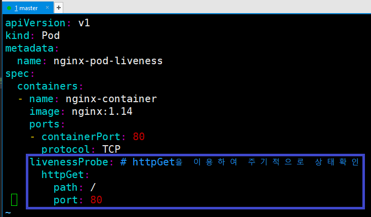
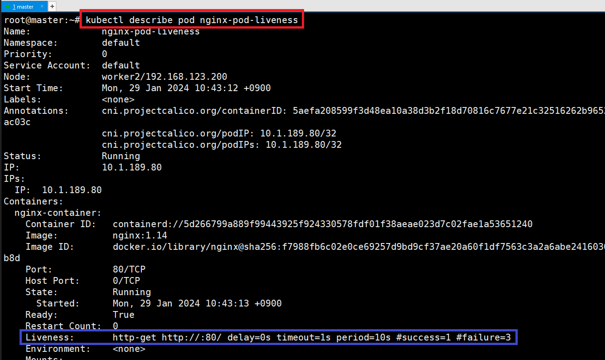
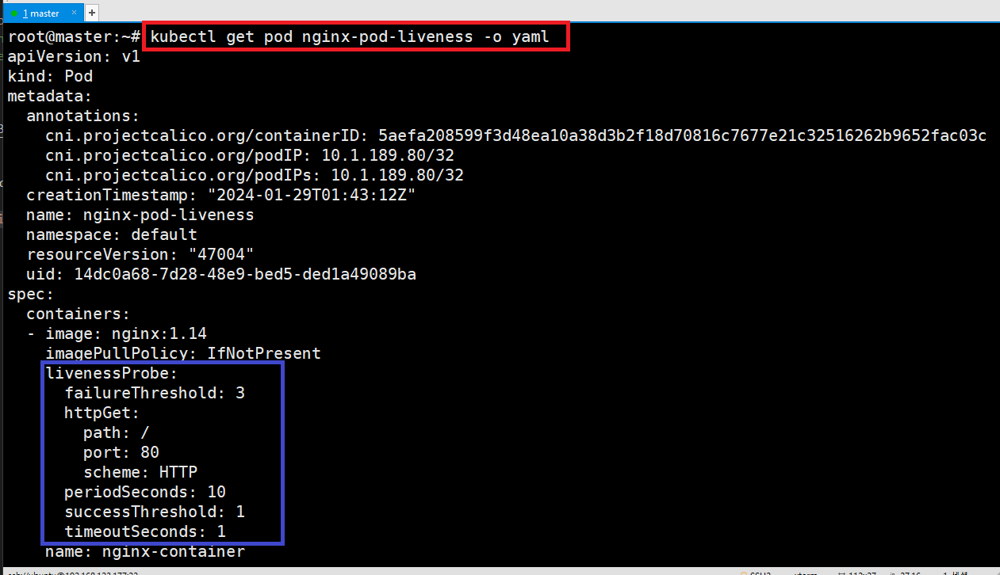
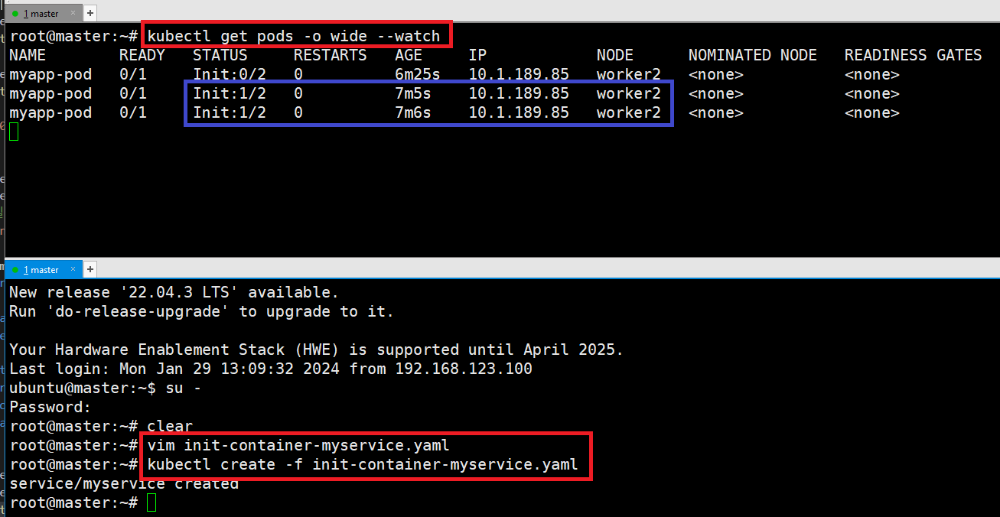
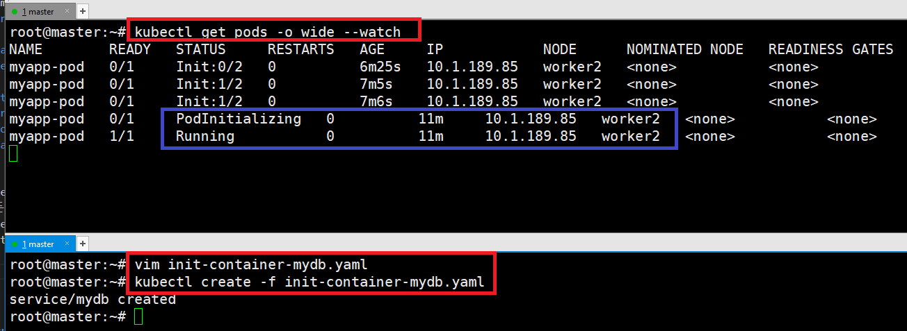
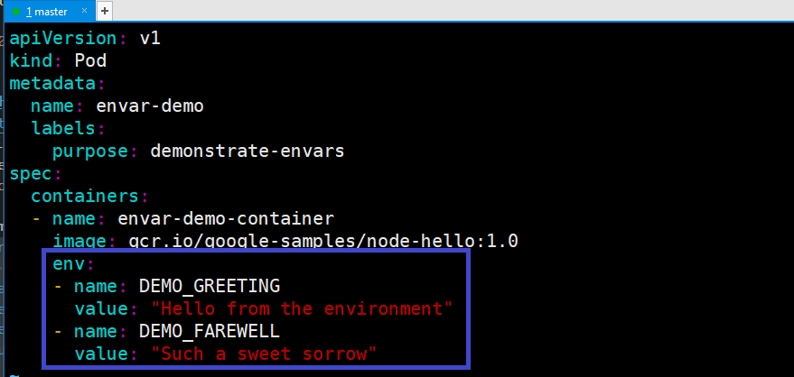

### 단계1: [Pod Lifecycle](https://kubernetes.io/ko/docs/concepts/workloads/pods/pod-lifecycle/#%ED%8C%8C%EB%93%9C%EC%9D%98-%EC%88%98%EB%AA%85)
- Pod의 생성 및 삭제 진행 상황 확인 
```shell
# 테스트를 위해서 기존 pod 모두 삭제 
kubectl delete pod --all
# Pod Lifecycle를 위해서 watch 진행 
kubectl get pods -o wide --watch
``` 
```shell
# pod 생성 > watch 확인 
kubectl create -f pod-multi.yaml
# pod 삭제 > watch 확인 
kubectl delete pod multipod
```
---


---
### 단계2: [livenessProbe](https://kubernetes.io/docs/tasks/configure-pod-container/configure-liveness-readiness-startup-probes/)
- 컨테이너에 주기적으로 요청을 하여 상태값을 확인하고 정상적이지 않을 때는 삭제 후 컨테이너 재실행하게 하는 기능  
```shell
vim pod-nginx-liveness.yaml
```
```yaml
apiVersion: v1
kind: Pod
metadata:
  name: nginx-pod-liveness
spec:
  containers:
  - name: nginx-container
    image: nginx:1.14
    ports:
    - containerPort: 80
      protocol: TCP
    livenessProbe: # httpGet을 이용하여 주기적으로 상태확인
      httpGet:
        path: /
        port: 80
```
---


---
- pod 생성 
```shell
kubectl get pods -o wide --watch
```
```shell
kubectl create -f pod-nginx-liveness.yaml
```


---
- liveness 정보 확인 
  - `http-get http://:80/`: health check 확인 방법
  - `delay=0s`: pod 실행 후 delay할 시간 
  - `timeout=1s`: health check 후 응답을 기다리는 시간 
  - `period=10s`: health check 반복 실행 시간 
  - `#success=1`: 한번 성공하면 성공으로 판단 
  - `#failure=3`: 연속 3번 실패하면 실패로 판단 
```shell
kubectl describe pod nginx-pod-liveness
# Liveness:       http-get http://:80/ delay=0s timeout=1s period=10s #success=1 #failure=3
```
---


---
- 실행중인 nginx-pod-liveness의 yaml 확인 
```shell
kubectl get pod nginx-pod-liveness -o yaml
```


---
- smlinux/unhealthy
  - 5번까지는 200(성공) / 6번부터는 500(에러)
```shell
vim unhealthy-liveness-test.yaml
# 아래내용 작성 
apiVersion: v1
kind: Pod
metadata:
  name: unhealthy-liveness-test
spec:
  containers:
  - name: unhealthy-container
    image: smlinux/unhealthy
    ports:
    - containerPort: 8080
      protocol: TCP
    livenessProbe: # livenessProbe 기본 값 수정 
      httpGet:
        path: /
        port: 8080
        scheme: HTTP
      periodSeconds: 3
      timeoutSeconds: 1
      successThreshold: 1
      failureThreshold: 1
```
---


---
- unhealthy-liveness-test 실행 
```shell
kubectl delete pod --all
kubectl get pods -o wide --watch
```
```shell
kubectl create -f unhealthy-liveness-test.yaml
```


---
### 단계3: [init container](https://kubernetes.io/ko/docs/concepts/workloads/pods/init-containers/)
- 초기화 컨테이너는 파드의 앱 컨테이너들이 실행되기 전에 실행되는 특수한 컨테이너이다. 
```shell
vim init-container.yaml
```
```yaml
apiVersion: v1
kind: Pod
metadata:
  name: myapp-pod
  labels:
    app.kubernetes.io/name: MyApp
spec:
  containers: # 초기화 컨테이너가 실행이 되면 생성됨 
  - name: myapp-container
    image: busybox:1.28
    command: ['sh', '-c', 'echo The app is running! && sleep 3600']
  initContainers: # 초기화 컨테이너 
  - name: init-myservice
    image: busybox:1.28
    command: ['sh', '-c', "until nslookup myservice.$(cat /var/run/secrets/kubernetes.io/serviceaccount/namespace).svc.cluster.local; do echo waiting for myservice; sleep 2; done"]
  - name: init-mydb
    image: busybox:1.28
    command: ['sh', '-c', "until nslookup mydb.$(cat /var/run/secrets/kubernetes.io/serviceaccount/namespace).svc.cluster.local; do echo waiting for mydb; sleep 2; done"]
```
---


---
- 초기화 컨테이너가 실행되지 않아서 myapp-container가 대기중 
```shell
kubectl get pods -o wide --watch
```
```shell
kubectl create -f init-container.yaml
```


---
- myservice 생성
```shell
# 파일 생성 
vim init-container-myservice.yaml
```
```yaml
apiVersion: v1
kind: Service
metadata:
  name: myservice
spec:
  ports:
  - protocol: TCP
    port: 80
    targetPort: 9376
```
---
- myservice 실행 
```shell
kubectl create -f init-container-myservice.yaml
```


---
- mydb 생성
```shell
# 파일 생성 
vim init-container-mydb.yaml
```
```yaml
apiVersion: v1
kind: Service
metadata:
  name: mydb
spec:
  ports:
  - protocol: TCP
    port: 80
    targetPort: 9377
```
---
- myservice 실행
- 모든 초기화 컨테이너가 실행되었기 때문에 myapp-container가 생성됨 
```shell
kubectl create -f init-container-mydb.yaml
```


---
### 단계4: [Resource 할당하기](https://kubernetes.io/ko/docs/concepts/configuration/manage-resources-containers/) 
- Pod의 리소스(CPU, Memory) 중에서 컨테이너가 사용할 수 있는 리소스 정의 
- limits
  - Pod가 사용할 수 있는 최대 리소스양을 제한 
  - 최대 리소스를 초과하게 되면, Pod를 restart함 
  - worker의 Pod들 중에 특정 Pod가 너무 많은 리소스를 갖지 못하도록 제한
- requests
  - Pod가 실행하기 위한 최소 리소스 양을 요청 
  - worker들 중에서 Pod를 실행시킬 수 있는 worker로 할당받음 
  - 만약 실행 가능한 worker가 없다면, 생길 때까지 계속 대기
---
- nginx-pod-resource.yaml 파일 생성 
```shell
vim nginx-pod-resource.yaml
```
```yaml
apiVersion: v1
kind: Pod
metadata:
  name: nginx-pod-resource
spec:
  containers:
  - name: nginx-container
    image: nginx:1.14
    ports:
    - containerPort: 8080
      protocol: TCP
    resources: # Pod의 리소스(CPU, Memory) 정의 
      requests:
        cpu: 200m # 1 cpu: 1000m
        memory: 250Mi # 1MiB = 1024kib
      limits:
        cpu: 1
        memory: 500Mi
```
---


---
- 결과 확인 
```shell
kubectl get pods -o wide --watch
```
```shell
kubectl create -f nginx-pod-resource.yaml
kubectl describe pod nginx-pod-resource # resources 정보 확인 
```


---
### 단계5: [환경변수 설정](https://kubernetes.io/ko/docs/tasks/inject-data-application/define-environment-variable-container/) 
- 파드를 생성할 때, 파드 안에서 동작하는 컨테이너를 위한 환경 변수를 설정할 수 있다.
```shell
vim pod-env.yaml
```
```yaml
apiVersion: v1
kind: Pod
metadata:
  name: envar-demo
  labels:
    purpose: demonstrate-envars
spec:
  containers:
  - name: envar-demo-container
    image: gcr.io/google-samples/node-hello:1.0
    env:
    - name: DEMO_GREETING
      value: "Hello from the environment"
    - name: DEMO_FAREWELL
      value: "Such a sweet sorrow"
```
---


---
```shell
# 생성
kubectl create -f pod-env.yaml
# pod 조회 
kubectl get pods -l purpose=demonstrate-envars
# 등록한 환경변수 확인 
kubectl exec envar-demo -- printenv
```


