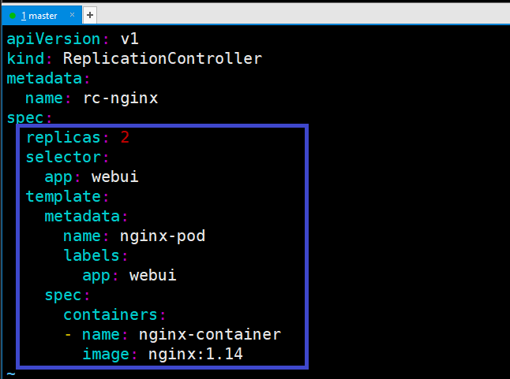
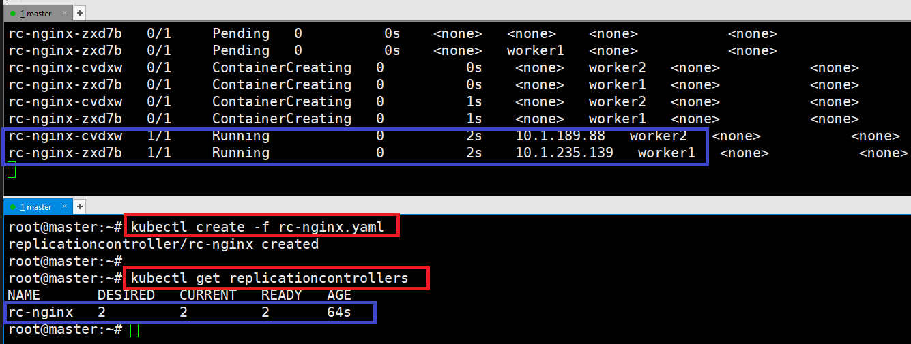
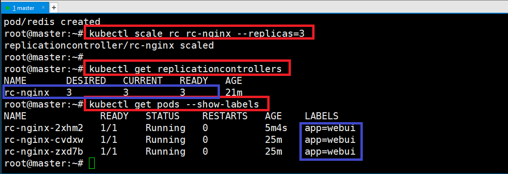
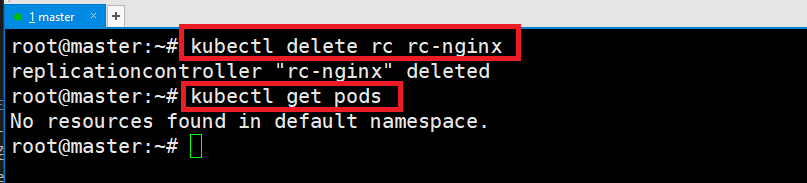
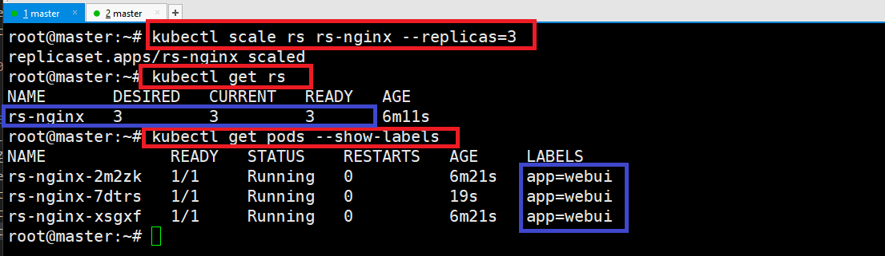
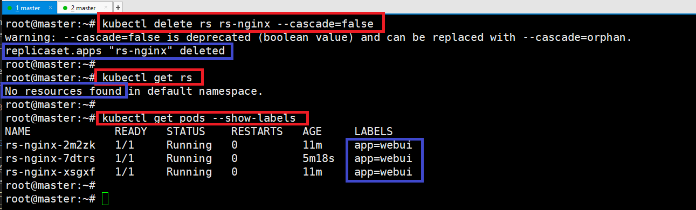
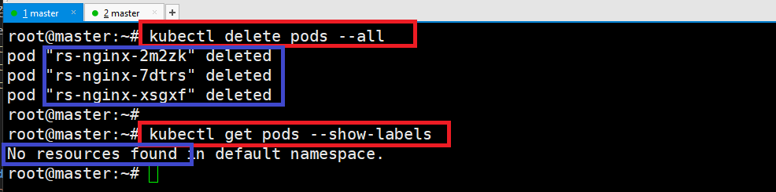

### 단계1: [ReplicationController](https://kubernetes.io/ko/docs/concepts/workloads/controllers/replicationcontroller/)
- 요구하는 Pod의 개수를 보장하며 Pod 집합의 실행을 항상 안정적으로 유지하는 것을 목표 
    - 요구하는 Pod의 개수가 부족하면, template를 이용해 Pod를 추가 생성
    - 요구하는 Pod 수보다 많으면, 최근에 생성된 Pod를 삭제 
- 기본구성요소
    - selector
    - replicas
    - template
---
- Pod vs ReplicationController


---
- rc-nginx.yaml 생성 
```shell
vim rc-nginx.yaml
```
```yaml
apiVersion: v1
kind: ReplicationController
metadata:
  name: rc-nginx
spec:
  replicas: 2
  selector:
    app: webui
  template:
    metadata:
      name: nginx-pod
      labels:
        app: webui
    spec:
      containers:
      - name: nginx-container
        image: nginx:1.14
```
---


---
- 실행 
```shell
kubectl get pods -o wide --watch
```
```shell
kubectl create -f rc-nginx.yaml
kubectl get replicationcontrollers
```


---
#### 테스트1
1. label이름이 webui인 pod를 실행함
2. ReplicationController에 의해서 자동 삭제됨 
```shell
vim rc-test-redis.yaml
```
```yaml
apiVersion: v1
kind: Pod
metadata:
  labels:
    app: webui
  name: redis
spec:
  containers:
  - image: redis
    name: redis
```
---
- 테스트 확인  
```shell
kubectl get pods -o wide --watch
```
```shell
kubectl create -f rc-test-redis.yaml
```


---
#### 테스트2
1. rc-nginx의 replicas을 3으로 변경 
2. 변경된 값에 따라서 ReplicationController가 자동으로 Pod 생성 
```shell
kubectl scale rc rc-nginx --replicas=3
kubectl get replicationcontrollers
kubectl get pods --show-labels
```


---
#### ReplicationController 삭제
```shell
kubectl delete rc rc-nginx
kubectl get pods
```


---
### 단계2: ReplicaSet
ReplicationController과 기능은 똑같음. 다만 Selector에 표현식을 추가할 수 있음.
- `In`: label의 값이 지정된 값 중 하나와 일치해야 한다
- `NotIn`: label의 값이 지정된 값과 일치하지 않아야 한다
- `Exists`: Pod는 지정된 Key를 가진 label이 포함되어야 한다. (Value 상관없음)
- `DoesNotExist`: pod에 지정된 키를 가진 label이 포함되어 있지 않아야 한다.

---
- rs-nginx.yaml 생성 
```shell
vim rs-nginx.yaml
```
```yaml
apiVersion: apps/v1
kind: ReplicaSet
metadata:
  name: rs-nginx
spec:
  replicas: 2
  selector:
    matchExpressions:
      - key: app
        operator: In
        values:
         - webui
  template:
    metadata:
      name: nginx-pod
      labels:
        app: webui
    spec:
      containers:
      - name: nginx-container
        image: nginx:1.14
```


---
- rs-nginx.yaml 실행  
```shell
kubectl get pods -o wide --watch
```
```shell
kubectl create -f rs-nginx.yaml
```


---
#### 테스트
1. rs-nginx의 replicas을 3으로 변경 
2. 변경된 값에 따라서 ReplicaSet가 자동으로 Pod 생성 
```shell
kubectl scale rs rs-nginx --replicas=3
kubectl get rs
kubectl get pods --show-labels
```


---
#### delete with cascade=orphan
- `--cascade=false`: ReplicaSet만 삭제 / 안에 있는 Pod 유지 
```shell
kubectl delete rs rs-nginx --cascade=orphan
kubectl get rs
kubectl get pods --show-labels
```


---
- ReplicaSet에 포함되어 있지 않기 때문에 pod 삭제 가능 
```shell
kubectl delete pods --all
```



