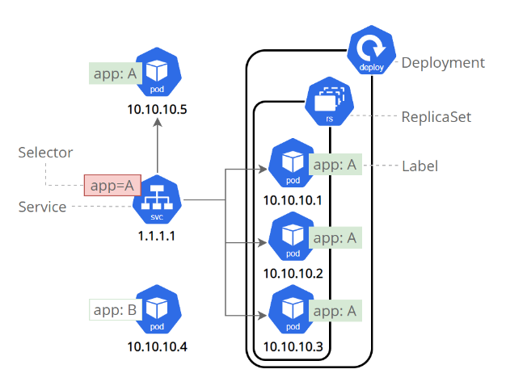
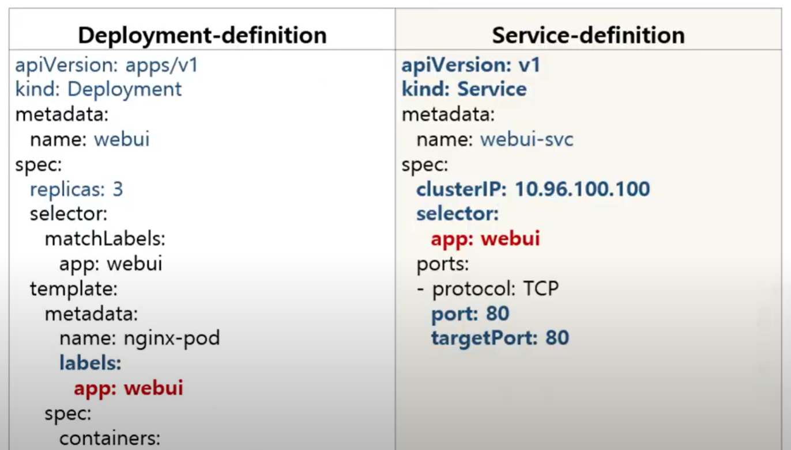
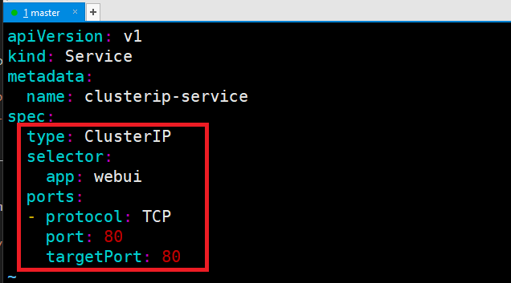
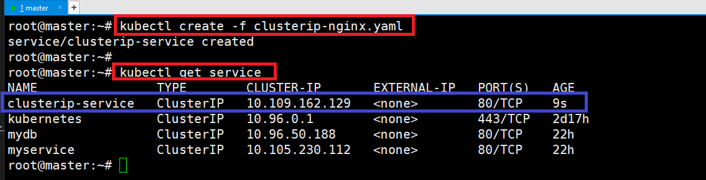
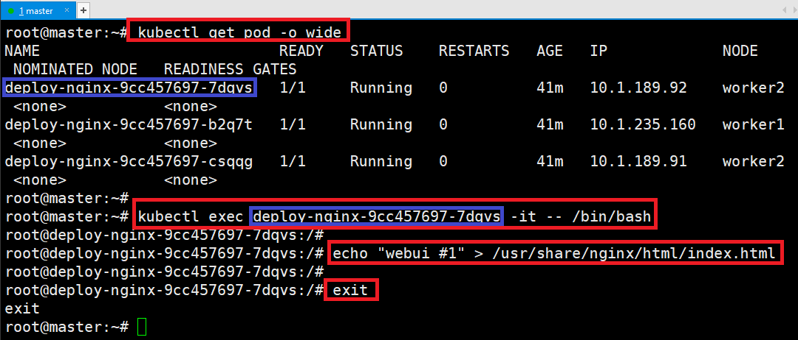
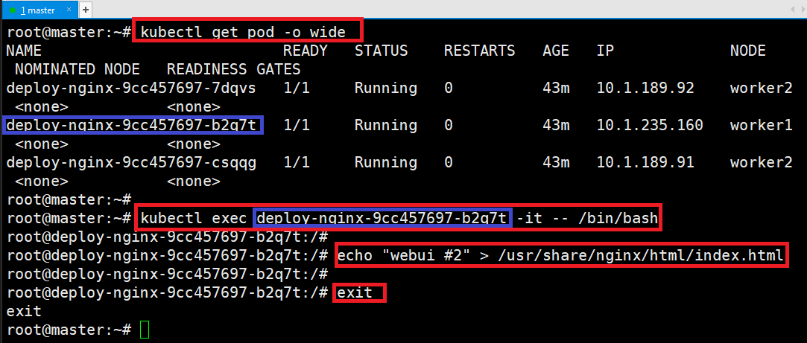
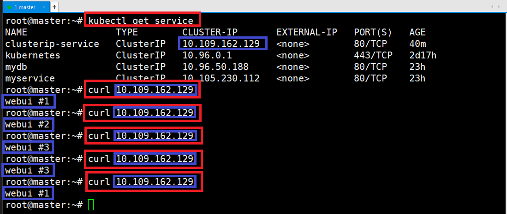
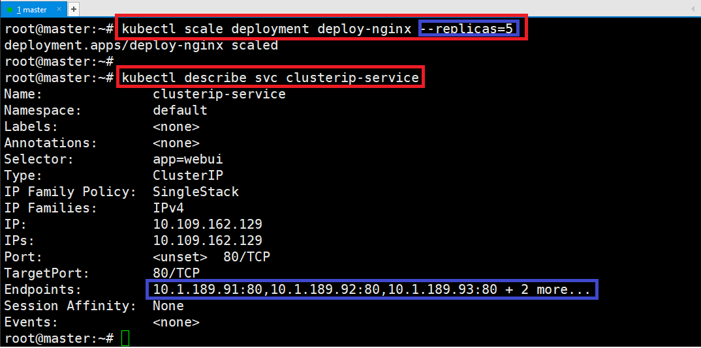
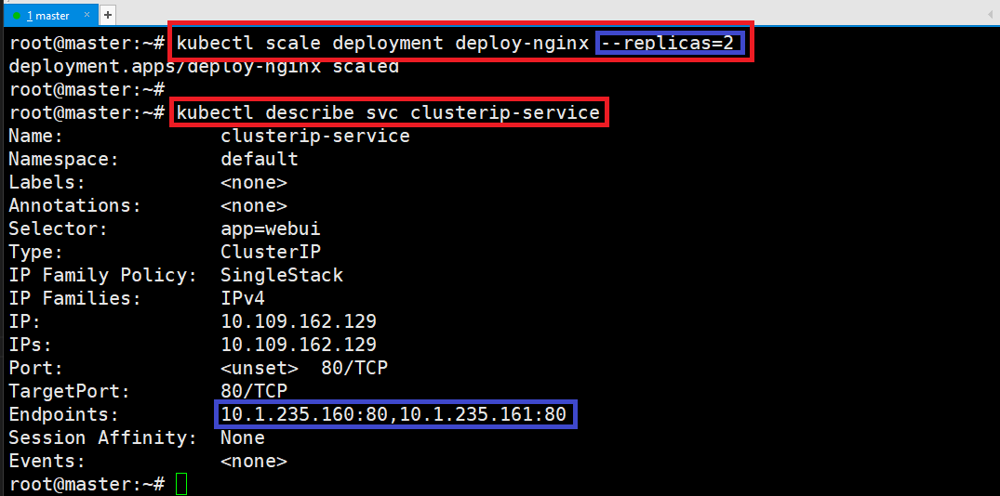
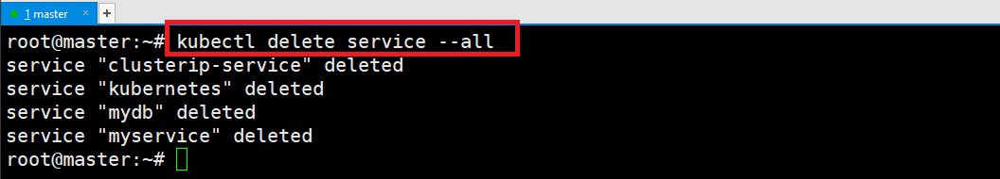

# [Service](https://kubernetes.io/ko/docs/concepts/services-networking/service/)
- 쿠버네티스 환경에서 서비스(Service)는 파드들을 통해 실행되고 있는 애플리케이션을 네트워크에 노출(expose)시키는 가상의 컴포넌트다. 


---
- clusterIP는 보통 생략
- port: Service의 port / targetPort: container의 port



---
## [Service Type](https://kubernetes.io/docs/concepts/services-networking/service/?ref=seongjin.me#publishing-services-service-types)
- [ClusterIP(default)](https://kubernetes.io/docs/concepts/services-networking/service/?ref=seongjin.me#type-clusterip)
  - 클러스터 내부에서만 접근할 수 있는 IP를 할당 
- [NodePort](https://kubernetes.io/docs/concepts/services-networking/service/?ref=seongjin.me#type-nodeport)
  - ClusterIP가 생성된 후 
  - 모든 Worker Node에 외부에서 접속가능 한 포트가 할당
- [LoadBalancer](https://kubernetes.io/docs/concepts/services-networking/service/?ref=seongjin.me#loadbalancer)
  - 클라우드 인프라스트럭처(AWS, Azure 등)나 오픈스택 클라우드에 적용 
  - LoadBalancer를 자동으로 프로 비전하는 기능 지원 
- [ExternalName](https://kubernetes.io/docs/concepts/services-networking/service/?ref=seongjin.me#externalname)
  - 클러스터 안에서 외부에 접속 시 사용할 도메인을 등록해서 사용
  - 클러스터 도메인이 실제 외부 도메인으로 치환되어 동작 
---
## [ClusterIP(default)](https://kubernetes.io/docs/concepts/services-networking/service/?ref=seongjin.me#type-clusterip)
- selector의 label이 동일한 파드들의 그룹으로 묶임
- 단일 진입점(Virtual IP)을 생성
- 클러스터 내부에서만 사용가능 


---
### 단계1: Deployment 생성 
```shell
vim deploy-nginx.yaml
```
```yaml
apiVersion: apps/v1
kind: Deployment
metadata:
  name: deploy-nginx
spec:
  replicas: 3
  selector:
    matchLabels:
      app: webui
  template:
    metadata:
      name: nginx-pod
      labels:
        app: webui
    spec:
      containers:
      - name: nginx-container
        image: nginx:1.14
```
---
- deploy를 이용하여 pod 3개 생성
```shell
kubectl create -f deploy-nginx.yaml
kubectl get pod -o wide
```


---
### 단계2: Service 생성 
- clusterip-nginx.yaml 생성
```shell
vim clusterip-nginx.yaml
```
```yaml
apiVersion: v1
kind: Service
metadata:
  name: clusterip-service
spec:
  type: ClusterIP
  selector:
    app: webui
  ports:
  - protocol: TCP
    port: 80
    targetPort: 80
```


---
- clusterip-nginx.yaml 실행 
```shell
kubectl create -f clusterip-nginx.yaml
kubectl get service
```


---
- clusterip-service와 pod 연결 설정 확인 
```shell
kubectl get pod -o wide
```
```shell
kubectl describe svc clusterip-service
```


---
### 단계3: 테스트 > 컨테이너 정보 변경 
- 첫번째 컨테이너 화면 내용 변경 
```shell
kubectl get pod -o wide
kubectl exec deploy-nginx-9cc457697-7dqvs -it -- /bin/bash
# 이제부터 container
echo "webui #1" > /usr/share/nginx/html/index.html
exit
```


---
- 두번째 컨테이너 화면 내용 변경 
```shell
kubectl get pod -o wide
kubectl exec deploy-nginx-9cc457697-b2q7t -it -- /bin/bash
# 이제부터 container
echo "webui #2" > /usr/share/nginx/html/index.html
exit
```


---
- 셋번째 컨테이너 화면 내용 변경 
```shell
kubectl get pod -o wide
kubectl exec deploy-nginx-9cc457697-csqqg -it -- /bin/bash
# 이제부터 container
echo "webui #3" > /usr/share/nginx/html/index.html
exit
```


---
### 단계4: 테스트 > 렌덤하게 pod가 접속됨
```shell
kubectl get service
curl 10.109.162.129
```


---
### 단계5: scaling > replicas=5
```shell
kubectl scale deployment deploy-nginx --replicas=5
kubectl describe svc clusterip-service
```


---
### 단계6: scaling > replicas=2
```shell
kubectl scale deployment deploy-nginx --replicas=2
kubectl describe svc clusterip-service
```


---
### 단계7: delete service
```shell
kubectl delete service --all
```



