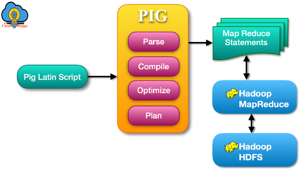
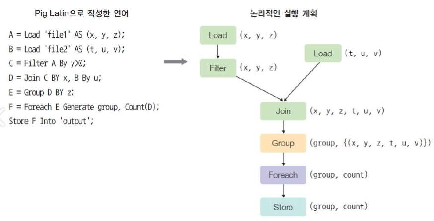

# [Pig](http://pig.apache.org)
- 복잡한 MapReduce 프로그래밍을 대체할 Pig Latin이라는 자체 언어를 제공 
- MapReduce API를 매우 단순화시키고 SQL과 유사한 형태로 설계되었다.

---
## [Apache Pig 아키텍처](https://www.cloudduggu.com/pig/architecture/) 

---
## Apache Pig 구성요소 
- Parser
> 사용자가 프로그램을 제출하면 처음에는 파서가 프로그램을 수신하고 이제 파서는 구문 검사와 유형 검사를 수행합니다. 이 활동을 수행하면 Pig Latin 문과 논리 연산자가 포함된 DAG가 출력으로 생성됩니다.
- Compiler
> 최적화 단계에서 DAG는 프로젝션 및 푸시다운과 같은 논리적 최적화를 수행하는 논리적 최적화 프로그램으로 푸시됩니다.

---
- Optimizer
> 컴파일러 단계에서는 최적화된 논리적 계획의 복잡성이 작은 Mapreduce 작업으로 수행되어 실행 엔진으로 전달됩니다.
- Plan(Execution Engine)
> 이는 Mapreduce 작업이 실행을 위해 Hadoop에 제출되는 마지막 단계입니다. 실행이 완료된 후 사용자에게 원하는 데이터를 전송합니다.

---
## [Pig 언어 : Pig Latin](https://warm-uk.tistory.com/62)
- 이해하기 쉽고 유지보수가 쉽다.
- 시스템이 코드 실행을 자동으로 최적화하므로(옵티마이저) 사용자는 효율성을 생각하지 않고 프로그래밍 내용에만 집중
- Pig Latin으로 작성한 데이터 처리 프로그램은 논리적인 실행 계획으로 변환되고, 이것은 최종적으로 MapReduce 실행 계획으로 변환

---
#### 실행 예시 

---
## [Hive vs Pig](https://m.blog.naver.com/kokoyou7620/222170072760)
- Pig: Query Language가 아닌 Data Flow를 처리하는 Language입니다.
- Hive: HiveQL이라는 SQL과 유사한 쿼리를 사용하는 Language입니다.

