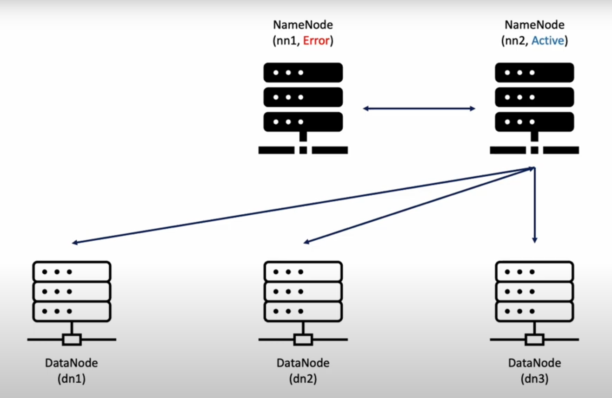

# [빅데이터 분석 환경 구축](https://www.youtube.com/watch?v=BdNYMu0bUDA&list=PLJlUnZ1kDbt7X2C4ntIYHmphNDIc5wN8J)
- 인프라 구성도(정상)

---
- nn1에서 error가 발생한 경우 

---
## [1. AWS EC2 인스턴스 배포](./1.%20AWS%20EC2%20인스턴스%20배포.md)

---
## [2. Java 설치 및 환경설정](./2.%20Java%20설치%20및%20환경설정.md)

---
## [3. Hadoop 설치 및 환경설정](./3.%20Hadoop%20설치%20및%20환경설정.md)

---
## [4. Spark 설치 및 환경설정](./4.%20Spark%20설치%20및%20환경설정.md)

---
## [5. Zookeeper 설치 및 환경설정](./5.%20Zookeeper%20설치%20및%20환경설정.md)

---
## [6. AMI 생성 및 인스턴스 복제](./6.%20AMI%20생성%20및%20인스턴스%20복제.md)

---
## [7. SSH 및 호스트이름 설정](./7.%20SSH%20및%20호스트이름%20설정.md)

---
## [8. Zookeeper 클러스터 실행](./8.%20Zookeeper%20클러스터%20실행.md)

---
## [9. Hadoop & Yarn 클러스터 실행](./9.%20Hadoop%20&%20Yarn%20클러스터%20실행.md)

---
## [10. Spark 클러스터 실행 및 PySpark 예제 실행](./10.%20Spark%20클러스터%20실행%20및%20PySpark%20예제%20실행.md)

