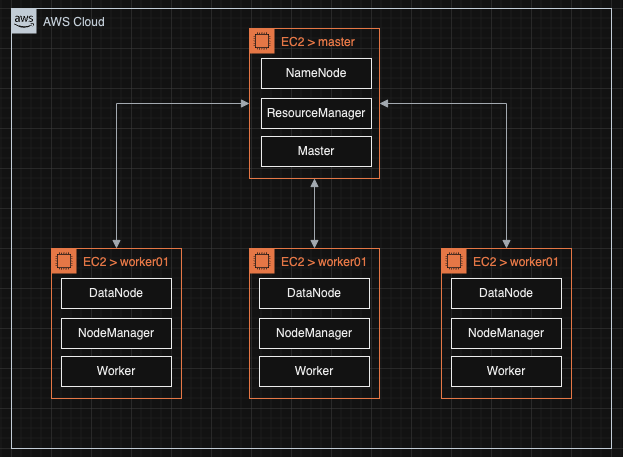

# [Apache hadoop, spark 클러스터 자체 구축 방법(기초)](https://youtu.be/qiEQ7gnYRfk?si=b2bCn4FlxzrNjx6_)
- [구축 가이드 문서](https://biggongjam.notion.site/Hadoop-Spark-Zookeeper-HA-6a741f79d3ae4f58b175ff48a485d261)

---
- [AWS 인프라 구성도 툴](https://app.diagrams.net/) 

---
## [1. AWS 인스턴스 배포](./1.%20AWS%20인스턴스%20배포.md)

---
## [2. 인스턴스 접근 설정](./2.%20인스턴스%20접근%20설정.md)
- [Windows용 OpenSSH의 키 기반 인증](https://learn.microsoft.com/ko-kr/windows-server/administration/openssh/openssh_keymanagement)

---
## [3. 인스턴스에 라이브러리 설치 및 설정](./3.%20인스턴스에%20라이브러리%20설치%20및%20설정.md)

---
## [4. Base AMI 생성](./4.%20Base%20AMI%20생성.md)

---
## [5. AMI로 생성된 인스턴스 접근 설정](./5.%20AMI로%20생성된%20인스턴스%20접근%20설정.md)

---
## [6. 인스턴스간 네트워크 설정 및 실행](./6.%20인스턴스간%20네트워크%20설정%20및%20실행.md)

---
## [7. 외부 접속 및 AWS 리소스 제거](./7.%20외부%20접속%20및%20AWS%20리소스%20제거.md)

