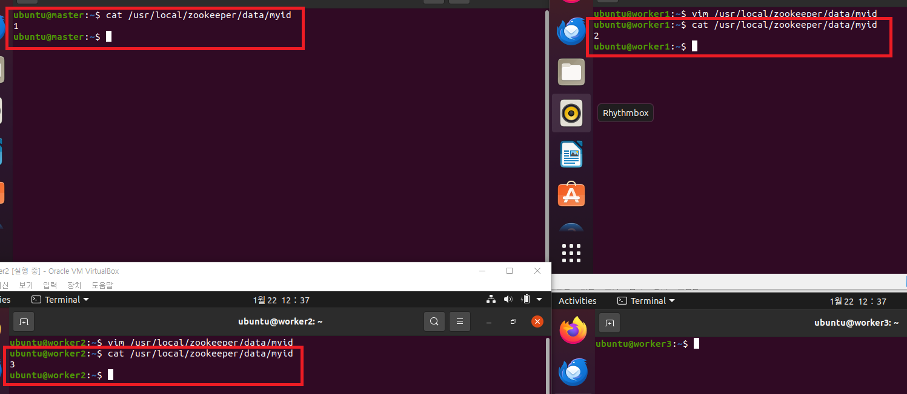
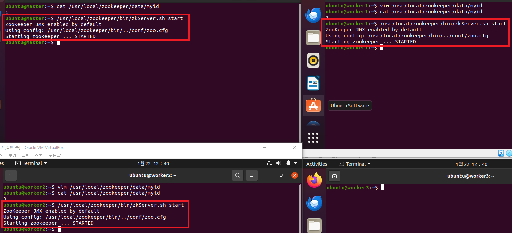
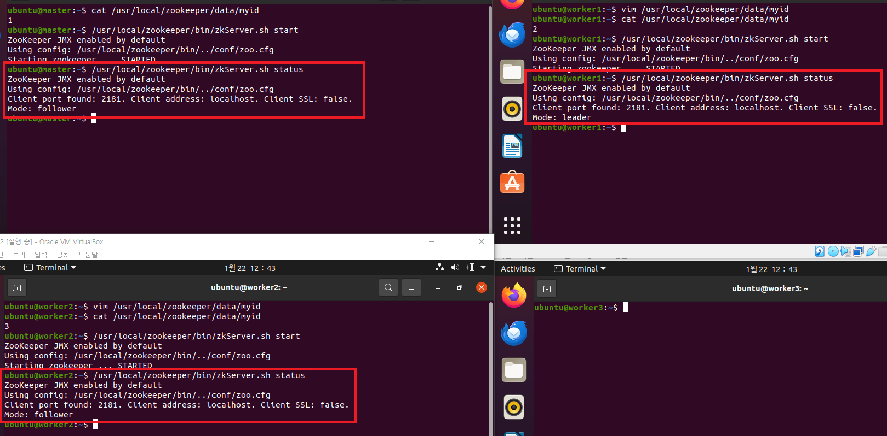
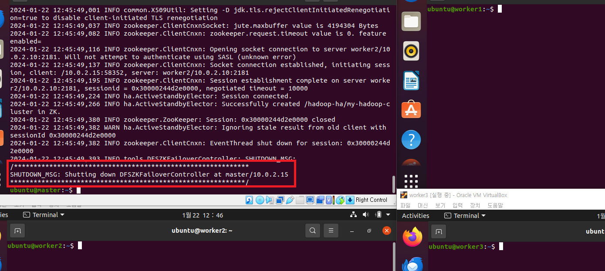

### 단계1: Zookeeper myid 파일 편집
-  master, worker1, worker2 서버에서 myid를 각각 1, 2, 3으로 편집한다. master 서버는 이미 지정했기 때문에 worker1, worker2에서 진행하면 된다.
```shell
# master 서버
cat /usr/local/zookeeper/data/myid

# worker1 서버로 이동
ssh worker1
vim /usr/local/zookeeper/data/myid
# 아래 내용으로 수정 후 저장
2

# worker2 서버로 이동
ssh worker2
vim /usr/local/zookeeper/data/myid
# 아래 내용으로 수정 후 저장
3
# master으로 이동
exit
```
---


---
### 단계2: Zookeeper 실행
```shell
# master zookeeper 시작
/usr/local/zookeeper/bin/zkServer.sh start

# worker1 zookeeper 시작
ssh worker1
/usr/local/zookeeper/bin/zkServer.sh start

# worker2 zookeeper 시작
ssh worker2
/usr/local/zookeeper/bin/zkServer.sh start
exit
```
---


---
### 단계3: Zookeeper 상태 확인
```shell
# master zookeeper 시작
/usr/local/zookeeper/bin/zkServer.sh status

# worker1 zookeeper 시작
ssh worker1
/usr/local/zookeeper/bin/zkServer.sh status

# worker2 zookeeper 시작
ssh worker2
/usr/local/zookeeper/bin/zkServer.sh status
exit
```
---


---
### 단계4: master 서버 > 주키퍼 초기화
```shell
# 주키퍼 초기화
hdfs zkfc -formatZK
```


---
### 단계5: master 서버 > HDFS ZKFC 초기화 확인
```shell
# zkCli 실행
/usr/local/zookeeper/bin/zkCli.sh

# Hadoop 클러스터 확인
ls /hadoop-ha

# [my-hadoop-cluster] 확인 후 quit 명령으로 종료

# 종료
quit
```
---


---
### 단계6: master, worker1, worker2 > Journalnode 실행
```shell
# master 실행
hdfs --daemon start journalnode
jps # 결과 확인

# worker1 실행
ssh worker1
hdfs --daemon start journalnode
jps # 결과 확인

# worker2 실행
ssh worker2
hdfs --daemon start journalnode
jps # 결과 확인
```
---
- QuorumPeerMain: zookeeper 가 동작하고 있다는 의미이다.
- JournalNode: journalnode 가 동작하고 있다는 의미이다.


