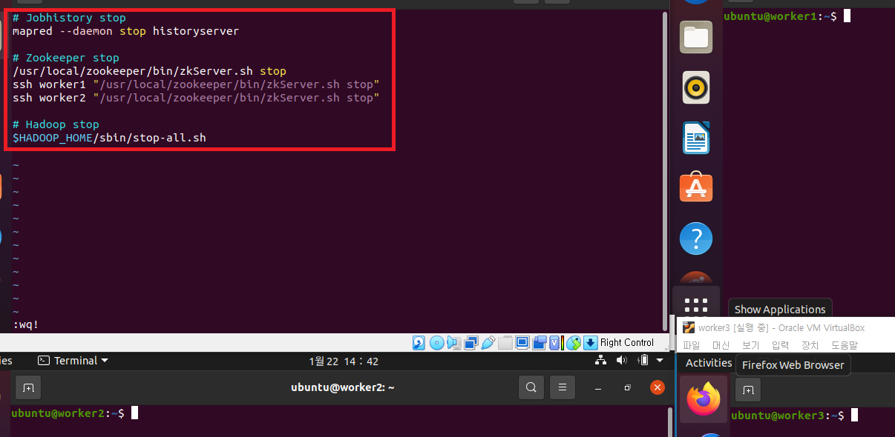

### 단계1: master > cluster-start-all.sh
- Hadoop, Yarn, Zookeeper 를 모두 실행 시키는 쉘 스크립트를 생성한다.
```shell
# home 디렉토리로 이동
cd ~ 

# 쉘 스크립트 편집
vim cluster-start-all.sh

# 아래 내용 추가 후 저장
# Zookeeper Run
/usr/local/zookeeper/bin/zkServer.sh start
ssh worker1 "/usr/local/zookeeper/bin/zkServer.sh start"
ssh worker2 "/usr/local/zookeeper/bin/zkServer.sh start"

# Hadoop Run
$HADOOP_HOME/sbin/start-all.sh

# Jobhistoryserver Run
mapred --daemon start historyserver
```
---


---
### 단계2: master > cluster-stop-all.sh
- Hadoop, Yarn, Zookeeper 를 모두 중단 시키는 쉘 스크립트를 생성한다.
```shell
# 쉘 스크립트 편집
vim cluster-stop-all.sh

# 아래 내용 추가 후 저장
# Jobhistory stop
mapred --daemon stop historyserver

# Zookeeper stop
/usr/local/zookeeper/bin/zkServer.sh stop
ssh worker1 "/usr/local/zookeeper/bin/zkServer.sh stop"
ssh worker2 "/usr/local/zookeeper/bin/zkServer.sh stop"

# Hadoop stop
$HADOOP_HOME/sbin/stop-all.sh
```
---


---
### 단계3: master > 쉡 스크립트 접근 권한 설정
```shell
# 쉡 스크립트 접근 권한 설정
sudo chmod 777 cluster-start-all.sh
sudo chmod 777 cluster-stop-all.sh

# 확인 
ls -al cluster*
```
---


---
### 단계4: master > cluster-start-all.sh 실행
- `NameNode, DFSZKFailoverController`: master, worker1
- `DataNode, NodeManager`: worker1, worker2, worker3
- `ResourceManager, JobHistoryServer`: master
- `QuorumPeerMain, JournalNode`: master, worker1, worker2
```shell
# 하둡이 멈춰있는지 확인!
jps
# 실행
. cluster-start-all.sh
# 확인 
jps
```
---


---
### 단계5: master > cluster-stop-all.sh 실행 
```shell
. cluster-stop-all.sh
jps
```

