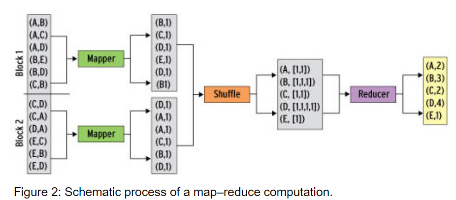
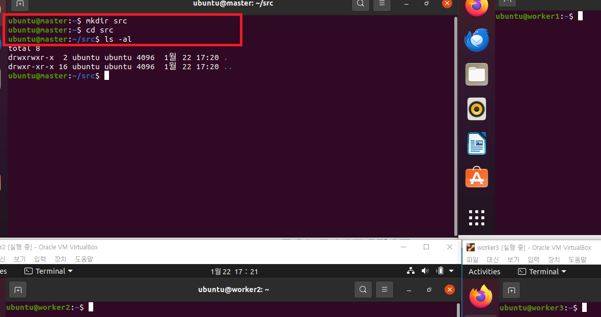
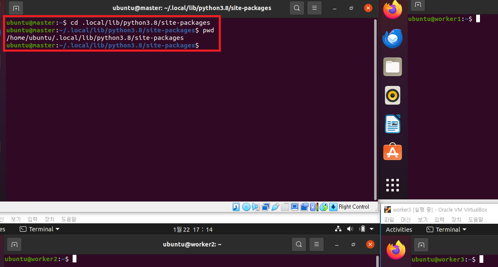
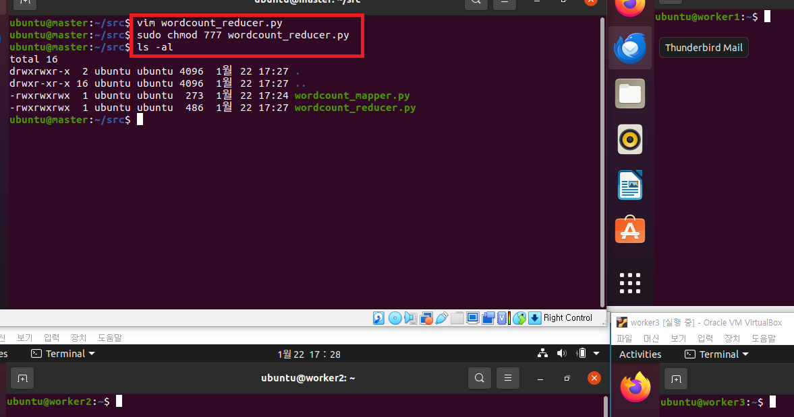
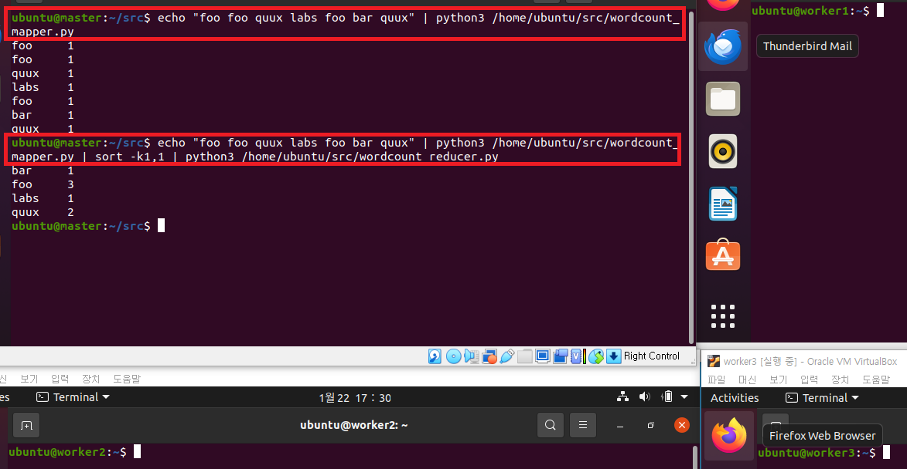
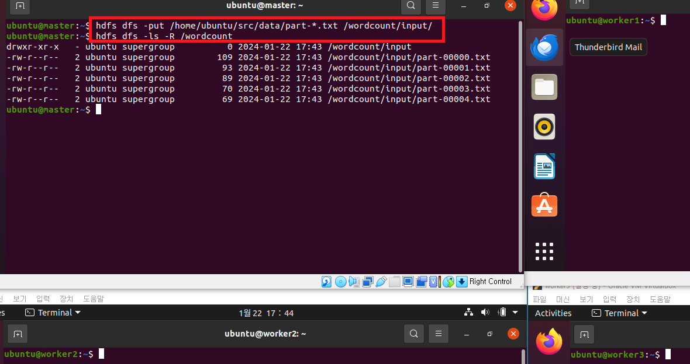

# [Map-Reduce](https://www.admin-magazine.com/HPC/Articles/MapReduce-and-Hadoop)
- 맵 리듀스는 기본적으로 Split -> Map -> Shuffle -> Reduce 의 절차를 갖습니다. 
- 여기서 Split-Map을 합쳐서 맵 태스크, Shuffle-Reduce 를 합쳐서 리듀스 태스크라고도 부릅니다. 
- Split 은 인풋데이터를 쪼개서 인풋을 키-쌍 값으로 만들어주는 작업이고, Map 은 키-쌍 값을 인풋으로 받아 list(키-값 쌍)을 내보냅니다. 
- Shuffle 에서는 list(키-값 쌍) 을 인풋으로 받아 키-값 쌍을 내보내고 Reduce 에서는 Shuffle 의 결과인 키-값 쌍 입력으로 받아 마지막으로 list(키-값 쌍) 을 내보냅니다. 

---


---
# Hadoop MapReduce 파이썬 구현 (단어 빈도수 세기)
### 단계1: src 디렉토리 생성 
```shell
mkdir src
cd src
ls -al
```


---
### 단계2: 파이썬 site-packages path 확인 
```shell
cd ~ # 홈 디렉토리로 이동 
cd .local/lib/python3.8/site-packages # 디렉토리 이동 
pwd # site-packages path 확인
# /home/ubuntu/.local/lib/python3.8/site-packages
```


---
### 단계3: MapReduce 생성 
```shell
cd /home/ubuntu/src 
vim wordcount_mapper.py # 아래 파이썬 코드 추가 

sudo chmod 777 wordcount_mapper.py 
ls -al
```
```python
#!/usr/bin/env python
# -*-coding:utf-8 -*
import sys  
# site-packages path 추가
sys.path.append( '/home/ubuntu/.local/lib/python3.8/site-packages')

for line in sys.stdin:
    words = line.strip().split()
    for word in words:
        print('{}\t{}'.format(word, 1))

``` 
---


---
```shell
vim wordcount_reducer.py # 아래 파이썬 코드 추가 

sudo chmod 777 wordcount_reducer.py
ls -al
```
---
```python
#!/usr/bin/env python
# -*-coding:utf-8 -*
import sys  
# site-packages path 추가 
sys.path.append( '/home/ubuntu/.local/lib/python3.8/site-packages')

def print_output(word, count):
        print('{}\t{}'.format(word, count))

word, count = None, 0
for line in sys.stdin:
    fields = line.strip().split('\t')

    if fields[0] != word:
        if word is not None:
            print_output(word, count)

        word, count = fields[0], 0
    count += 1

print_output(word, count)
```
---



---
# 예제1: 하나의 텍스트 처리 
```shell
# wordcount_mapper > 단순 단어 카운트 
echo "foo foo quux labs foo bar quux" | python3 /home/ubuntu/src/wordcount_mapper.py
# wordcount_reducer > 카운트된 단어 sum 
echo "foo foo quux labs foo bar quux" | python3 /home/ubuntu/src/wordcount_mapper.py | sort -k1,1 | python3 /home/ubuntu/src/wordcount_reducer.py
```



---
# 예제2: 여러 개의 텍스트 문서 처리 
### 단계1: (영어명언)데이터 생성 
```shell
mkdir data
cd data 

# 인생에서 가장 큰 영광은 넘어지지 않는 것에 있는 것이 아니라 매번 일어선다는 데 있다. (넬슨 만델라)
echo "The greatest glory in living lies not in never falling, but in rising every time we fall. – Nelson Mandela" >> part-00000.txt
# 인생은 산이다. 당신의 목표는 정상에 도달하는 것이 아니라 당신의 길을 찾는 것이다. (막심 라가세)
echo "Life is a mountain. Your goal is to find your path, not to reach the top. – Maxime Lagacé" >> part-00001.txt
# 인생에서 많은 패배에 직면하겠지만 결코 패배하지 말라. (마야 안젤루)
echo "You will face many defeats in life, but never let yourself be defeated. – Maya Angelou" >> part-00002.txt
# 내 인생을 바꾸는 사람은 자신입니다. 아무도 대신해줄 수 없어요. (캐롤 버넷)
echo "Only I can change me life, no one can do it for me. – Carol Burnett" >> part-00003.txt
# 위대한 이들은 목적을 갖고, 그 외의 사람들은 소원을 갖는다. (워싱턴 어빙)
echo "Great minds have purposes, others have wishes. – Washington Irving" >> part-00004.txt
```
---


---
### 단계2: 하둡에 데이터 저장 
```shell
# 폴더 생성 
hdfs dfs -mkdir -p /wordcount/input/ 
# 데이터 저장
hdfs dfs -put /home/ubuntu/src/data/part-*.txt /wordcount/input/
# 데이터 확인
hdfs dfs -ls -R /wordcount
```
---


---
### 단계3: 실행 
```shell
# 폴더 생성
hdfs dfs -rm -r /wordcount/output
# 실행 
hadoop jar $HADOOP_HOME/share/hadoop/tools/lib/hadoop-streaming-3.3.0.jar \
-files '/home/ubuntu/src/wordcount_mapper.py,/home/ubuntu/src/wordcount_reducer.py' \
-mapper 'python3 wordcount_mapper.py' \
-reducer 'python3 wordcount_reducer.py' \
-input /wordcount/input/* \
-output /wordcount/output 
```
---


---
### 단계4: 확인 
```shell
hdfs dfs -text /wordcount/output/part-*
```


---
### 단계5: Web UI
- yarn web ui: http://127.0.0.1:8088/cluster


