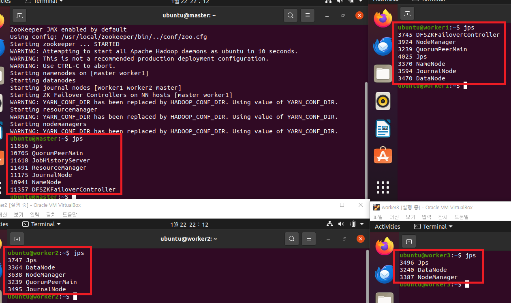
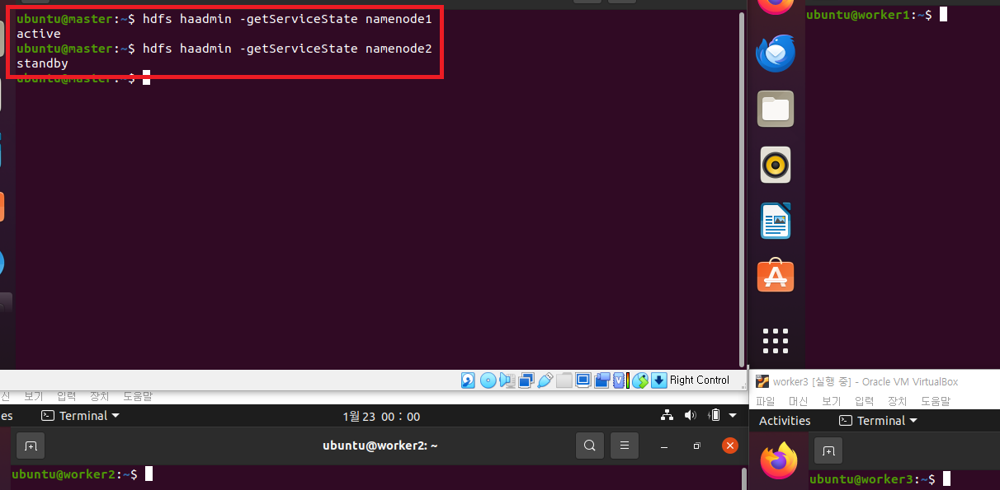
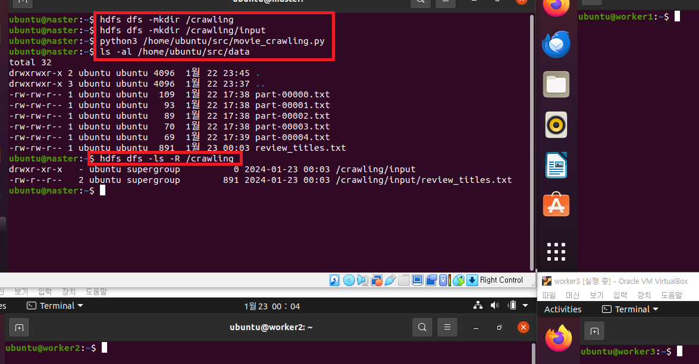
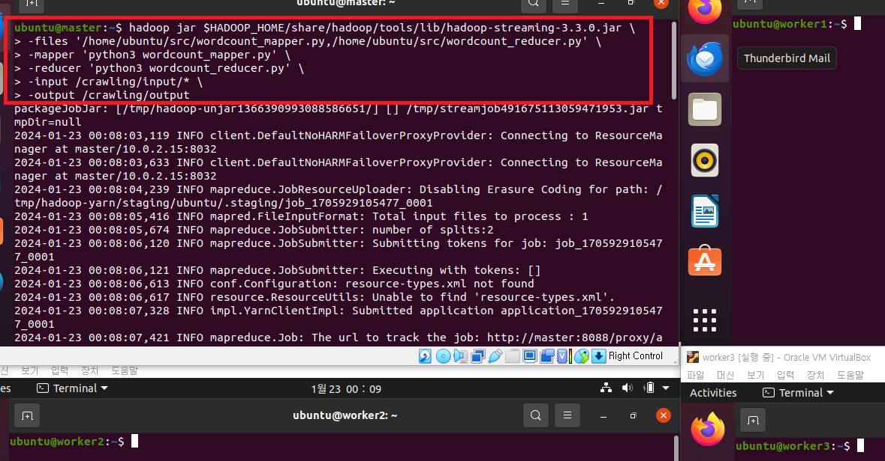
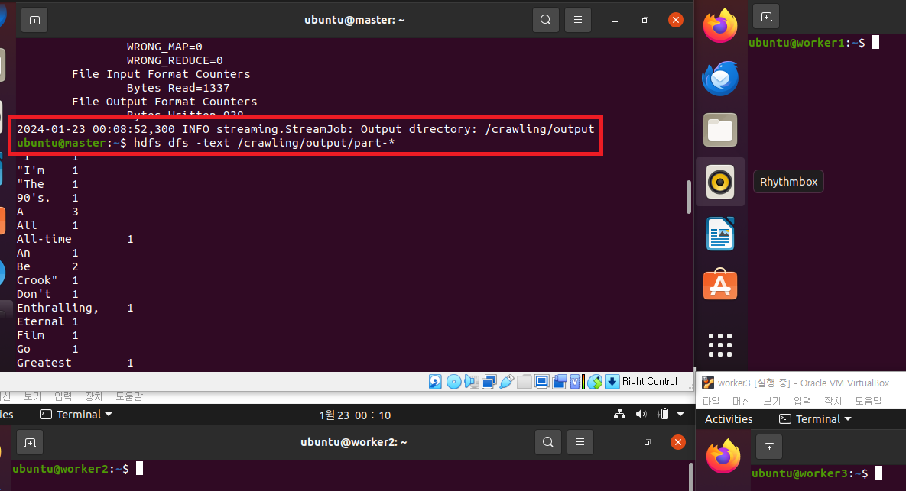
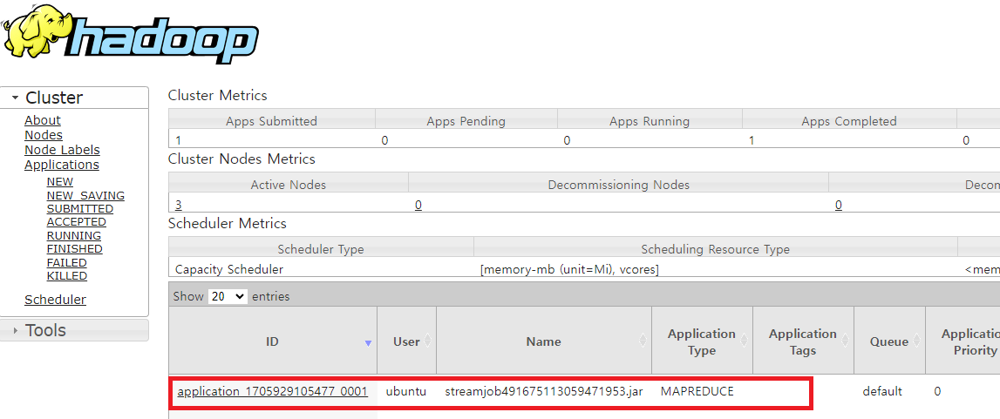

### 단계1: 파이썬 라이브러리 설치 
- `Requests`: HTTP를 사용하기 위해 쓰여지는 라이브러리
- `BeautifulSoup`: HTML/XML문자열에서 원하는 태그정보를 뽑아주는 라이브러리 
- `pandas`: 데이터 조작 및 분석을 위한 라이브러리
- `pyarrow`: 인메모리 분석을 위한  라이브러리
- `hdfs`: 하둡용 라이브러리
```shell
# 버전 확인 
python3 --version
# 크롤링에 필요한 라이브러리 설치 
pip3 install requests beautifulsoup4 pandas pyarrow hdfs
```

---


---
### 단계2: master > 하둡 실행 
```shell
# 실행
. cluster-start-all.sh
# 확인 
jps
```
---


---
### 단계3: master, worker1 서버 > Active, Standby NameNode 확인
- namenode1를 active / namenode2를 standby 상태로 만듬
```shell
hdfs haadmin -getServiceState namenode1 
hdfs haadmin -getServiceState namenode2
```
---


---
#### 참고용 
- 강제로 Standby -> Active 
```shell
hdfs haadmin -transitionToActive namenode1 --forcemanual
```
- 강제로 Active -> Standby
```shell
hdfs haadmin -transitionToStandby namenode2 --forcemanual
```

---
### 단계3: 크롤링 파이썬 파일 생성 
- sample_movie_crawling.py 확인
  - guest_ip 주소 변경!!
```shell
cd /home/ubuntu/src
# sample_movie_crawling.py 파일 내용 복사 및 붙여넣기
vim movie_crawling.py  

sudo chmod 777 movie_crawling.py
```
---


---
### 단계4: 파이썬 파일 실행 및 확인
```shell
hdfs dfs -mkdir /crawling
hdfs dfs -mkdir /crawling/input

# 파일 실행 
python3 /home/ubuntu/src/movie_crawling.py
# 결과 확인 
ls -al /home/ubuntu/src/data
# hadoop 데이터 확인 
hdfs dfs -ls -R /crawling
```
---


---
### 단계5: 하둡 워드카운트 실행 
```shell
# 실행 
hadoop jar $HADOOP_HOME/share/hadoop/tools/lib/hadoop-streaming-3.3.0.jar \
-files '/home/ubuntu/src/wordcount_mapper.py,/home/ubuntu/src/wordcount_reducer.py' \
-mapper 'python3 wordcount_mapper.py' \
-reducer 'python3 wordcount_reducer.py' \
-input /crawling/input/* \
-output /crawling/output 
```
---


---
### 단계6: 결과 확인  
```shell
hdfs dfs -text /crawling/output/part-*
```


---
### 단계7: Web UI
- yarn web ui: http://127.0.0.1:8088/cluster


---
### 단계8: master > 하둡 정지 
```shell
# 정지
. cluster-stop-all.sh
# 확인 
jps
```
