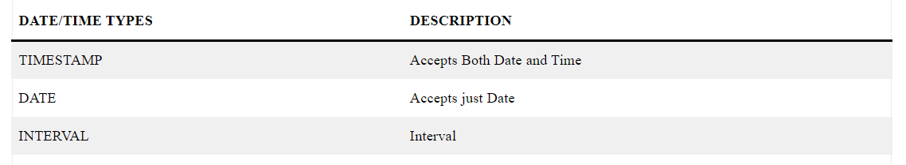
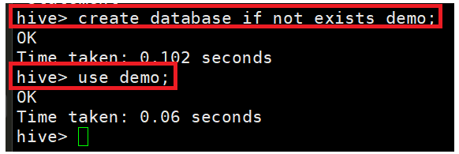
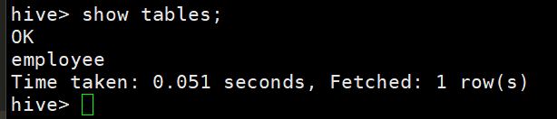
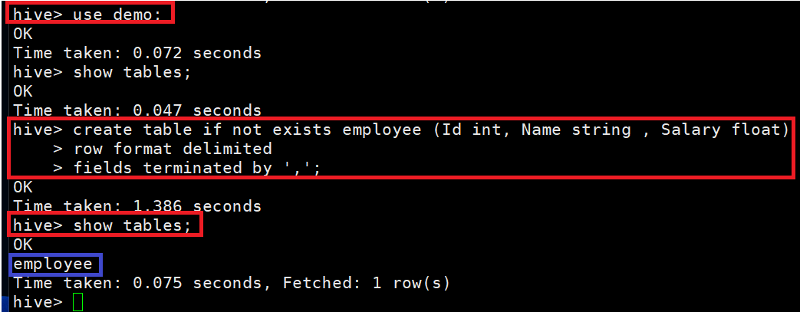
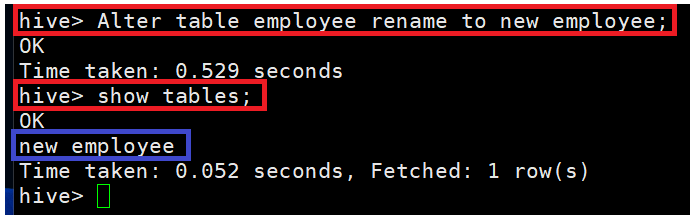
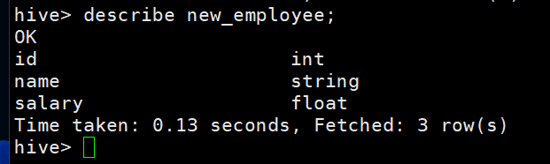
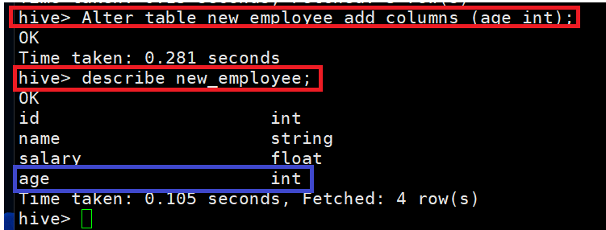
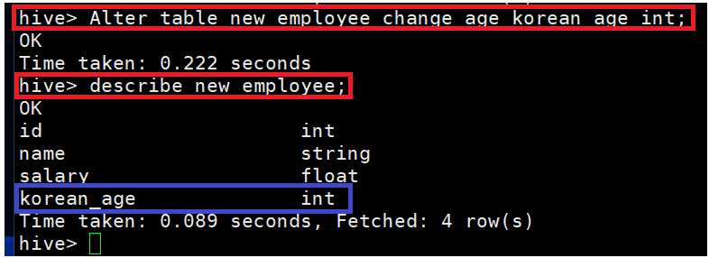

# [Data Types](https://sparkbyexamples.com/apache-hive/hive-data-types-primitive-complex/)

---
### Numberic Types


---
### Date/Time Types


### String Types


---
### Misc Types


### Complex Types


---
# [Database](https://www.javatpoint.com/hive-create-database)

---
### 단계1: database 조회
```sql
show databases;
```


---
### 단계2: database 생성
```sql
create database demo; 
show databases;
```


---
### 단계3: database 삭제
```sql
drop database demo; 
show databases;
```


---
# [Table](https://www.javatpoint.com/hive-create-table)

---
### 단계1: database 생성 및 적용 
```sql
create database if not exists demo; # 생성
use demo; # 적용 
```


---
### 단계2: table 생성 
```sql
create table employee (Id int, Name string , Salary float)  
row format delimited  
fields terminated by ','; 
```


---
### 단계3: table 조회  
```sql
show tables;
```


---
### 단계4: table 상세 조회  
```sql
describe employee;
```


---
### 단계5: table 삭제  
```sql
drop table employee;
show tables;
```


---
# [Alter Table](https://www.javatpoint.com/hive-alter-table)

---
### 단계1: database 적용 및 테이블 생성 
```sql
use demo; # 적용 
create table if not exists employee (Id int, Name string , Salary float)  
row format delimited  
fields terminated by ',';  # 테이블 생성 
show tables; # 테이블 조회  
```


---
### 단계2: Rename a Table
```sql
Alter table employee rename to new_employee; 
show tables; # 테이블 조회 
```


---
### 단계3: Adding column
- 기존 컬럼 확인 
```sql
describe new_employee;
```


---
- 컬럼 추가 
```sql
Alter table new_employee add columns (age int);  
describe new_employee;
```


---
### 단계4: Change Column
```sql
Alter table new_employee change age korean_age int; 
describe new_employee;
```


