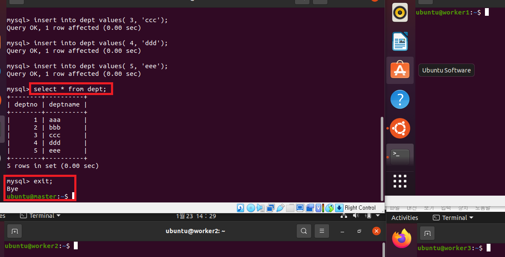
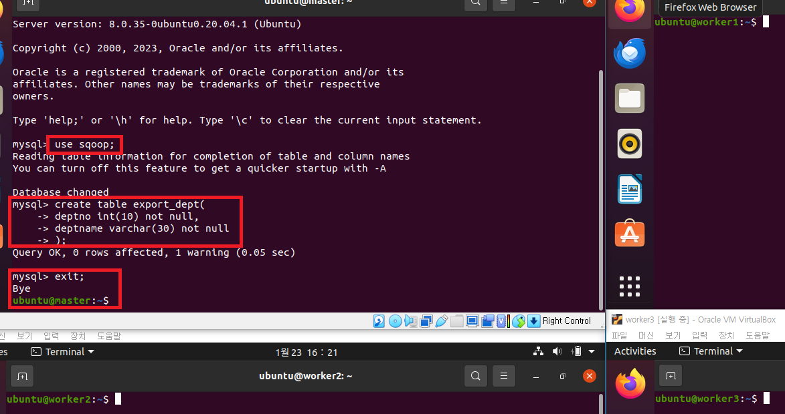
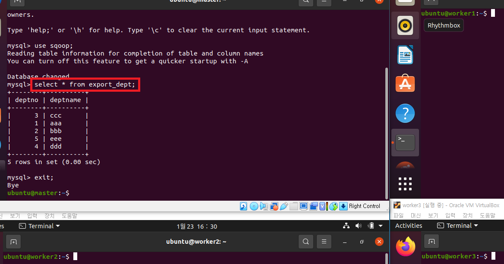

# Sqoop with Hadoop

---
### 단계1: mysql 접속 및 데이터베이스 생성 
- mysql 접속
```shell
sudo mysql -u hive -p # 비번: 123456
```
- 데이터베이스 생성 
```sql
create database sqoop;
use sqoop;
```
---


---
### 단계2: 테이블 생성, 데이터 추가 
```sql
create table dept(
deptno int(10) not null,
deptname varchar(30) not null
);

insert into dept values( 1, 'aaa');
insert into dept values( 2, 'bbb');
insert into dept values( 3, 'ccc');
insert into dept values( 4, 'ddd');
insert into dept values( 5, 'eee');

select * from dept;
exit;
```
---


---
### 단계3: sqoop을 이용한 데이터 조회  
```shell
sqoop eval  \
--driver "com.mysql.cj.jdbc.Driver" \
--connect "jdbc:mysql://master:3306/sqoop?useSSL=false&allowPublicKeyRetrieval=true&characterEncoding=UTF-8&serverTimezone=UTC" \
--username hive \
--password 123456 \
--query 'select * from dept;'
```
---


---
### 단계4: import 테스트 
- sqoop import 진행
  - `--table`: 테이블명
  - `--target-dir`: 하둡 저장소(이미존재하면 에러발생)
  - `-m 1`: 맵리듀스의 매퍼를 한개 실행 
```shell
hdfs dfs -mkdir /sqoop
# 만약 /sqoop 존재한다면, 삭제 
hdfs dfs -rm -r /sqoop/dept

# import
sqoop import  \
--driver "com.mysql.cj.jdbc.Driver" \
--connect "jdbc:mysql://master:3306/sqoop?useSSL=false&allowPublicKeyRetrieval=true&characterEncoding=UTF-8&serverTimezone=UTC" \
--username hive \
--password 123456 \
--table dept \
--fields-terminated-by "," \
--target-dir /sqoop/dept  \
-m 1

# 결과 확인 
hdfs dfs -text /sqoop/dept/part-*
```
---


---
### 단계5: export 테스트 
- mysql 접속
```shell
sudo mysql -u hive -p # 비번: 123456
```
- 테이블 생성
```sql
use sqoop;

create table export_dept(
deptno int(10) not null,
deptname varchar(30) not null
);

exit;
```
---


---
- sqoop export 진행
```shell
sqoop export  \
--driver "com.mysql.cj.jdbc.Driver" \
--connect "jdbc:mysql://master:3306/sqoop?useSSL=false&allowPublicKeyRetrieval=true&characterEncoding=UTF-8&serverTimezone=UTC" \
--username hive \
--password 123456 \
--table export_dept \
--export-dir /sqoop/dept \
--input-fields-terminated-by ',' \
--input-lines-terminated-by '\n'
```
---


---
- mysql 접속
```shell
sudo mysql -u hive -p # 비번: 123456
```
- 데이터 조회 
```sql
use sqoop;

select * from export_dept;

exit;
```
---



