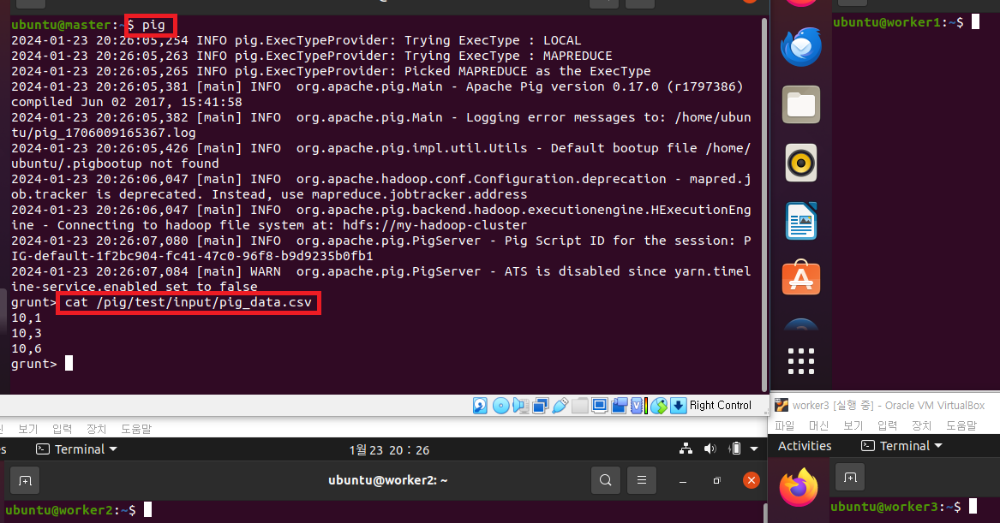
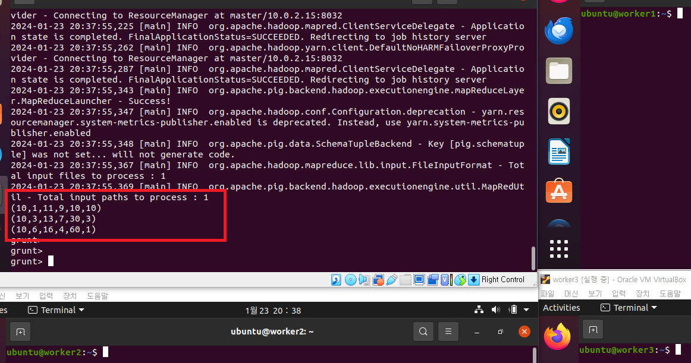

### 단계1: 테스트 데이터 생성 
```shell
vim ./src/data/pig_data.csv
# 아래 내용 입력 
10,1
10,3
10,6

cat ./src/data/pig_data.csv
```
---


---
### 단계2: 하둡에 데이터 추가
```shell
hdfs dfs -mkdir -p /pig/test/input
# hadoop 데이터 전달
hdfs dfs -put /home/ubuntu/src/data/pig_data.csv /pig/test/input
# hadoop 데이터 확인 
hdfs dfs -ls -R /pig
```
---


---
### 단계3: pig 데이터 확인 
```shell
# pig 접속 
pig 

# pig > 데이터 확인 
cat /pig/test/input/pig_data.csv
```
---


---
### 단계4: 데이터의 속성 이름과 데이터 형태를 정하고, 출력
```shell
# 데이터 정의
A = LOAD '/pig/test/input/pig_data.csv' USING PigStorage(',') AS (f1:int, f2:int);
# 데이터 출력 
DUMP A;
```
---


---
### 단계5: A 릴레이션의 f1 , f2 속성과 f1과 f2를 나누기 연산하고, 나머지를 세번째 속성으로 지정하여 X 릴레이션에 저장 후 출력
- 명령어 
```shell
X = FOREACH A GENERATE f1, f2, f1%f2;
DUMP X;
```
- 결과
> (10, 1, 0) 🡪 10 / 1의 몫: 10, 나머지0
> (10, 3, 1) 🡪 10 / 3의 몫: 3, 나머지 1
> (10, 6, 4) 🡪 10 / 6의 몫: 1, 나머지 4
---


---
### 단계6: (더하기 +), (빼기 -), (곱하기 *), (나누기 /)
- 명령어 
```shell
X = FOREACH A GENERATE f1, f2, f1+f2, f1-f2, f1*f2, f1/f2;
DUMP X;
```
- 결과
> (10, 1, 11, 9, 10, 10)
> - 10 + 1 = 1
> - 10 - 1 = 9
> - 10 * 1 = 10
> - 10 / 1 = 10
---

