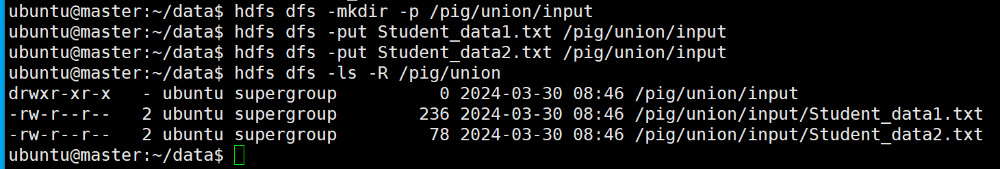
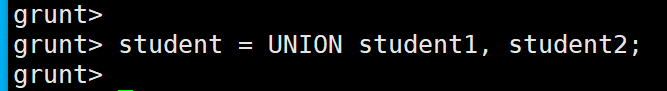
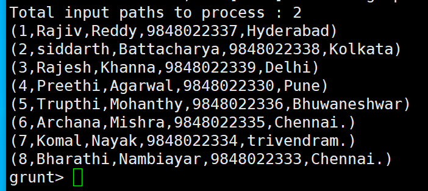
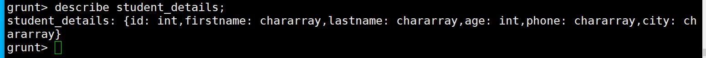
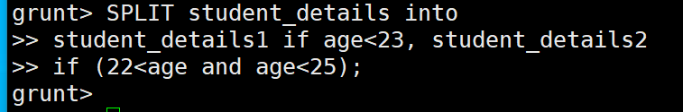
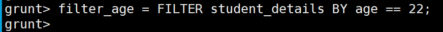
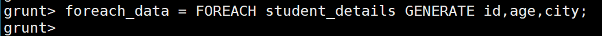
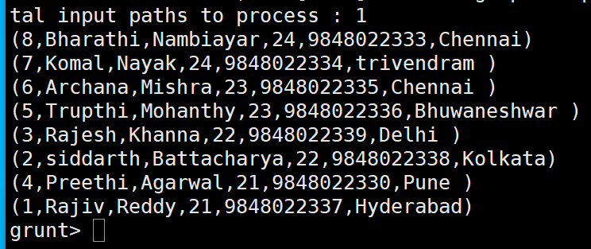

# [Union](https://www.tutorialspoint.com/apache_pig/apache_pig_union_operator.htm)

---
### 단계1: Student_data1.txt
```shell
vim Student_data1.txt
# 아래 내용 작성 
001,Rajiv,Reddy,9848022337,Hyderabad
002,siddarth,Battacharya,9848022338,Kolkata
003,Rajesh,Khanna,9848022339,Delhi
004,Preethi,Agarwal,9848022330,Pune
005,Trupthi,Mohanthy,9848022336,Bhuwaneshwar
006,Archana,Mishra,9848022335,Chennai.
```
### 단계2: Student_data2.txt
```shell
vim Student_data2.txt
# 아래 내용 작성 
7,Komal,Nayak,9848022334,trivendram.
8,Bharathi,Nambiayar,9848022333,Chennai.
```
---
### 단계3: hadoop 데이터 전달 
```shell
hdfs dfs -mkdir -p /pig/union/input
hdfs dfs -put Student_data1.txt /pig/union/input
hdfs dfs -put Student_data2.txt /pig/union/input
# hadoop 데이터 확인 
hdfs dfs -ls -R /pig/union
```


---
### 단계4: LOAD
```shell
student1 = LOAD '/pig/union/input/Student_data1.txt' USING PigStorage(',') 
   as (id:int, firstname:chararray, lastname:chararray, phone:chararray, city:chararray); 

student2 = LOAD '/pig/union/input/Student_data2.txt' USING PigStorage(',') 
   as (id:int, firstname:chararray, lastname:chararray, phone:chararray, city:chararray);
```
### 단계5: describe
```shell
describe student1;

describe student2;
```


---
### 단계6: UNION
```shell
student = UNION student1, student2;
```

### 단계7: 
```shell
Dump student; 
```


---
# [Split](https://www.tutorialspoint.com/apache_pig/apache_pig_split_operator.htm)

---
### 단계1: student_details.txt
```shell
vim student_details.txt
# 아래 내용 작성 
001,Rajiv,Reddy,21,9848022337,Hyderabad
002,siddarth,Battacharya,22,9848022338,Kolkata
003,Rajesh,Khanna,22,9848022339,Delhi 
004,Preethi,Agarwal,21,9848022330,Pune 
005,Trupthi,Mohanthy,23,9848022336,Bhuwaneshwar 
006,Archana,Mishra,23,9848022335,Chennai 
007,Komal,Nayak,24,9848022334,trivendram 
008,Bharathi,Nambiayar,24,9848022333,Chennai
```
### 단계2: hadoop 데이터 전달 
```shell
hdfs dfs -mkdir -p /pig/split/input
hdfs dfs -put student_details.txt /pig/split/input
# hadoop 데이터 확인 
hdfs dfs -ls -R /pig/split
```
---
### 단계3: LOAD
```shell
student_details = LOAD '/pig/split/input/student_details.txt' USING PigStorage(',')
   as (id:int, firstname:chararray, lastname:chararray, age:int, phone:chararray, city:chararray); 

describe student_details;
```


### 단계4: SPLIT
```shell
SPLIT student_details into 
student_details1 if age<23, student_details2 
if (22<age and age<25);
```


---
### 단계5: Dump 
```shell
Dump student_details1; 
```

```shell
Dump student_details2; 
```


---
# [Filter](https://www.tutorialspoint.com/apache_pig/apache_pig_filter_operator.htm)
---
### 단계1: FILTER
```shell
filter_age = FILTER student_details BY age == 22;
filter_age1 = FILTER student_details BY age != 22;
filter_age2 = FILTER student_details BY (age == 22 or age == 24);
filter_age3 = FILTER student_details BY not(age == 22 or age == 24);
filter_age4 = FILTER student_details BY (id<=5) and (age==23 or age==21);
```

### 단계2: Dump 
```shell
Dump filter_age; 
```


---
# [Foreach](https://www.tutorialspoint.com/apache_pig/apache_pig_foreach_operator.htm)

---
### 단계1: FOREACH 
```shell
foreach_data = FOREACH student_details GENERATE id,age,city;
foreach_data1 = FOREACH student_details GENERATE $0,$1,$2;
```

### 단계2: Dump 
```shell
Dump foreach_data; 
```


---
# [Order By](https://www.tutorialspoint.com/apache_pig/apache_pig_order_by.htm)

---
### 단계1: ORDER 
```shell
order_by_data = ORDER student_details BY age DESC;
order_by_data1 = ORDER student_details BY age;
```

### 단계2: Dump 
```shell
Dump order_by_data; 
```


---
# [Limit](https://www.tutorialspoint.com/apache_pig/apache_pig_limit_operator.htm)

---
### 단계1: LIMIT 
```shell
limit_data = LIMIT student_details 4; 
limit_data = LIMIT ( ORDER student_details BY age DESC ) 2; 
```

### 단계2: Dump 
```shell
Dump limit_data; 
```


