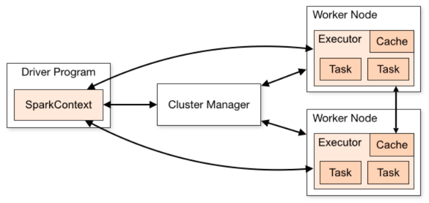
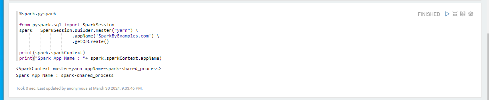
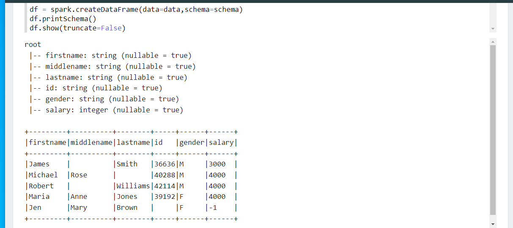
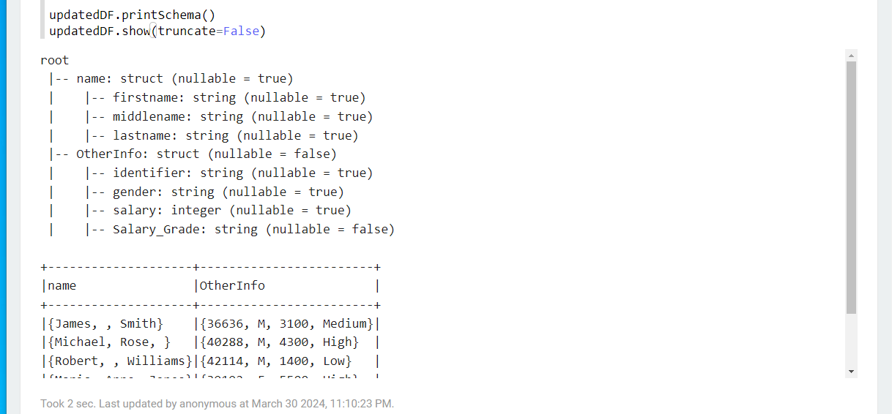

# [SparkContext](https://sparkbyexamples.com/pyspark/pyspark-sparkcontext-explained/)
- Spark 드라이버 프로그램은 SparkContext를 생성 및 사용하여 클러스터 관리자에 연결하여 PySpark 작업을 제출하고 통신할 리소스 관리자(YARN, Mesos 또는 Standalone)를 파악합니다. 



---
### 단계1: Create SparkContext
```python
%spark.pyspark

from pyspark.sql import SparkSession
spark = SparkSession.builder.master("yarn") \
                    .appName('SparkByExamples.com') \
                    .getOrCreate()
                    
print(spark.sparkContext)
print("Spark App Name : "+ spark.sparkContext.appName)
```


---
### 단계2: Stop PySpark SparkContext
```python
%spark.pyspark

spark.sparkContext.stop()

print(spark.sparkContext)
print("Spark App Name : "+ spark.sparkContext.appName)
```


---
# [Create an Empty DataFrame & RDD](https://sparkbyexamples.com/pyspark/pyspark-create-an-empty-dataframe/)

---
### 단계1: Create Empty RDD
```python
%spark.pyspark

emptyRDD = spark.sparkContext.emptyRDD()
print(emptyRDD)
```


---
### 단계2: Create Empty DataFrame with Schema
```python
%spark.pyspark

from pyspark.sql.types import StructType,StructField, StringType

#Create Schema
schema = StructType([
  StructField('firstname', StringType(), True),
  StructField('middlename', StringType(), True),
  StructField('lastname', StringType(), True)
  ])

#Create empty DataFrame from empty RDD
df = spark.createDataFrame(emptyRDD,schema)
df.printSchema()
```
---


---
### 단계3:  Convert Empty RDD to DataFrame
```python
%spark.pyspark

#Convert empty RDD to Dataframe
df1 = emptyRDD.toDF(schema)
df1.printSchema()
```


---
### 단계4: Create Empty DataFrame with Schema
```python
%spark.pyspark

#Create empty DataFrame directly.
df2 = spark.createDataFrame([], schema)
df2.printSchema()
```


---
# [Convert PySpark RDD to DataFrame](https://sparkbyexamples.com/pyspark/convert-pyspark-rdd-to-dataframe/)

---
### 단계1: Create PySpark RDD
```python
%spark.pyspark

dept = [("Finance",10),("Marketing",20),("Sales",30),("IT",40)]
rdd = spark.sparkContext.parallelize(dept)
```
```python
%spark.pyspark

df = rdd.toDF()
df.printSchema()
df.show(truncate=False)
```
---


---
### 단계2: Set Columns Name
```python
%spark.pyspark

deptColumns = ["dept_name","dept_id"]
df2 = rdd.toDF(deptColumns)
df2.printSchema()
df2.show(truncate=False)
```


---
### 단계3: Using PySpark createDataFrame()
```python
%spark.pyspark

deptDF = spark.createDataFrame(rdd, schema = deptColumns)
deptDF.printSchema()
deptDF.show(truncate=False)
```


---
### 단계4: Using createDataFrame() with StructType schema
```python
%spark.pyspark

from pyspark.sql.types import StructType,StructField, StringType

deptSchema = StructType([       
    StructField('dept_name', StringType(), True),
    StructField('dept_id', StringType(), True)
])

deptDF1 = spark.createDataFrame(rdd, schema = deptSchema)
deptDF1.printSchema()
deptDF1.show(truncate=False)
```
---


---
# [Convert PySpark DataFrame to Pandas](https://sparkbyexamples.com/pandas/convert-pyspark-dataframe-to-pandas/)

---
### 단계1: Prepare PySpark DataFrame
```python
%spark.pyspark

data = [("James","","Smith","36636","M",60000),
        ("Michael","Rose","","40288","M",70000),
        ("Robert","","Williams","42114","",400000),
        ("Maria","Anne","Jones","39192","F",500000),
        ("Jen","Mary","Brown","","F",0)]

columns = ["first_name","middle_name","last_name","dob","gender","salary"]
pysparkDF = spark.createDataFrame(data = data, schema = columns)
pysparkDF.printSchema()
pysparkDF.show(truncate=False)
```
---
### 단계2: Convert PySpark Dataframe to Pandas DataFrame
```python
%spark.pyspark

import sys  
# site-packages path 추가
sys.path.append( '/home/ubuntu/.local/lib/python3.8/site-packages')

pandasDF = pysparkDF.toPandas()
print(pandasDF)
```
---


---
# [Display DataFrame Contents in Table](https://sparkbyexamples.com/pyspark/pyspark-show-display-dataframe-contents-in-table/)
```python
%spark.pyspark

columns = ["Seqno","Quote"]
data = [("1", "Be the change that you wish to see in the world"),
    ("2", "Everyone thinks of changing the world, but no one thinks of changing himself."),
    ("3", "The purpose of our lives is to be happy."),
    ("4", "Be cool.")]
df = spark.createDataFrame(data,columns)
```
---
### 단계1: show() - Default
```python
%spark.pyspark

# Default - displays 20 rows and 
# 20 charactes from column value 
df.show()
```


---
### 단계2: show() - Display full contents
```python
%spark.pyspark

#Display full column contents
df.show(truncate=False)
```


---
### 단계3: show() - Display 2 rows
```python
%spark.pyspark

# Display 2 rows and full column contents
df.show(2,truncate=False) 
```


---
# [PySpark StructType & StructField Explained](https://sparkbyexamples.com/pyspark/pyspark-structtype-and-structfield/)

---
### 단계1: Using PySpark StructType & StructField with DataFrame
```python
%spark.pyspark

from pyspark.sql.types import StructType,StructField, StringType, IntegerType

data = [("James","","Smith","36636","M",3000),
    ("Michael","Rose","","40288","M",4000),
    ("Robert","","Williams","42114","M",4000),
    ("Maria","Anne","Jones","39192","F",4000),
    ("Jen","Mary","Brown","","F",-1)
  ]

schema = StructType([ \
    StructField("firstname",StringType(),True), \
    StructField("middlename",StringType(),True), \
    StructField("lastname",StringType(),True), \
    StructField("id", StringType(), True), \
    StructField("gender", StringType(), True), \
    StructField("salary", IntegerType(), True) \
  ])
 
df = spark.createDataFrame(data=data,schema=schema)
df.printSchema()
df.show(truncate=False) 
```
---


---
### 단계2: Defining Nested StructType object struct
```python
%spark.pyspark

# Defining schema using nested StructType
structureData = [
    (("James","","Smith"),"36636","M",3100),
    (("Michael","Rose",""),"40288","M",4300),
    (("Robert","","Williams"),"42114","M",1400),
    (("Maria","Anne","Jones"),"39192","F",5500),
    (("Jen","Mary","Brown"),"","F",-1)
  ]
structureSchema = StructType([
        StructField('name', StructType([
             StructField('firstname', StringType(), True),
             StructField('middlename', StringType(), True),
             StructField('lastname', StringType(), True)
             ])),
         StructField('id', StringType(), True),
         StructField('gender', StringType(), True),
         StructField('salary', IntegerType(), True)
         ])

df2 = spark.createDataFrame(data=structureData,schema=structureSchema)
df2.printSchema()
df2.show(truncate=False)
```
---


---
### 단계3: Adding & Changing struct of the DataFrame
```python
%spark.pyspark

# Updating existing structtype using struct
from pyspark.sql.functions import col,struct,when
updatedDF = df2.withColumn("OtherInfo", 
    struct(col("id").alias("identifier"),
    col("gender").alias("gender"),
    col("salary").alias("salary"),
    when(col("salary").cast(IntegerType()) < 2000,"Low")
      .when(col("salary").cast(IntegerType()) < 4000,"Medium")
      .otherwise("High").alias("Salary_Grade")
  )).drop("id","gender","salary")

updatedDF.printSchema()
updatedDF.show(truncate=False)
```
---


---
### 단계4: Creating StructType object struct from JSON file
```python
%spark.pyspark

print(df2.schema.json())
```


