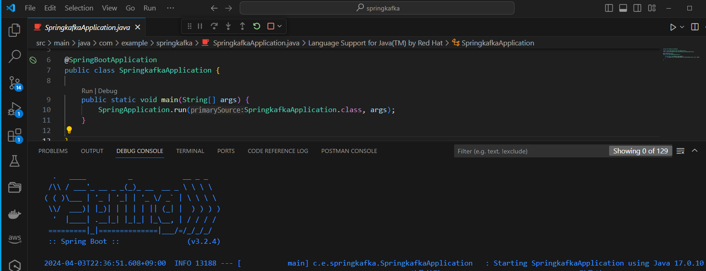
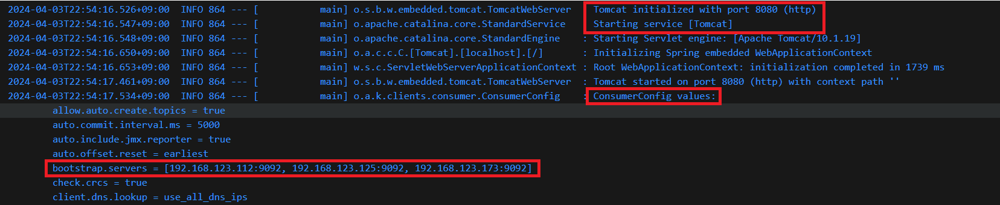
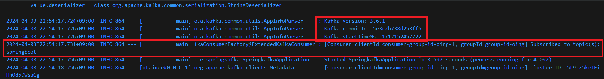
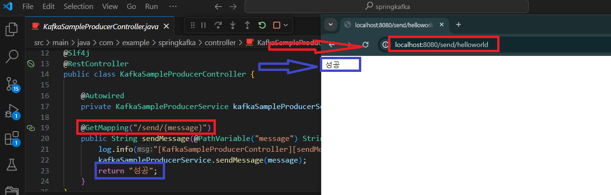

# kafka

---
### 단계1: 카프라 실행


---
### 단계2: 토픽 생성
```shell
# 토픽 생성
$KAFKA_HOME/bin/kafka-topics.sh --create \
--bootstrap-server kafka01:9092,kafka02:9092,kafka03:9092 \
--partitions 1 \
--replication-factor 1 \
--topic springboot
```
---
### 단계3: 토픽 조회
```shell
# 토픽 조회
$KAFKA_HOME/bin/kafka-topics.sh \
--list \
--bootstrap-server kafka01:9092,kafka02:9092,kafka03:9092
```


---
# SpringBoot

---
### 단계1: 스프링 프로젝트 생성 
- 예제프로젝트: springkafka


---
### 단계2: application.yml
```yaml
spring:  
    # kafka property에 대한 설명 >> https://oingdaddy.tistory.com/307
    kafka:    
        consumer:      
            bootstrap-servers: 192.168.123.112:9092,192.168.123.125:9092,192.168.123.173:9092      
            group-id: group-id-oing      
            auto-offset-reset: earliest      
            key-deserializer: org.apache.kafka.common.serialization.StringDeserializer      
            value-deserializer: org.apache.kafka.common.serialization.StringDeserializer    
        producer:      
            bootstrap-servers: 192.168.123.112:9092,192.168.123.125:9092,192.168.123.173:9092     
            key-serializer: org.apache.kafka.common.serialization.StringSerializer      
            value-serializer: org.apache.kafka.common.serialization.StringSerializer

```
---
### 단계3: KafkaSampleConsumerService.java
```java
package com.example.springkafka.service;

import java.io.IOException;
import org.springframework.kafka.annotation.KafkaListener;
import org.springframework.stereotype.Service;
import lombok.extern.slf4j.Slf4j;

@Slf4j
@Service
public class KafkaSampleConsumerService {
    
    @KafkaListener(topics = "springboot", groupId = "group-id-oing")
    public void consume(String message) throws IOException {       

        log.info("[KafkaSampleConsumerService][consume] Start");
        log.info("receive message : "+message);
    }

}
```
---
### 단계4: KafkaSampleProducerService.java
```java
package com.example.springkafka.service;

import org.springframework.beans.factory.annotation.Autowired;
import org.springframework.kafka.core.KafkaTemplate;
import org.springframework.stereotype.Service;
import lombok.extern.slf4j.Slf4j;

@Slf4j
@Service
public class KafkaSampleProducerService {
    
    @Autowired
    private KafkaTemplate<String, String> kafkaTemplate;

    public void sendMessage(String message) {
        log.info("[KafkaSampleProducerService][sendMessage] Start");
        log.info("send message : "+message);
        kafkaTemplate.send("springboot", message);
    }
}
```
---
### 단계5: KafkaSampleProducerController.java
```java
package com.example.springkafka.controller;

import org.springframework.beans.factory.annotation.Autowired;
import org.springframework.web.bind.annotation.GetMapping;
import org.springframework.web.bind.annotation.PathVariable;
import org.springframework.web.bind.annotation.RestController;
import com.example.springkafka.service.KafkaSampleProducerService;
import lombok.extern.slf4j.Slf4j;

@Slf4j
@RestController
public class KafkaSampleProducerController {
    
    @Autowired
    private KafkaSampleProducerService kafkaSampleProducerService;

    @GetMapping("/send/{message}")
    public String sendMessage(@PathVariable("message") String message) {
        log.info("[KafkaSampleProducerController][sendMessage] Start");
        kafkaSampleProducerService.sendMessage(message);
        return "성공";
    }
}
```
---
# 카프라 테스트 with SpringBoot

---
### 단계1: SpringBoot Start


---
- 주요 로그 정보들




---
### 단계2: Test
- http://localhost:8080/send/helloworld



---
### 단계3: KafkaSampleProducerService > log


---
### 단계4: KafkaSampleConsumerService > log


---
### 단계5: kafka consumer 
```shell
$KAFKA_HOME/bin/kafka-console-consumer.sh \
--bootstrap-server kafka01:9092,kafka02:9092,kafka03:9092 \
--topic springboot \
--from-beginning
```


---
# 참고문서
- [kafak with spring](https://oingdaddy.tistory.com/308)


