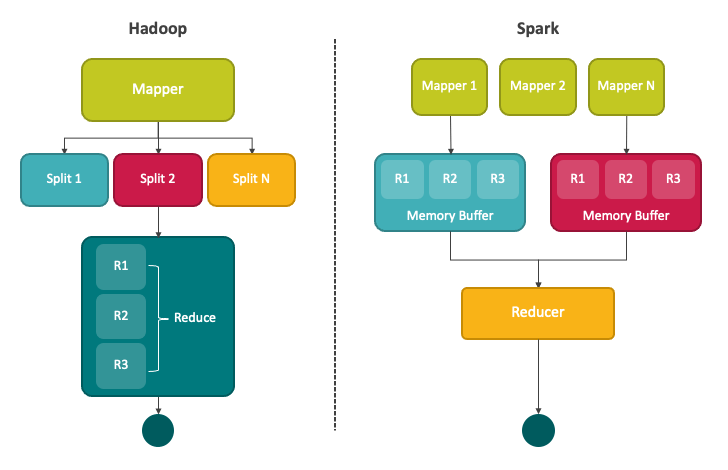
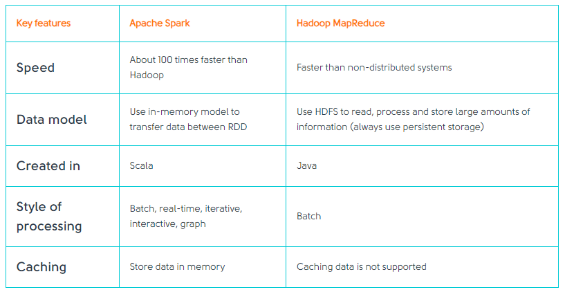
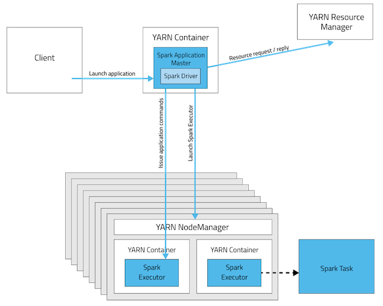
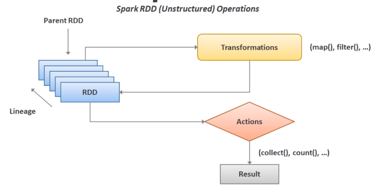
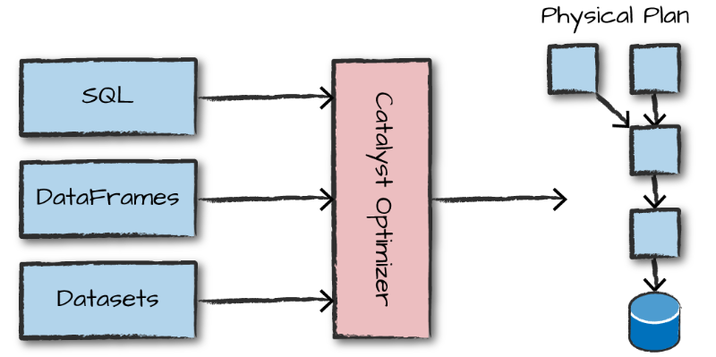
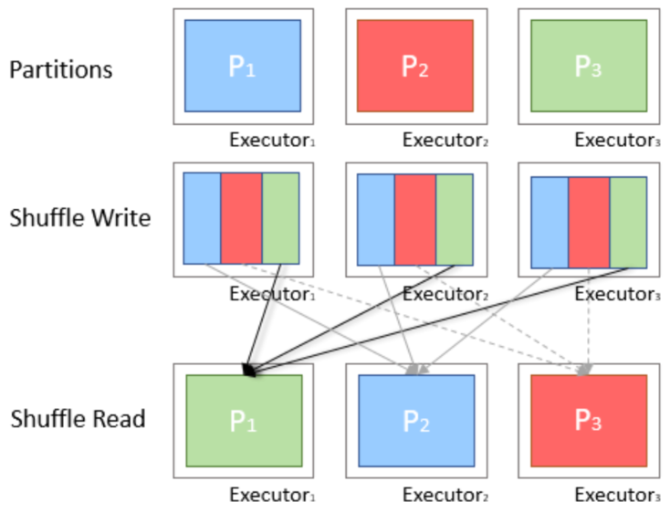

# [Spark 특징](https://www.brainbackdoor.com/data/spark-characteristics)
1. Apache Spark는 데이터 처리를 위한 범용 프레임워크이다. 
2. 다양한 Layer의 API, 다양한 형태의 API (Dataset, Dataframe, Spark SQL)를 지원해준다.
3. 다양한 Storage와 연동되는 Connector가 존재하여 데이터 추출 및 저장이 가능하다.
4. Yarn, Mesos, k8s 등 환경을 위한 Cluster Manager가 있으며, SQL, Python, Scala 등을 위한 터미널, Jupyter 등 다양한 실행 모드 및 환경을 지원한다. 
---

---
# [Spark vs Hadoop](https://svitla.com/blog/spark-vs-hadoop)
## computation flow
- Hadoop은 MapReduce가 끝날때마다 필요한 데이터를 디스크에 저장하는 과정이 있다. 하지만 Spark는 필요한 데이터를 메모리에 저장을 하여 속도가 더 빠르다.

---
### Spark의 주요장점 
- Real-time analysis 
- Machine Learning algorithms

---
# [Spark](https://mangkyu.tistory.com/128)
### Spark with Hadoop
- Spark는 Hadoop을 대체하기 나온 것이 아니라 Hadoop과 함께 하며 성능을 높이고자 나온 것이다.
- 따라서 Hadoop의 버전과 무관하게 그리고 Hadoop 클러스터에 대한 관리자 권한이 있는지와 무관하게 Spark를 실행할 수 있다.

---
### Spark 실행 모드 
- Cluster Mode(클러스터 모드)
    -  오랜 작업시간이 필요한 경우, Cluster Mode를 사용하는 것이 좋다.

---
- Client Mode(클라이언트 모드)
    -  interactive jobs(실시간 쿼리 or 온라인 데이터 분석 등)에 적합하다.

---
# [Spark 주요개념](https://velog.io/@rymyung/Apache-Spark-%EA%B8%B0%EB%B3%B8-%EA%B0%9C%EB%85%90)
### RDD(Resilient Distributed Dataset)
- Spark의 DataFrame / SQL / DataSet API를 사용할 때, 내부적으로 RDD로 코드가 생성되어 실행
- RDD의 동작은 크게 Transformation과 Action으로 구분

---
### Optimization
- Spark는 DataFrame / SQL / DataSet API를 Catalyst Optimizer를 통해 최적화하고 최종적으로 RDD를 위한 코드를 생성한다.

---
### Partition
- 일반적으로 Spark는 단일 머신에서 처리하기 어려운 큰 사이즈의 데이터를 사용
- 사용자는 DataFrame 같은 추상화된 API를 통해 데이터를 '하나'처럼 다룸. 그러나 Spark는 데이터를 분할해 Partition 단위로 처리

---
### Shuffle
- Shuffle은 특정 연산을 수행하기 위해 여러 Partition 내의 데이터가 그룹화되어 다른 Partition 들로 이동하는 것
- Shuffle 로 인해 Memory / Disk / Network 등 많은 자원이 소모하므로 Shuffle 을 적게, 필요한 만큼만 수행해 자원을 덜 소모하고 실행 시간도 짧아지도록 하는게 중요

---

