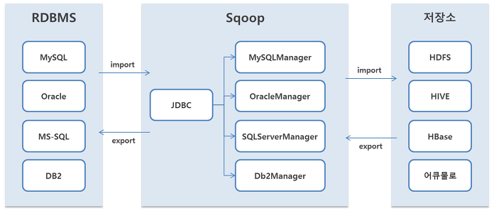
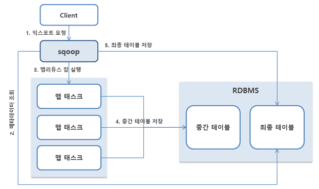

# [Sqoop](https://excelsior-cjh.tistory.com/56)
- 대용량 데이터 전송 솔루션 
- Sqoop은 HDFS, RDBMS, DW, NoSQL등 다양한 저장소에 대용량 데이터를 신속하게 전송할 수 있는 방법을 제공한다.
- Oracle, MS-SQL, DB2 등과 같은 상용 RDBMS와 MySQL, PostgresSQL과 같은 오픈소스 RDBMS등을 지원합니다.

---
## Sqoop 아키텍처 
- 스쿱은 관계형 DB를 읽고 쓸 수 있는 커넥터라는 개념을 사용한다. 커넥터는 각 DB별로 구현돼 있으며, JDBC 드라이버를 이용해 데이터베이스 접속 및 쿼리 실행을 요청한다.

---
## 데이터 import 동작 방식 

---
1. 클라이언트가 스쿱에 임포트를 요청. 클라이언트는 데이터베이스 접속 정보, 임포트 대상 테이블, 임포트 질의, 실행할 맵 태스크 개수등을 설정
2. 스쿱은 데이터베이스에서 해당 테이블의 메타데이터를 조회해 ORM(Object Relational Mapping)클래스를 생성. ORM클래스에는 익스포트 대상 테이블의 컬럼을 자바 변수로 매핕하고, 맵리듀스 잡 실행에 필요한 직렬화 메소드가 생성
3. 스쿱은 ORM클래스가 정상적으로 생성되면 맵리듀스 잡 실행을 요청. 스쿱은 맵 태스크의 출력 결과를 임포트에 사용하기 때문에 리듀스 태스크는 실행되지 않는다.
---
4. 맵 태스크는 데이터베이스에 JDBC로 접속한 후 SELECT 쿼리를 실행. 이때 쿼리문은 사용자가 직접 설정한 쿼리일 수도 있고, 사용자가 테이블만 설정했을 경우에는 ORM 클래스를 이용해 쿼리를 설정.스쿱은 대상 테이블의 Primary key의 최소값과 최대값을 조회한 후 데이터가 균등하게 분포되도록 쿼리문을 수정한다.
5. 맵 태스크는 쿼리문을 실행한 결과를 HDFS에 저장한다. 전체 맵 태스크가 종료되면 스쿱은 클라이언트에게 작업이 종료됐다고 알려준다.
6. 사용자가 설정한 하이브 테이블을 생성한다.
7. 맵 태스크에 저장된 결과를 하이브 테이블의 데이터 경로로 로딩한다.
---
## 데이터 export 동작 방식 

---
1. 클라이언트는 스쿱에 익스포트를 요청한다.
2. 스쿱은 데이터베이스에서 메타데이터를 조회한 후 맵리듀스 잡에서 사용할 ORM클래스를 생성한다.
3. 스쿱은 데이터베이스의 중간 테이블의 데이터를 모두 삭제한 후 맵리듀스 잡을 실행한다.
4. 맵 태스크는 HDFS에서 데이터를 조회한 후 INSERT 쿼리문을 만들어 중간 테이블에 데이터를 입력한다. 이때 쿼리문은 레코드당 한 번씩 실행하는 것이 아니라 천 개 단위로 배치로 실행한다. 중간 테이블 사용여부와 배치 단위는 sqoop.export.records.per.statement 옵션으로 수정할 수 있다.
5. 스쿱은 맵리듀스 잡이 정상적으로 종료되면 중간 테이블의 결과를 최종 테이블에 입력한다. 

---
# [Sqoop 은퇴?](https://hazel-developer.tistory.com/293)
- Sqoop은 사용은 할 수 있지만, 더이상 update가 되지는 않는다.
- [공식싸이트](https://sqoop.apache.org/)

---
## Apache Sqoop의 한계
1. 외부 데이터베이스와 연결함에 있어서 비효율적
2. 멈추거나 다시 시작할 수 없다.
3. 데이터 추출은, 데이터 소스 서버에 영향을 받는다.
4. MapReduce 기반으로 작업되다 보니 느리다.

---
## Apache Sqoop의 대안 
- stackshare에서는 아래의 툴들이 sqoop의 대안이 될 수도 있다고 한다.
- 이 중에서 RDBMS에서 배치로 데이터를 수집해서 분산 스토리지에 적재하기 위해서는 spark가 가장 많이 언급되고 있다.

---
### Spark vs Sqoop
- sqoop은 확실히 RDBMS에서 분산스토리지로 데이터를 수집적재한다는 하나의 기능에 맞춤화된 툴이라면,
- Spark는 실질적으로 데이터 수집적재보다는 처리에 좀 더 맞춤화 된 툴이다.

---

---

