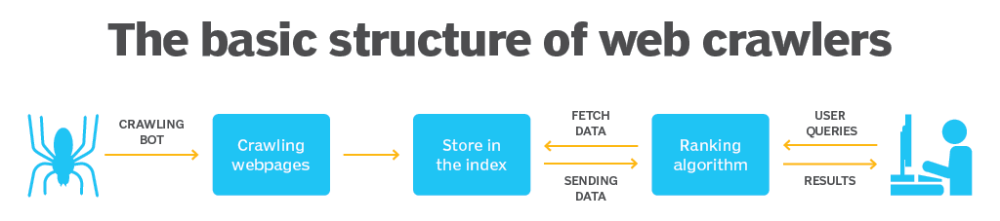

# [1. Web Crawling vs Web Scraping](https://brunch.co.kr/@8d1b089f514b4d5/33)
- Web Crawling
웹 크롤링(Web Crawling)이란 기본적으로 웹 상에 존재하는 데이터를 자동적으로 탐색하는 행위를 의미합니다.
- Web Scraping
웹 스크래핑(Web Scraping)이란 웹 사이트 상에서 원하는 정보를 추출하는 방법을 의미합니다.

일반 개인이나 학생이 웹 상의 데이터를 수집하는 과정을 보면, 브라우저를 탐색하고, 그 중 원하는 정보만을 추출하는 프로세스로 구성되어 있습니다. 즉, 웹 크롤링과 웹 스크래핑 둘다 포함된 것을 알 수 있습니다. 

그래서 웹 크롤링과 웹 스크래핑을 혼용되어 많이 쓰고 있습니다.

---
# [2. 웹 크롤링은 합법인가?](https://jinooh.tistory.com/3)
## 문제가 되는 크롤링
- 수집한 데이터의 상업적 이용
- 크롤링 과정에서 해당 서버의 문제 야기 
- 수집한 데이터가 사용자의 민감한 정보인지
- 사이트의 이용방침, 의사(robots.txt, 이용목적)을 위반하지 않는지 

---
## 대표적인 국내 사례
### 잡코리아 - 사람인 
- 원고 - 잡코리아 / 피고 -사람인
- (주)사람인의 웹사이트에 잡코리아의 채용 정보를 크롤링하여 기재한 사건
- 피고는 원고에 2억5천여만원 지급 

### 야놀자 - 여기어때(진행중)
- 원고 - 야놀자 / 피고 -여기어때
- 야놀자의 제휴 숙박업소, 목록, 주소, 정보, 가격 정보 등을 API를 통해 크롤링하여 여기어때 서비스에 무단으로 복제한 사건

---
# [3. 크롤링 구조](https://www.techtarget.com/whatis/definition/crawler) 

---
# 4. 크롤링 종류 
## 정적 웹 페이지 크롤링 
- 정적 웹 페이지란 서버(Web Server)에 미리 저장된 파일이 그대로 전달되는 웹 페이지를 말합니다. 
- 즉, 특정 웹페이지의 url 주소만 주소창에 입력하면 웹 브라우저로 HTML 정보를 마음대로 가져올 수 있습니다.

---
### 장점 
- 요청에 대한 파일만 전송하면 되기 때문에 서버간 통신이 거의 없고 속도가 빠름
- 단순한 문서들로만 이루어져 있어서 어떤 호스팅서버에서도 동작 가능하므로 구축하는데 드는 비용이 적음
### 단점 
- 저장된 정보만 보여주기 때문에 서비스가 한정적
- 추가, 수정, 삭제 등의 작업을 서버에서 직접 다운받아 편집 후 업로드로 수정해줘야 하기 때문에 관리가 어려움
### 라이브러리
- requests & BeautifulSoup

---
## 동적 웹 페이지 크롤링
- 동적 웹 페이지란 입력, 클릭, 로그인 등 여러 이유로 비동기 통신(Ajax) 형태로 서버(Was Server)와 데이터를 주고 받아 동적으로 제공하는 웹 페이지를 말합니다.

---
### [동기와 비동기 통신 방식 차이](https://sjparkk-dev1og.tistory.com/27)
동기식은 요청 후 응답을 받아야지만 다음 동작이 이뤄지고 비동기식에서는 요청을 보낸 후 응답과는 상관없이 동작하는 방식이다.

---
### 장점 
- 다양한 정보를 조합하여 웹 페이지를 제공하기 때문에 서비스가 다양함
- 추가, 수정, 삭제 등의 작업이 가능하기 때문에 관리가 편함
### 단점 
- 웹 페이지를 보여주기 위해서 여러번의 비동기 통신을 처리하기 때문에 상대적으로 속도가 느림
### 라이브러리
- selenium & chromedriver

---
# 5. 주요 크롤링 모듈(라이브러리)
### [requests](https://www.daleseo.com/python-requests/)
- 파이썬 HTTP 통신에 사용되는 모듈
- 설치방법: pip install requests
### [beautifulsoup](https://wikidocs.net/85739)
- HTML, XML, JSON 등 파일의 구문을 분석하는 모듈
- 설치방법: pip install beautifulsoup4
### [selenium](https://gorokke.tistory.com/8)
- 웹 브라우저를 이용하는 자동화 프로그램입니다. 
- 설치방법: pip install selenium

